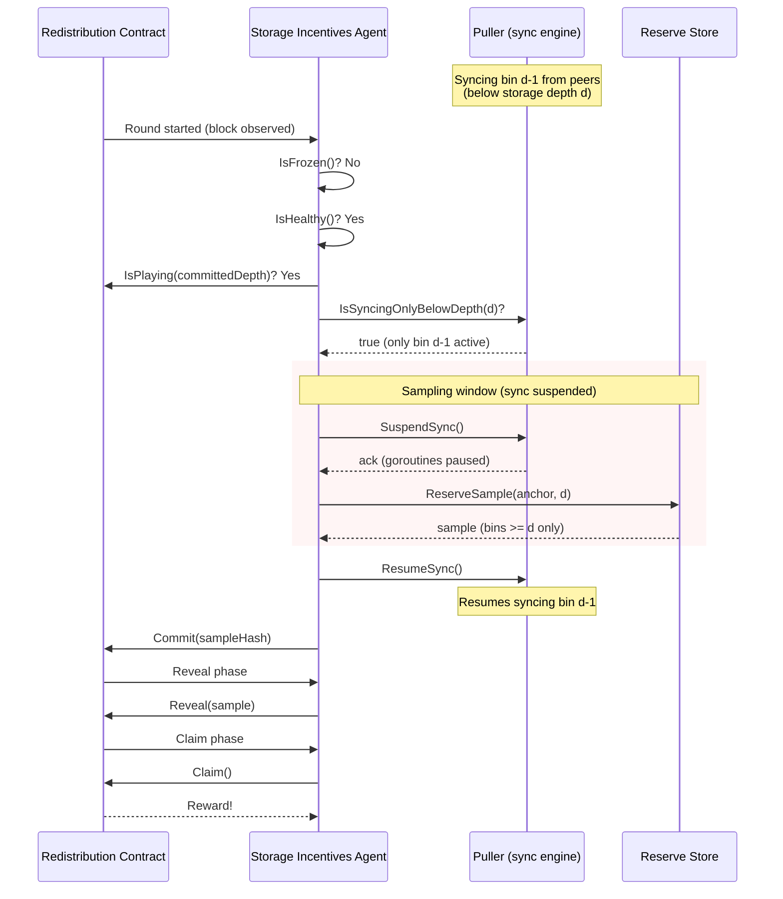

## Simple Summary

Nodes that are syncing chunks exclusively in proximity-order bins below
their storage depth should remain eligible to participate in the
redistribution game. The reserve digest is unaffected by sub-depth sync,
so the current blanket exclusion of all syncing nodes is unnecessarily
punitive.

## Abstract

The Swarm redistribution game requires neighbouring nodes to independently
produce matching reserve digests. A node is currently excluded from the game
whenever any pullsync activity is in progress, regardless of which bins are
being synced. This proposal observes that the reserve digest covers only
chunks at or above the storage depth $d$, so syncing in bins below $d$ has
no effect on the digest. The amendment introduces a depth-aware eligibility
predicate that permits game participation during sub-depth sync, and a sync
suspension mechanism that pauses pullsync during the sampling window to
guarantee a consistent reserve snapshot.

## Motivation

When a node expands its reserve into a lower bin (for example, syncing bin
$d{-}1$ in preparation for a depth decrease), the sync process can take
hours. Throughout this period the node is excluded from every redistribution
round, forfeiting potential rewards despite maintaining a fully valid reserve
at the current depth.

The exclusion serves no purpose in this case. The reserve digest is computed
over bins $\geq d$. Chunks arriving in bins $< d$ are, by definition, not
part of the reserve and cannot influence the digest. Blocking the node from
the game is therefore a false negative in the eligibility check.

## Specification

### Definitions

**Definition 1 (Proximity Order).** For two addresses $a, b \in \{0,1\}^{256}$,
the proximity order is the number of leading zero bits in their bitwise XOR:

$$
\mathit{PO}(a,b) := \mathit{CLZ}_{256}(\mathit{XOR}(a,b)) = 256 - \lfloor\log_2(\mathit{XOR}(a,b))\rfloor - 1
$$

with the convention $\mathit{PO}(a,a) := 256$.

**Definition 2 (Storage Depth).** The storage depth of a node $N$ is the smallest
non-negative integer $d$ such that the reserve at depth $d$ fits within the
prescribed capacity:

$$
d := \min\{ k \in \mathbb{N}_0 \mid |R_N(k)| \leq S_R \}
$$

**Definition 3 (Reserve).** Let $\mathcal{C}$ denote the universe of valid chunks.
The reserve of node $N$ at depth $d$ is:

$$
R_N(d) := \{ c \in \mathcal{C} \mid \mathit{PO}(c, N) \geq d \}
$$

The consensual reserve size limit is $S_R = 2^{22}$ (ca. 4M chunks).

**Definition 4 (PO Bin).** The PO bin of node $N$ at proximity order $p$ is:

$$
B_N(p) := \{ c \in \mathcal{C} \mid \mathit{PO}(c, N) = p \}
$$

The reserve decomposes as $R_N(d) = \bigcup_{p=d}^{256} B_N(p)$.

**Definition 5 (Reserve Digest).** The reserve digest $H(R_N(d))$ is the BMT root
hash computed over the ordered contents of the reserve. This is the value committed
in the redistribution game's commit phase.

### Reserve-expanding sync

**Definition 6 (Sub-Depth Sync).** A node $N$ with storage depth $d$ is performing
sub-depth sync if it is syncing chunks exclusively from PO bins $p < d$.

**Definition 7 (Expanded Reserve).** When node $N$ syncs the bin immediately below
its depth, the expanded reserve is:

$$
R_N(d{-}1) = B_N(d{-}1) \cup R_N(d)
$$

Since $B_N(d{-}1)$ and $R_N(d)$ are disjoint, sizes add:

$$
|R_N(d{-}1)| = |B_N(d{-}1)| + |R_N(d)|
$$

**Property 1 (Reserve Size Equivalence).** Under uniform chunk distribution with
$T$ total chunks, the expected size of a single PO bin equals the expected size
of the entire reserve above it:

$$
\mathbb{E}[|B_N(d{-}1)|] = \mathbb{E}[|R_N(d)|]
$$

Each additional bit of prefix match halves the address space, giving
$\mathbb{E}[|B_N(p)|] = T / 2^{p+1}$. Summing over all reserve bins:

$$
\mathbb{E}[|R_N(d)|] = \sum_{p=d}^{\infty} \frac{T}{2^{p+1}} = \frac{T}{2^d}
$$

And directly $\mathbb{E}[|B_N(d{-}1)|] = T / 2^d = \mathbb{E}[|R_N(d)|]$.

**Property 2 (Reserve Digest Invariance).** If node $N$ performs sub-depth sync,
the reserve digest $H(R_N(d))$ is unchanged.

*Proof.* Let $S = \{c_1, \ldots, c_k\}$ be the set of chunks acquired during
sub-depth sync. By Definition 6, every $c_i \in S$ satisfies $\mathit{PO}(c_i, N) < d$.
By Definition 3, every member of $R_N(d)$ satisfies $\mathit{PO}(c, N) \geq d$.
Therefore $S \cap R_N(d) = \varnothing$: the newly synced chunks are disjoint from
the reserve. Since no element is added to or removed from $R_N(d)$, the digest
$H(R_N(d))$ is invariant under sub-depth sync. $\square$

### Modified eligibility rule

**Algorithm 1 (Current Eligibility Check).** A node $N$ is eligible iff all of the
following hold:

1. $N$ is *fully synced*: no active pullsync operations in any bin.
2. $N$ is *healthy*: sufficient connected peers.
3. $N$ is not *frozen*: stake not locked by a prior penalty.

**Definition 8 (Bin-Level Sync Status).** For each PO bin $p \in [0, 256)$, define
the predicate $\mathit{syncing}(p)$ which is true iff the node has at least one
active pullsync goroutine operating in bin $p$.

**Algorithm 2 (Amended Eligibility Check).** A node $N$ with storage depth $d$ is
eligible iff all of the following hold:

1. $N$ is *reserve-synced*: either fully synced, or syncing exclusively in bins
   below the storage depth: $\forall p \geq d: \neg\mathit{syncing}(p)$
2. $N$ is *healthy*.
3. $N$ is not *frozen*.

**Property 3 (Eligibility Preservation).** A node satisfying Algorithm 2 condition (1)
has a stable reserve digest, because sub-depth sync does not modify $R_N(d)$
(Property 2). The node can therefore produce the same digest as its honest
neighbours and participate in the game without risk of divergence.

### Sync suspension during sampling

Even with the amended eligibility rule, the pullsync protocol and the sampling
computation share the reserve index. To guarantee a consistent snapshot, sync
operations SHOULD be suspended for the duration of the sampling window.

> **Key ordering.** The protocol suspends *syncing* during sampling, rather than
> blocking *sampling* during syncing. This ensures that eligible nodes always
> participate in every round.

**Definition 9 (Sampling Window).** The sampling window $[t_s, t_e]$ is the time
interval during which the node computes its reserve sample for the current
redistribution round.

**Algorithm 3 (Sync Suspension Protocol).** On entry to the sampling window:

1. Signal all active pullsync goroutines to pause at their next safe point
   (after completing any in-flight chunk delivery).
2. Wait until all goroutines have acknowledged suspension.
3. Compute the reserve sample $H(R_N(d))$.
4. Signal goroutines to resume normal operation.

Goroutines operating in bins $p < d$ MAY optionally continue unsuspended, since
they do not affect the reserve digest (Property 2). However, suspending all bins
provides the simplest implementation with no correctness trade-off.

**Property 4 (Suspension Correctness).** If all pullsync goroutines operating in
bins $p \geq d$ are suspended before the sample computation begins, and the reserve
index supports snapshot-consistent iteration, then the reserve digest is
deterministic with respect to the reserve state at the moment of suspension.

### Summary of changes

| Component | Current Behaviour | Amended Behaviour |
|---|---|---|
| Eligibility check | Node must be fully synced (no active sync in any bin) | Node must be reserve-synced (no active sync in bins $\geq d$) |
| Sync state tracking | Global aggregate `SyncRate()` | Per-bin $\mathit{syncing}(p)$ predicate |
| Sampling window | Sampling blocked if syncing active | Syncing suspended during sampling |
| Depth change gating | Blocked until global `SyncRate() = 0` | Unchanged (conservative; may be relaxed in future) |

## Rationale

**Suspend sync, not block sampling.** The key design decision is to invert the
current relationship between syncing and sampling. Rather than preventing a syncing
node from sampling, the amended protocol prevents sampling from being disrupted by
sync. This ensures that every eligible node participates in every round, maximising
the honest participation rate and the security of the Schelling game.

**Per-bin predicate, not per-peer.** The eligibility check aggregates sync status
across all peers at the bin level. A per-peer check would be insufficient: a node
might be syncing bin $d$ from peer $A$ and bin $d{-}1$ from peer $B$. The
aggregated per-bin predicate correctly identifies that bin $d$ is active and the
node is therefore not eligible.

**Full suspension vs selective.** Algorithm 3 permits but does not require selective
suspension (only bins $\geq d$). Full suspension is recommended for simplicity. The
sampling window is short (seconds), and the cost of briefly pausing sub-depth sync
is negligible compared to the complexity of selective goroutine management.

## Backwards Compatibility

This proposal modifies the eligibility logic within a single node. It does not
change any wire protocol messages, protobuf definitions, or on-chain contracts.
Nodes running the amended logic will participate in rounds where they would
previously have been excluded; from the perspective of other nodes and the
redistribution contract, this is indistinguishable from a node that happened to
finish syncing before the round started.

No coordinated upgrade is required. Nodes can adopt this change independently.

## Test Cases

1. **Bin-level sync tracking.** Construct a puller with mock peers syncing in
   various bins. Assert the predicate returns the correct value for different
   depth thresholds.
2. **Sync suspension.** Start sync goroutines, call `SuspendSync()`, verify no
   new chunk deliveries occur, call `ResumeSync()`, verify sync resumes.
3. **Sub-depth sync eligibility.** Set up a node with depth $d$, start syncing
   only in bin $d{-}1$, verify that the node participates in the redistribution
   round.
4. **Suspension during sampling.** Start a redistribution round, verify that sync
   is suspended during `handleSample` and resumed after.

## Implementation

### Pseudocode

```go
func isReserveSynced(depth uint8) bool {
    for _, peer := range puller.peers {
        for bin := range peer.activeSyncs {
            if bin >= depth {
                return false
            }
        }
    }
    return true
}
```

```go
func handleSample(round uint64) {
    if isFrozen() || !isHealthy() || !isPlaying(round) {
        return
    }

    depth := store.StorageRadius()
    if !isReserveSynced(depth) {
        return
    }

    puller.SuspendSync()
    defer puller.ResumeSync()

    sample := store.ReserveSample(anchor, depth)
    commit(sample)
}
```

### Protocol flow



A detailed gap analysis against the current Bee implementation is maintained separately
in the protocol repository (`src/pullsync/amendments/reserve_sync_eligibility_gap_analysis.tex`).

## Copyright

Copyright and related rights waived via [CC0](https://creativecommons.org/publicdomain/zero/1.0/).
