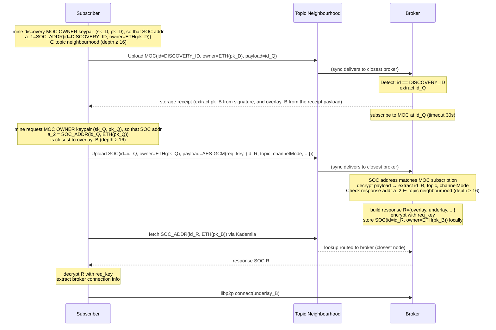
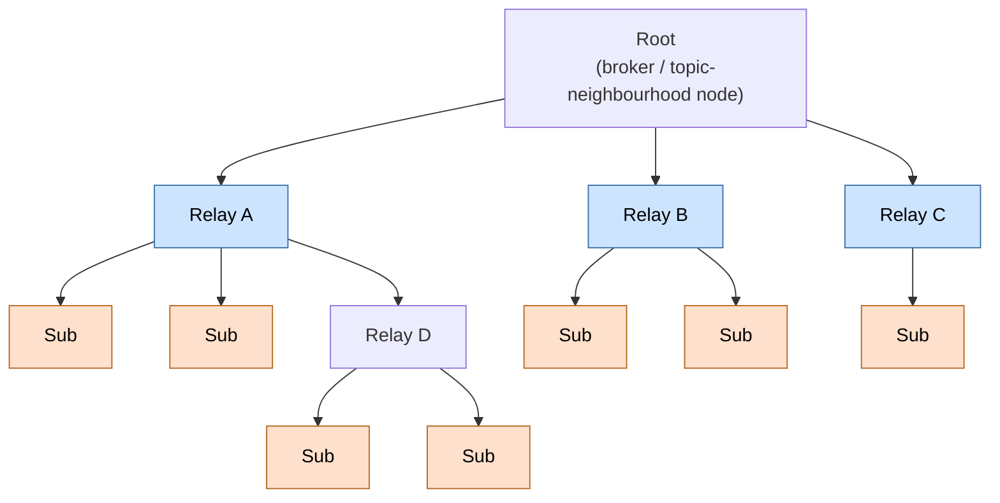
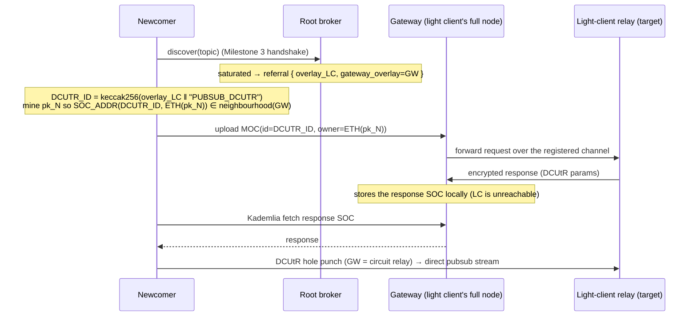
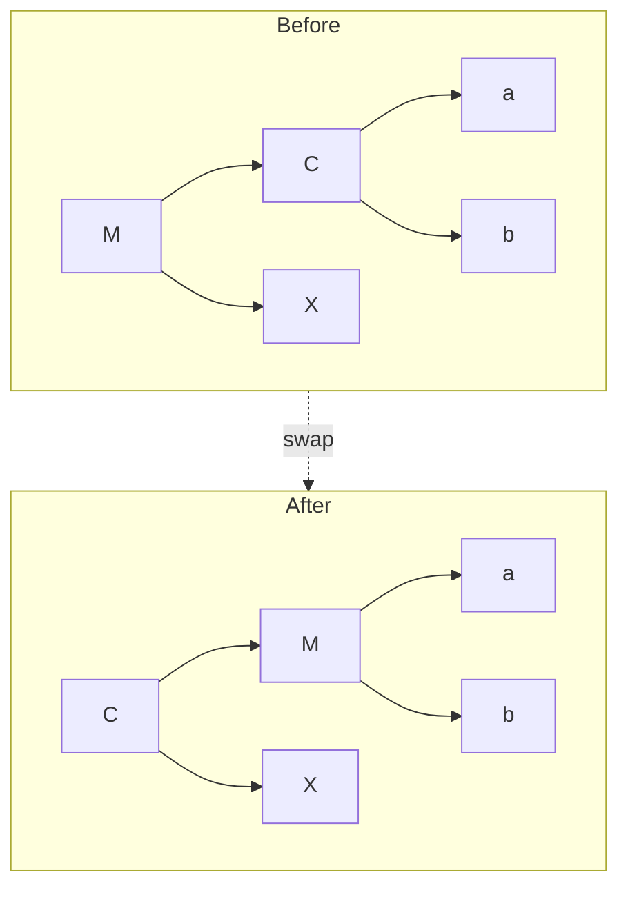

## Simple Summary

A real-time messaging feature for dApps: WebSocket clients publish and subscribe to topic streams through Bee nodes, which act as the transport layer by leveraging their existing libp2p connections and bandwidth incentive system.

## Abstract

One designated node operates as a **Broker**: it accepts long-lived p2p streams and broadcasts them to all connected receivers. Other nodes connect as either a **Publisher** (send + receive) or a **Subscriber** (receive only). A WebSocket API on each Bee node serves as the bidirectional bridge between dApps and the p2p stream. Message format, validation and handshake logic are defined by a pluggable `Mode`; the initial mode `gsoc-ephemeral` uses SOC-style signing to authenticate pubsub messages in transit — these are not stored on the Swarm network as GSOC chunks. This SWIP also covers a decentralised broker discovery mechanism that locates a suitable broker for a topic based on Kademlia routing, with load balancing across multiple brokers deferred to a later milestone.

## Motivation

Swarm has two event-based primitives — GSOC and PSS — but both require full-node operation: the events arrive via Kademlia routing as part of pull/push syncing, which light clients do not participate in. For anyone not running a full node the only option is polling storage, which is slow and fundamentally not real-time. This leaves two unaddressed needs: real-time message exchange that does not require storing chunks on the network, and a way to channel network events that full nodes observe naturally out to light clients.

A brokered pub/sub layer fills several gaps at once:

- **Real-time applications** can exchange messages without long-term storage or polling.
- **Swarm network events** (e.g. incoming GSOC notifications) can be fanned out to light clients that would otherwise never see them.
- **Bandwidth incentives** — brokers are compensated for the data they transmit, creating a sustainable relay economy within Swarm.
- **Store-less uploads** — a publisher mode could let light clients push chunks to the network and pay by bandwidth rather than postage stamp.

The mode system ensures the protocol is not locked to any single message format and can evolve to cover these use cases incrementally.

## Specification

### Roles

```
Subscriber ──► (p2p stream, read-only)  ──►┐
                                            Broker  ──► rebroadcast to all subscribers
Publisher  ──► (p2p stream, read+write) ──►┘
```

| Role | Description |
|---|---|
| **Broker** | Opt-in (`--pubsub-broker-mode`). Validates publisher identity; re-broadcasts to all subscribers. |
| **Subscriber** | Dials broker; receives all broadcasts. |
| **Publisher** | Upgraded subscriber; sends mode-specific messages to the broker; also receives broadcasts. |

### Protocol

- **libp2p**: `pubsub/1.0.0`, stream name `msg`
- Topic address and mode are negotiated via **libp2p stream headers** (not the stream name)

#### Stream headers (client → broker)

| Key | Value |
|---|---|
| `pubsub-topic-address` | 32-byte topic address |
| `pubsub-mode` | 1-byte mode ID |
| `pubsub-readwrite` | `0x01` publisher / `0x00` subscriber |
| `pubsub-gsoc-owner` | 20-byte ETH address _(GSOC-Ephemeral mode, publisher only)_ |
| `pubsub-gsoc-id` | 32-byte SOC ID _(GSOC-Ephemeral mode, publisher only)_ |

#### Wire format

All broker→subscriber frames share a common 1-byte type prefix. Service-level (protocol) types are reserved from the **top of the byte downward** (`0xFF`, `0xFE`, …) and are valid across all modes; `0xFF` is ping — the broker sends one every 30 s to keep the long-lived stream alive. Mode-specific types grow **upward** from `0x00`.

```
Broker → any subscriber:
[ 0xFF ]   ping  (service level, all modes — no further fields)
[ 0x00+ ]  mode-specific frame
```

Publisher→Broker framing is mode-specific and carries **no message type prefix** — the broker knows the stream is a publisher stream from the `pubsub-readwrite` header set at connect time.

#### GSOC Ephemeral mode (mode 1)

Messages are SOC chunks. The topic address is `soc.CreateAddress(socID, ownerAddr)`, so only the holder of the topic private key can publish. The broker verifies the ECDSA signature on every message before broadcasting.

```
Publisher → Broker:
[ sig: 65 B ][ span: 8 B LE ][ payload: up to 4 KB ]

Broker → Subscriber:
[ 0x00 ][ SOC ID: 32 B ][ owner: 20 B ][ sig: 65 B ][ span: 8 B ][ payload ]  handshake (first msg)
[ 0x01 ][ sig: 65 B ][ span: 8 B ][ payload ]                                  data (subsequent)
```

The handshake frame carries SOC identity once on first broadcast; subsequent messages are data-only. The subscriber verifies `soc.CreateAddress(id, owner) == topicAddress` on handshake receipt.

### WebSocket API

```
GET /pubsub/{topic}   — WebSocket upgrade (subscriber or publisher)
GET /pubsub/          — list active topics
```

Connection parameters are accepted as HTTP headers or query params (query param fallback for browser WebSocket clients that cannot set custom headers):

- `Swarm-Pubsub-Peer` (required): multiaddr of the broker
- `Swarm-Pubsub-Gsoc-Eth-Address` + `Swarm-Pubsub-Gsoc-Topic` (optional, GSOC Ephemeral mode): enable publisher role

The WebSocket client sees the mode's raw payload; all p2p framing is transparent. For GSOC-Ephemeral mode: `[sig: 65 B][span: 8 B][payload]`.

### Multi-session multiplexer

Multiple WebSocket sessions on the same node and topic share one p2p stream:

```
WS session 1 ──┐
WS session 2 ──┤  SubscriberConn (shared stream + runMux goroutine)  ──► Broker
WS session N ──┘
```

`runMux` reads from the stream and fans out to per-session channels. Ref-counting (`refs`) ensures `FullClose` is called exactly once when the last session exits. If the stream dies, the shared conn is cleared immediately so new sessions open a fresh stream.

### Mode extensibility

The `Mode` interface decouples the protocol machinery from message semantics:

```
type Mode interface {
    Connect(...)         // open stream with appropriate headers
    HandleBroker(...)    // broker-side stream handler
    ReadBrokerMessage()  // decode one broker→subscriber frame
    FormatBroadcast()    // encode one broker→subscriber frame
    ValidatePublisher()  // verify publisher identity
    ...
}
```

New modes can be added by implementing `Mode` and registering a mode ID. Candidates include: unauthenticated broadcast, stake-gated publishing, Swarm-event fan-out, or bandwidth-incentivised chunk upload.

## Roadmap

### Milestone 1 — Direct messaging _(this SWIP)_

Two-directional messaging between a broker and its direct peers over a dedicated libp2p channel. Top-down message broadcast with per-message authentication.

Deliverables: pubsub protocol in Bee, WebSocket + topic-list API endpoints, pubsub JS library.

### Milestone 2 — Bandwidth incentives

The broker–subscriber stream is a metered channel: the subscriber pays the broker/forwarder per chunk via chequebook cheques (incorporating Swarm's bandwidth incentive model).

- Subscription connection query returns incentive params (price in PLUR/chunk, cheque threshold).
- Bee gains a pubsub cashout option for accumulated cheques.
- Light clients require a funded chequebook and a blockchain connection.

### Milestone 3 — Decentralised broker discovery

Make the broker underlay address parameter optional. Instead of the client hardcoding a broker, it discovers an eligible broker node through a two-phase MOC handshake (see [SWIP-42](https://github.com/ethersphere/SWIPs/pull/80)) targeting the topic's neighbourhood. No on-chain registry is required — broker public keys are discovered in-band via storage receipts. The protocol requires targeted chunk delivery and retrieval to/from the closest responsible node (see e.g. [bee#5081](https://github.com/ethersphere/bee/pull/5081)).

#### Protocol constants

```
DISCOVERY_ID   = keccak256("PUBSUB-REQUEST") // MOC ID for discovery
```

Broker nodes continuously watch for incoming SOCs whose ID matches `DISCOVERY_ID`. This is a single, network-wide subscription filter.

#### Workflow



> **Note:** `req_key = keccak256(ECDH(sk_Q, pk_B))` — the ECDH shared secret between the subscriber's Phase 2 request keypair and the broker's public key. Both the Phase 2 request payload and the response payload are encrypted with this same key (see [Encryption](#encryption--ecdh--aes-256-gcm) below).

#### Phase 1 — Discovery request (MOC)

1. The subscriber generates a random 32-byte `id_Q` — this doubles as the SOC ID for the Phase 2 upload.
2. The subscriber mines a **discovery keypair** `(sk_D, pk_D)` such that `soc.CreateAddress(DISCOVERY_ID, ETH(pk_D))` falls within the topic's neighbourhood (PO ≥ 16 relative to topic address).
3. The subscriber uploads a MOC with `id = DISCOVERY_ID`, `owner = ETH(pk_D)`, and `id_Q` as payload. Push-sync routes the chunk to the topic neighbourhood.
4. A broker node in the topic neighbourhood detects the incoming MOC (`id == DISCOVERY_ID`), stores it, and extracts `id_Q`.
5. The broker returns a **storage receipt**. The subscriber extracts `pk_B` and the broker's overlay address (`overlay_B`) from the receipt.
6. The broker subscribes to MOC events matching `id == id_Q`, independent of owner — the subscriber's Phase 2 keypair does not exist yet at this point. This subscription times out after 30 seconds if no matching SOC arrives.

#### Phase 2 — Encrypted request/response (MOC)

7. The subscriber generates a random 32-byte `id_R` for the response, and mines a **request keypair** `(sk_Q, pk_Q)` — distinct from `(sk_D, pk_D)` — such that `soc.CreateAddress(id_Q, ETH(pk_Q))` is closest to the broker's overlay `overlay_B` (PO ≥ 16). Mining a fresh keypair here, rather than reusing `pk_D`, decouples the topic-neighbourhood constraint of Phase 1 from the broker-proximity constraint of Phase 2, so no single address has to satisfy both at once.
8. The subscriber uploads a SOC with `id = id_Q`, `owner = ETH(pk_Q)`. The payload is encrypted with the ECDH-derived key:
   ```
   shared  = ECDH(sk_Q, pk_B)
   req_key = keccak256(shared)
   nonce   = keccak256(req_key) [:12]
   payload = AES-256-GCM(req_key, nonce, { id_R, topic, channelMode, ... })
   ```
9. The broker, subscribed to MOC events on `id_Q`, receives the SOC (matching on ID regardless of owner), decrypts the payload with `req_key = keccak256(ECDH(sk_B, pk_Q))`, and extracts `id_R`, `topic`, and `channelMode`.
10. The broker verifies that the response address `soc.CreateAddress(id_R, ETH(pk_B))` falls within the topic neighbourhood (PO ≥ 16).
11. The broker builds response `R = { overlay, underlay, incentive_params, hive_conn_list }`, encrypts it with the same `req_key`:
    ```
    C_res = AES-256-GCM(req_key, nonce, R)
    ```
12. The broker creates a SOC signed with `sk_B` at address `soc.CreateAddress(id_R, ETH(pk_B))` and stores it locally.
13. The subscriber fetches the response SOC via Kademlia lookup (routed to the broker as the closest responsible node), decrypts with `req_key`, and connects to the broker via libp2p.

#### Encryption — ECDH + AES-256-GCM

The Phase 2 request payload and the response SOC payload both use AES-256-GCM keyed by the same ECDH-derived `req_key`. Both parties can compute it independently: `ECDH(sk_Q, pk_B) = ECDH(sk_B, pk_Q)` — the subscriber knows `sk_Q` (mined in Phase 2) and `pk_B` (from the Phase 1 storage receipt); the broker knows `sk_B` and `pk_Q` (from the owner field of the Phase 2 SOC).

```
shared  = ECDH(sk_Q, pk_B)   // = ECDH(sk_B, pk_Q)
req_key = keccak256(shared)
nonce   = keccak256(req_key) [:12]   // deterministic, reused for both directions
```

AES-256-GCM provides authenticated encryption. Because `sk_Q` is unique per discovery session (freshly mined in Phase 2), `req_key` — and therefore the nonce — is never reused across sessions, satisfying GCM's uniqueness requirement. Forward secrecy is provided by the ephemeral nature of `sk_Q`.

#### Postage stamps

The subscriber needs a postage stamp for the MOC/SOC uploads. The broker does not need a stamp for the response SOC — it is stored locally and served directly on fetch. Once [SWIP-36](https://github.com/ethersphere/SWIPs/pull/70) (free uploads) is adopted, the subscriber's stamp requirements can be lifted.

#### Rationale

The two-phase MOC handshake avoids several problems that a simpler single-round or registry-based discovery would face:

- **No on-chain registry** — the broker's public key and overlay are discovered in-band via the storage receipt, removing any blockchain dependency for discovery.
- **No concurrent requester collision** — the response is a separate SOC at a unique mined address per session; multiple subscribers never interfere with each other.
- **No caching problem** — the response SOC is a new chunk stored locally by the broker, not an overwrite of the request chunk, so stale cached copies are not an issue.
- **No single-node targeting** — any broker in the topic neighbourhood can respond to the MOC; if one is offline, another picks it up.
- **Decoupled key mining** — Phase 1 mines an owner key (`pk_D`) for topic-neighbourhood membership; Phase 2 mines a separate owner key (`pk_Q`) for proximity to the broker's overlay, while `id_Q` stays constant across both. This lets the broker's Phase 1 subscription match on `id` alone, without needing to know the subscriber's Phase 2 key in advance.

#### Security considerations

1. **MOC flooding (DoS on Phase 1)** — An attacker can flood MOC chunks with `id = DISCOVERY_ID` to a topic neighbourhood. Each MOC only causes the broker to create a lightweight subscription hook (30s timeout), so the cost to the broker is minimal (memory for pending subscriptions). The attacker must also mine a keypair per chunk targeting the topic neighbourhood. Bandwidth incentives provide a baseline rate limit: the attacker pays per chunk forwarded. Brokers can cap the number of concurrent pending subscriptions.
2. **Phase 2 flooding (DoS on subscription)** — An attacker observing the Phase 1 MOC learns `id_Q`, but not `pk_B` (only the intended subscriber learns it, via the storage receipt) or the subscriber's `sk_Q`. The broker's MOC subscription matches any SOC with `id == id_Q` regardless of owner, so an attacker could forge such a SOC, but without `pk_B` it cannot produce a payload that decrypts under `req_key` — a garbage SOC fails decryption and is discarded.
3. **Response SOC mining cost** — The subscriber must mine `pk_Q` such that `soc.CreateAddress(id_Q, ETH(pk_Q))` is close to the broker's overlay.
4. **Timing window** — The broker's MOC subscription on `id_Q` has a 30s timeout. The subscriber must complete Phase 2 (mine `pk_Q` + upload SOC) within this window. Mining at depth 16 is fast, so this is not a practical concern.

New API endpoint: `GET /pubsub/discover/{topic}?mode=<id>` — returns broker connection data for the given topic.

### Milestone 4 — Load balancing and multi-level forwarding

A single broker is bandwidth-bound: every subscriber it serves consumes one outgoing stream's worth of its uplink. Milestone 4 distributes that load across a **multi-level forwarding tree** of willing relay nodes, and continuously **reshapes the tree so the fastest, most stable nodes sit closest to the root** — minimising end-to-end delivery latency across the whole topic.



High-bandwidth, stable nodes (blue) are kept close to the root; low-bandwidth or churny nodes (orange) are pushed toward the leaves, where a failure costs only their own stream.

The data plane is unchanged from Milestone 1/2: each tree edge is a `pubsub/1.0.0` stream carrying the same broker→subscriber frames, and each edge is independently metered by the bandwidth incentives. A node receives the broadcast on its **uplink** (from its parent) and fans it out on its **downlinks** (to its children). The root remains the sole origin: it receives the publisher stream, validates per mode, and starts the cascade.

A second, low-rate **control plane** (a reserved frame type on the same stream, see _Control frames_ below) carries the tree-maintenance messages — capacity beacons, referrals, delegation orders, rearrangement swaps, and DCUtR signalling.

#### Design goals

| Goal | Mechanism |
|---|---|
| No single node holds global membership | Aggregated **capacity beacons** — each node summarises only its subtree to its parent; no node stores the full member list of the tree. |
| Fastest/most stable nodes near the root | Per-node **score** drives **promotion swaps** with hysteresis + cooldown. |
| Relays earn for relaying | Per-hop Milestone-2 metering: a relay nets `(k−1)·p` for `k` children — positive if `k ≥ 2`. |
| Light clients can be relays / be reached | **DCUtR rendezvous** via a full-node gateway, addressed with a Milestone-3-style MOC handshake. |
| Newcomers (NAT'd) can join any node | **DCUtR** hole-punching with the target's parent (or root) as the signalling relay. |

#### Roles (extends Milestone 1)

| Role | Uplink | Downlinks | Notes |
|---|---|---|---|
| **Root** | 0 | many | The Milestone-3 broker; origin of the cascade. |
| **Relay** | 1 (to parent) | ≥ 2 | Any node — full **or light** — that opted in (`--pubsub-relay-willing`) and was delegated a batch. |
| **Leaf** | 1 (to parent) | 0 | Plain subscriber/publisher. |

A relay is just a subscriber that also serves children; promotion/demotion between Leaf and Relay is dynamic and driven by the policy below.

#### Node score and metrics

Every node computes a **score** that determines how high in the tree it deserves to sit. Higher score → closer to the root.

```
Score = w₁ · (1 / rtt_parent)   // low latency to source path
      + w₂ · uptime             // session age — proxy for stability
```

- `rtt_parent` is measured for free from the **`0xFF` ping** frames already defined in Milestone 1 (ping every 30 s); the child echoes, the parent records RTT.
- `uptime` is credited only for the span the **parent has witnessed** since attachment, not a self-asserted history — so a newcomer can't claim to be a veteran. Longer uptime is prioritized so unstable nodes drift to the leaves where their failure blast radius is one stream, not a whole subtree.

Both terms are **measured by the parent**, not self-reported, so the score can't be gamed. Spare capacity is tracked separately as `self_free_slots` (below): it gates *whether* a node can take a new child, not *how high* it sits, and is validated against observed delivery — children may **re-parent** if real service is worse than advertised.

#### Capacity beacons (control plane)

Each node periodically (e.g. every 15 s, piggy-backed on the keepalive) sends its parent a **beacon** summarising itself **and the best free slot in its entire subtree**:

```
Beacon (child → parent) {
  self_score      uint16
  self_free_slots uint8        // 0 if saturated
  best_descendant {            // single best free slot anywhere below this node
    overlay         32 B       // target node; rendezvous id = keccak256(overlay ‖ "PUBSUB_DCUTR")
    gateway_overlay 32 B | ∅   // set if target is a sync-less light client (see "Reaching a relay")
    underlay        ? | ∅      // set if target is directly dialable
    depth           uint8
    score           uint16
  } | ∅
}
```

A parent merges its children's `best_descendant` reports with its own free capacity and propagates the single best (lowest-depth, highest-score) upward. The result: **the root always knows the one (or few) best places a newcomer can attach, without storing the membership of the tree**. State per node is `children.length`.

#### Joining a multi-level tree — what the root answers

Milestone 3 discovery (`GET /pubsub/discover/{topic}`) is unchanged on the wire; the Milestone-3 response `R` (which already carries the responder's `overlay`, `underlay` and `incentive_params`) gains a single `referrals` field — the best free slot(s), aggregated from the capacity beacons. If the responder itself has a free direct slot, it lists **itself** as a referral:

```
referrals: [
  {
    overlay,          // target node; the join rendezvous id is keccak256(overlay ‖ "PUBSUB_DCUTR")
    gateway_overlay?, // set if target is a sync-less light client: whose neighbourhood the join
                      // MOC must target, and who stores/serves the response chunk on its behalf
    underlay?,        // set if the target is directly dialable
    depth, score
  }
]
```

Resolution order for a newcomer:

1. **Responder has a slot** → it lists itself in `referrals`; the newcomer connects to it directly (Milestone 1 path). Cheapest hop, lowest latency — preferred while it has headroom.
2. **Responder full** → `referrals` carries the aggregated best free slot(s) from the beacons. The newcomer connects to the referral target (next section). This is a **single redirect**, not a walk — the beacon aggregation already found the slot.
3. **Referral stale** (target full/offline by the time the newcomer arrives) → the target answers with its *own* `referrals` (its local best-descendant), and the newcomer descends one more level. This **recursive-referral fallback** bounds worst-case to O(depth) round trips, but the common case is one redirect.

> **Approaches considered.** (a) _Recursive walk from the root_ — correct but O(depth) round trips every join; we keep it only as the staleness fallback. (b) _Root-side full registry of all subsumed nodes_ — rejected: `n` state on the root with churn, and the root has no incentive to maintain it. (c) _Beacon-aggregated referral_ (**chosen**) — `depth` gossip, `children.length` root state, single-redirect common case, and the root maintains only a summary it already needs for its own load decisions.

#### Reaching a relay — the DCUtR rendezvous

The referral target may be (a) a directly dialable node, (b) a NAT'd full node, or (c) a sync-less **light client** that cannot be found through the plain Milestone-3 neighbourhood handshake. All three reuse one **deterministic rendezvous id** derived from the target's overlay:

```
DCUTR_ID(target) = keccak256( overlay_target ‖ "PUBSUB_DCUTR" )
```

The target (or its gateway) watches for an incoming **MOC with `id == DCUTR_ID(target)`** — exactly as a broker watches for `DISCOVERY_ID` in Milestone 3; only the watched id and the responsible neighbourhood differ. The newcomer always mines a **fresh per-session keypair `(sk_N, pk_N)`** so that the chunk address falls in the neighbourhood that will pick it up. The rendezvous only *routes the request*; the resulting `pubsub/1.0.0` stream is a direct connection to the **single target node**, never to a neighbourhood.

- **Directly dialable** → the newcomer dials `underlay` and opens the stream with the topic headers (Milestone 1). No rendezvous needed.
- **NAT'd full node** → the node participates in sync, so it is its own rendezvous host. The newcomer mines `(sk_N, pk_N)` so `soc.CreateAddress(DCUTR_ID(target), ETH(pk_N))` lands in the **target's** neighbourhood and uploads `MOC(id=DCUTR_ID(target), owner=ETH(pk_N))`. The target picks it up, stores an encrypted response SOC locally (Milestone-3 style) carrying its DCUtR coordination params; the newcomer fetches it via Kademlia and the two run **DCUtR hole punching** (libp2p circuit-relay v2 → coordinated hole punch → direct upgrade), with the referring ancestor acting as the circuit relay. The relayed path is dropped once the direct stream is up.
- **Sync-less light client** → the light client has no neighbourhood of its own, so it registers the watch on a full-node **gateway** it already connects to (the channel it maintains to that node): *"notify me of any SOC with `id == DCUTR_ID(me)`."* The newcomer mines `(sk_N, pk_N)` so `soc.CreateAddress(DCUTR_ID(target), ETH(pk_N))` lands in the **gateway's** neighbourhood and uploads the MOC there. The gateway (the closest node) stores it, matches the id, and forwards the request to the light client over their channel. The light client builds the encrypted response and hands it back to the gateway; **the response chunk is stored on the gateway, not on the unreachable light client**, so the newcomer fetches it by ordinary Kademlia lookup. The two then establish the data stream via DCUtR, with the gateway acting as the circuit relay for the hole punch.

This makes a light client a first-class relay — discoverable, able to answer join requests, and forwarding the topic stream to its children — all without ever participating in pull/push sync.



#### Relay sign-up and delegation (the ≥2 rule)

A node opts in with `--pubsub-relay-willing` and advertises `self_free_slots > 0` in its beacon. When a parent is **over capacity** — `current_children > max_fanout`, or measured uplink saturated, or downstream RTTs degrading — it **deepens its subtree** by delegating a *batch* of children to a relay-willing candidate:

1. Parent selects a relay-willing candidate `R` (from its beacon view, or a control-plane query to its children/root).
2. Parent picks a batch of **≥ 2** of its current children with similar scores (so the new sub-tree is balanced).
3. Parent sends each batched child a `REPARENT{ to: R, gateway? }` control frame; sends `R` an `EXPECT{ children: [...] }`.
4. The children connect to `R` (via the DCUtR rendezvous above) and only then drop the old edge — **make-before-break**, so no broadcast gap.
5. `R` is now a relay with ≥ 2 children; the parent's direct child count drops by `(batch − 1)`.

**Why batches of ≥ 2 — economics.** Each edge is metered (Milestone 2): a node pays its parent per chunk and charges each child per chunk. A relay with `k` children nets `k·p − 1·p = (k−1)·p` per chunk.

| `k` | Relay margin | Verdict |
|---|---|---|
| 1 | `0` | Pure pass-through: adds a hop and latency for **zero** profit — never delegate a single child. |
| ≥ 2 | `(k−1)·p > 0` | Relay profits; the extra hop buys the parent bandwidth relief. |

So the ≥2 rule is not a heuristic — it is the break-even point of the relay's payment channel.

**Why the parent (and root) delegate at all.** Delegating moves revenue downstream (the parent now earns from one relay edge instead of `k` direct edges). The parent does it because, when saturated, *not* delegating degrades every stream it serves and triggers rearrangement that would cost it those children anyway.

**Payment: flat downstream, depth-scaled upstream.** The two directions are metered separately, mirroring the main Swarm network:

- *Subscription (downstream broadcast)* — each node pays its **direct parent** the standard Milestone-2 per-chunk price for the stream it receives, **independent of depth**: a subscriber pays its broker exactly what any other subscriber pays, wherever it sits in the tree.
- *Publishing (upstream)* — a publish message must travel up to the root before it can be broadcast, so the publisher attaches **excess bandwidth credit proportional to its depth `d`** — enough for each of the `d` forwarding ancestors to recover its relaying cost plus margin. This is the same per-hop accounting that push-sync (upload) and retrieval (fetch) already use on the main network: the publisher pays for the path its chunk traverses.

The combined effect reinforces the rearrangement equilibrium: a node higher in the tree publishes more cheaply (fewer up-hops) **and** earns steadier, more saturated subscription revenue — so the fastest, most stable nodes are pulled toward the top by economics as well as by the score metric.

#### Tree rearrangement — when it is worth it

Rearrangement keeps the high-score nodes high. The only primitive is a **local promotion swap** between a child `C` and its parent `M`:



`C` takes `M`'s position and adopts `M`'s other children (`X`); `M` becomes a child of `C` and keeps its own subtree (`a`, `b`). Only three nodes (`M`, `C`, and `M`'s parent) re-wire — the rest of the tree is untouched.

A swap is triggered if **all** hold (to guarantee it improves delivery and does not oscillate):

1. **Score gap**: `Score(C) − Score(M) > Θ` — `C` is meaningfully faster/more stable than its parent. `Θ` is the hysteresis band; small gaps are ignored.
2. **Latency win**: the estimated change in subtree delivery latency is negative — putting the higher-throughput, lower-RTT node above the larger sub-population strictly reduces aggregate (and worst-case) latency.
3. **Stability window**: `C` has been connected longer than `T_stable` — don't promote a node that may vanish.
4. **Cooldown**: neither node swapped within `T_cooldown` — prevents flapping under noisy measurements.

Swaps use the same **make-before-break** reconnection as delegation, so no broadcast is lost. Net effect over time: high-bandwidth, low-latency, long-lived nodes rise toward the root; slow or churny nodes settle near the leaves, where a failure costs only their own stream. Because high positions are also the most profitable, the performance-optimal topology is also the economic equilibrium — the rearrangement metric is simply the referee that allocates the lucrative high slots to the nodes that serve them best.

#### Control frames

Protocol (service-level) frame types are allocated from the **top of the type byte downward** (`0xFF`, `0xFE`, …), while mode (channel) frame types grow **upward** from `0x00`. A receiver can therefore tell a protocol frame from a channel payload purely by where it sits in the byte range, and new protocol frames can be added without ever colliding with a mode's. These frames are valid across all modes and are never forwarded to the WebSocket client.

| Type | Direction | Purpose |
|---|---|---|
| `0xFF` | broker→child | ping (keepalive, all modes) |
| `0xFE` | child→parent | capacity beacon |
| `0xFD` | parent→child | `REPARENT{ to, gateway? }` |
| `0xFC` | parent→relay | `EXPECT{ children }` |
| `0xFB` | ↕ via circuit relay | DCUtR signalling |
| `0xFA` | ↕ | swap negotiation (propose / ack) |

> Mode frames grow upward from `0x00`.

#### Security & robustness considerations

1. **Beacon poisoning** — a node could advertise a fake high-score free slot to attract (and then drop) traffic, or to insert itself high. Beacons are advisory only: a node's score is **measured by its parent** (RTT from pings, witnessed uptime), not taken from the beacon, and an advertised free slot is validated against observed delivery before a referral/swap is acted on. A node that fails to deliver is demoted (and re-parented by its own children); repeated bad beacons → the parent stops trusting that child's `best_descendant` reports.
2. **Reparent / swap forgery** — `REPARENT`, `EXPECT`, and swap frames are only honoured from a node's current parent over the existing authenticated stream; an off-path attacker cannot inject them. Children verify the new parent serves valid mode frames (e.g. correct SOC signatures in GSOC-Ephemeral) before dropping the old edge (make-before-break makes a failed reparent a no-op).
3. **Relay withholding / equivocation** — a relay that drops or alters frames is detected by its children (missing pings, failed per-message validation in authenticated modes) and abandoned via re-discovery; the broadcast remains end-to-end authenticated, so an intermediate relay cannot forge content, only withhold it (a liveness, not integrity, faultrral stale** (target full/offline by the time the newcomer arrives) → the target answers with its *own* `referrals` (its local best-descend).
4. **Rendezvous flooding** — same profile as Milestone 3 Phase-1 flooding, scoped to one relay's `DCUTR_ID(target)`; the gateway and relay cap concurrent pending join handshakes, and each MOC still requires the newcomer to mine an owner key into the responsible neighbourhood.
5. **Oscillation / thrash** — bounded by the hysteresis band `Θ`, the stability window `T_stable`, and the per-node `T_cooldown`; make-before-break guarantees no message loss even if a rearrangement is later reverted.

#### Why not just use libp2p gossipsub?

libp2p already ships **gossipsub**, a battle-tested mesh multicast. Swarm builds its own because gossipsub's two core mechanisms — flooding to a random mesh, and IHAVE/IWANT **pull** to recover misses — are exactly what an incentivised network rejects: **no node wants to pay for a message it didn't ask for.** That single economic fact dissolves gossipsub's whole machinery:

- **No pull, no surplus gossip, no redundant paths.** Every incoming message is metered (Milestone 2), so a node accepts traffic only for the `(channelMode, topicAddress)` it subscribed to. There is nothing to deduplicate and nothing to chase via IWANT — the redundancy gossipsub spends bandwidth on simply never arises.
- **One domain per session.** The `(channelMode, topicAddress)` duplet *is* the network: the channel mode defines *what* is exchanged and *how*, the topic address defines *who* may author. Every message lives inside that domain and no two topics ever mix on one session.
- **Authentication is structural, not bolted on.** Messages are SOC-signed against the `topicAddress`, so only the consensus that holds the topic key can author. Relayers forward authenticated frames **without being trusted members of that consensus** — an intermediate node can withhold, never forge.
- **Withholding is recoverable, not fatal.** A censoring root is not a stuck single point: subscribers re-point to another node serving the topic neighbourhood, or the dApp mines a fresh `topicAddress` by its own consensus and relocates the whole session. That is a liveness fault, not an integrity one.

**Milestone 4 keeps the property — even as a mesh.** Multi-level forwarding adds capacity and shortens latency, but it does *not* reintroduce flooding: every edge still pays its upstream per incoming message, and every node still receives *only* its topic's stream. 

## Rationale

- **Broker topology** keeps the subscriber implementation simple and connection count low; brokers can be specialised nodes.
- **GSOC Ephemeral mode** reuses existing SOC signing infrastructure and provides per-message authenticity without additional key exchange. It is the first mode, not the only one.
- **Shared p2p stream per topic per node** avoids redundant connections when multiple browser tabs open the same topic.
- **Type-byte framing** splits the byte at two ends — mode (channel) frames grow upward from `0x00`, service-level protocol frames (ping, beacons, reparent, …) are reserved downward from `0xFF` — so new modes and new protocol frames can be added independently without ever colliding.

## Backwards Compatibility

This is a new protocol (`pubsub/1.0.0`) with no overlap with existing Bee protocols. Broker mode is opt-in. No existing behaviour is affected.

## Test Cases

- Broker correctly re-broadcasts a valid publisher message to all connected subscribers.
- Broker rejects a message that fails mode validation (e.g. invalid SOC signature in GSOC-Ephemeral mode).
- Multiple WebSocket sessions on the same topic share one p2p stream (ref count increments/decrements correctly).
- Stream failure clears the shared conn; next session opens a fresh stream.
- Ping frames are consumed at service level and not forwarded to the WebSocket client.

## Implementation

Reference implementation (Milestone 1):
- Bee node: [ethersphere/bee#5435](https://github.com/ethersphere/bee/pull/5435) (`feat/pubsub` branch)
- bee-js client: [ethersphere/bee-js#1151](https://github.com/ethersphere/bee-js/pull/1151)

## Copyright

Copyright and related rights waived via [CC0](https://creativecommons.org/publicdomain/zero/1.0/).
