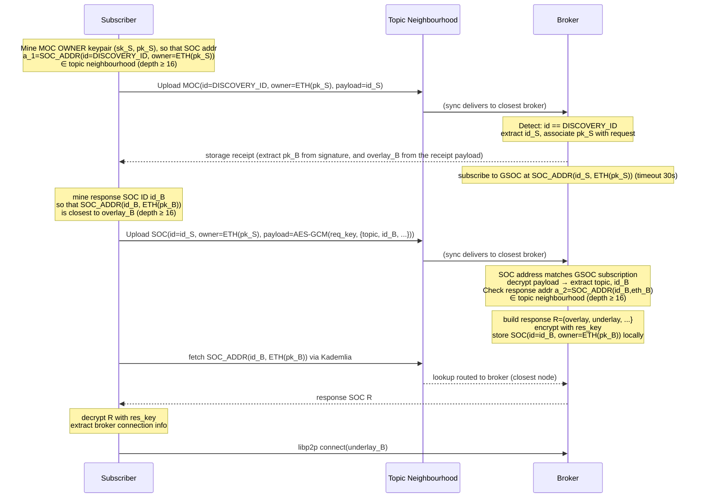

## Simple Summary

A real-time messaging feature for dApps: WebSocket clients publish and subscribe to topic streams through Bee nodes, which act as the transport layer by leveraging their existing libp2p connections and bandwidth incentive system.

## Abstract

One designated node operates as a **Broker**: it accepts long-lived p2p streams and broadcasts them to all connected receivers. Other nodes connect as either a **Publisher** (send + receive) or a **Subscriber** (receive only). A WebSocket API on each Bee node serves as the bidirectional bridge between dApps and the p2p stream. Message format, validation and handshake logic are defined by a pluggable `Mode`; the initial mode `gsoc-ephemeral` uses SOC-style signing to authenticate pubsub messages in transit — these are not stored on the Swarm network as GSOC chunks. This SWIP also covers a decentralised broker discovery mechanism that locates a suitable broker for a topic based on Kademlia routing, with load balancing across multiple brokers deferred to a later milestone.

## Motivation

Swarm has two event-based primitives — GSOC and PSS — but both require full-node operation: the events arrive via Kademlia routing as part of pull/push syncing, which light clients do not participate in. For anyone not running a full node the only option is polling storage, which is slow and fundamentally not real-time. This leaves two unaddressed needs: real-time message exchange that does not require storing chunks on the network, and a way to channel network events that full nodes observe naturally out to light clients.

A brokered pub/sub layer fills several gaps at once:

- **Real-time applications** can exchange messages without long-term storage or polling.
- **Swarm network events** (e.g. incoming GSOC notifications) can be fanned out to light clients that would otherwise never see them.
- **Bandwidth incentives** — brokers are compensated for the data they transmit, creating a sustainable relay economy within Swarm.
- **Store-less uploads** — a publisher mode could let light clients push chunks to the network and pay by bandwidth rather than postage stamp.

The mode system ensures the protocol is not locked to any single message format and can evolve to cover these use cases incrementally.

## Specification

### Roles

```
Subscriber ──► (p2p stream, read-only)  ──►┐
                                            Broker  ──► rebroadcast to all subscribers
Publisher  ──► (p2p stream, read+write) ──►┘
```

| Role | Description |
|---|---|
| **Broker** | Opt-in (`--pubsub-broker-mode`). Validates publisher identity; re-broadcasts to all subscribers. |
| **Subscriber** | Dials broker; receives all broadcasts. |
| **Publisher** | Upgraded subscriber; sends mode-specific messages to the broker; also receives broadcasts. |

### Protocol

- **libp2p**: `pubsub/1.0.0`, stream name `msg`
- Topic address and mode are negotiated via **libp2p stream headers** (not the stream name)

#### Stream headers (client → broker)

| Key | Value |
|---|---|
| `pubsub-topic-address` | 32-byte topic address |
| `pubsub-mode` | 1-byte mode ID |
| `pubsub-readwrite` | `0x01` publisher / `0x00` subscriber |
| `pubsub-gsoc-owner` | 20-byte ETH address _(GSOC-Ephemeral mode, publisher only)_ |
| `pubsub-gsoc-id` | 32-byte SOC ID _(GSOC-Ephemeral mode, publisher only)_ |

#### Wire format

All broker→subscriber frames share a common 1-byte type prefix. `0x01` is permanently reserved at the service level (ping, valid across all modes); the broker sends a ping every 30 s to keep the long-lived stream alive. 
Mode-specific types start at `0x02`. 

```
Broker → any subscriber:
[ 0x01 ]   ping  (service level, all modes — no further fields)
[ 0x02+ ]  mode-specific frame
```

Publisher→Broker framing is mode-specific and carries **no message type prefix** — the broker knows the stream is a publisher stream from the `pubsub-readwrite` header set at connect time.

#### GSOC Ephemeral mode (mode 1)

Messages are SOC chunks. The topic address is `soc.CreateAddress(socID, ownerAddr)`, so only the holder of the topic private key can publish. The broker verifies the ECDSA signature on every message before broadcasting.

```
Publisher → Broker:
[ sig: 65 B ][ span: 8 B LE ][ payload: up to 4 KB ]

Broker → Subscriber:
[ 0x02 ][ SOC ID: 32 B ][ owner: 20 B ][ sig: 65 B ][ span: 8 B ][ payload ]  handshake (first msg)
[ 0x03 ][ sig: 65 B ][ span: 8 B ][ payload ]                                  data (subsequent)
```

The handshake frame carries SOC identity once on first broadcast; subsequent messages are data-only. The subscriber verifies `soc.CreateAddress(id, owner) == topicAddress` on handshake receipt.

### WebSocket API

```
GET /pubsub/{topic}   — WebSocket upgrade (subscriber or publisher)
GET /pubsub/          — list active topics
```

Connection parameters are accepted as HTTP headers or query params (query param fallback for browser WebSocket clients that cannot set custom headers):

- `Swarm-Pubsub-Peer` (required): multiaddr of the broker
- `Swarm-Pubsub-Gsoc-Eth-Address` + `Swarm-Pubsub-Gsoc-Topic` (optional, GSOC Ephemeral mode): enable publisher role

The WebSocket client sees the mode's raw payload; all p2p framing is transparent. For GSOC-Ephemeral mode: `[sig: 65 B][span: 8 B][payload]`.

### Multi-session multiplexer

Multiple WebSocket sessions on the same node and topic share one p2p stream:

```
WS session 1 ──┐
WS session 2 ──┤  SubscriberConn (shared stream + runMux goroutine)  ──► Broker
WS session N ──┘
```

`runMux` reads from the stream and fans out to per-session channels. Ref-counting (`refs`) ensures `FullClose` is called exactly once when the last session exits. If the stream dies, the shared conn is cleared immediately so new sessions open a fresh stream.

### Mode extensibility

The `Mode` interface decouples the protocol machinery from message semantics:

```
type Mode interface {
    Connect(...)         // open stream with appropriate headers
    HandleBroker(...)    // broker-side stream handler
    ReadBrokerMessage()  // decode one broker→subscriber frame
    FormatBroadcast()    // encode one broker→subscriber frame
    ValidatePublisher()  // verify publisher identity
    ...
}
```

New modes can be added by implementing `Mode` and registering a mode ID. Candidates include: unauthenticated broadcast, stake-gated publishing, Swarm-event fan-out, or bandwidth-incentivised chunk upload.

## Roadmap

### Milestone 1 — Direct messaging _(this SWIP)_

Two-directional messaging between a broker and its direct peers over a dedicated libp2p channel. Top-down message broadcast with per-message authentication.

Deliverables: pubsub protocol in Bee, WebSocket + topic-list API endpoints, pubsub JS library.

### Milestone 2 — Bandwidth incentives

The broker–subscriber stream is a metered channel: the subscriber pays the broker/forwarder per chunk via chequebook cheques (incorporating Swarm's bandwidth incentive model).

- Subscription connection query returns incentive params (price in PLUR/chunk, cheque threshold).
- Bee gains a pubsub cashout option for accumulated cheques.
- Light clients require a funded chequebook and a blockchain connection.

### Milestone 3 — Decentralised broker discovery

Make the broker underlay address parameter optional. Instead of the client hardcoding a broker, it discovers an eligible broker node through a two-phase handshake using MOC and GSOC chunks (see [SWIP-42](https://github.com/ethersphere/SWIPs/pull/80)) targeting the topic's neighbourhood. No on-chain registry is required — broker public keys are discovered in-band via storage receipts. The protocol requires targeted chunk delivery and retrieval to/from the closest responsible node (see e.g. [bee#5081](https://github.com/ethersphere/bee/pull/5081)).

#### Protocol constants

```
DISCOVERY_ID   = keccak256("PUBSUB-REQUEST") // MOC ID for discovery
```

Broker nodes continuously watch for incoming SOCs whose ID matches `DISCOVERY_ID`. This is a single, network-wide subscription filter.

#### Workflow



#### Phase 1 — Discovery request (MOC)

1. The subscriber generates a random 32-byte `id_S`.
2. The subscriber mines a keypair `(sk_S, pk_S)` such that `soc.CreateAddress(DISCOVERY_ID, ETH(pk_S))` falls within the topic's neighbourhood (PO ≥ 16 relative to topic address).
3. The subscriber uploads a MOC with `id = DISCOVERY_ID`, `owner = ETH(pk_S)`, and `id_S` as payload. Push-sync routes the chunk to the topic neighbourhood.
4. A broker node in the topic neighbourhood detects the incoming SOC (`id == DISCOVERY_ID`), stores it, extracts `id_S`, and associates `pk_S` with the request.
5. The broker returns a **storage receipt**. The subscriber extracts `pk_B` and the broker's overlay address from the receipt signature.
6. The broker subscribes to GSOC events on address `soc.CreateAddress(id_S, ETH(pk_S))`. This subscription times out after 30 seconds if no matching SOC arrives.

#### Phase 2 — Encrypted handshake (GSOC)

7. The subscriber mines a SOC ID `id_B` such that `soc.CreateAddress(id_B, ETH(pk_B))` is closest to the broker's overlay (PO ≥ 16).
8. The subscriber uploads a SOC with `id = id_S`, `owner = ETH(pk_S)`. The payload is encrypted with the ECDH-derived key:
   ```
   shared  = ECDH(sk_S, pk_B)
   req_key = keccak256(shared ‖ 0x00)
   nonce   = keccak256(req_key) [:12]
   payload = AES-256-GCM(req_key, nonce, { topic, id_B, chequebook_addr, ... })
   ```
9. The broker (subscribed to GSOC at `soc.CreateAddress(id_S, ETH(pk_S))`) receives the SOC, decrypts the payload, and extracts `topic` and `id_B`.
10. The broker verifies that `soc.CreateAddress(id_B, ETH(pk_B))` falls within the topic neighbourhood (PO ≥ 16).
11. The broker builds response `R = { overlay, underlay, incentive_params, hive_conn_list }`, encrypts it symmetrically:
    ```
    shared  = ECDH(sk_B, pk_S)
    res_key = keccak256(shared ‖ 0x01)
    nonce   = keccak256(res_key) [:12]
    C_res   = AES-256-GCM(res_key, nonce, R)
    ```
12. The broker creates a SOC signed with `sk_B` at address `soc.CreateAddress(id_B, ETH(pk_B))` and stores it locally.
13. The subscriber fetches the response SOC via Kademlia lookup (routed to the broker as the closest responsible node), decrypts with `res_key` derived from the same ECDH shared secret, and connects to the broker via libp2p.

#### Encryption — ECDH + AES-256-GCM

Both the Phase 2 SOC payload and the response SOC payload use AES-256-GCM keyed by an ECDH shared secret. Both parties can compute the shared secret independently: `ECDH(sk_S, pk_B) = ECDH(sk_B, pk_S)` — the subscriber knows `sk_S` (mined in Phase 1) and `pk_B` (from the storage receipt); the broker knows `sk_B` and `pk_S` (from the Phase 1 MOC).

Request and response derive separate keys to avoid nonce reuse:

```
shared  = ECDH(sk_S, pk_B)          // = ECDH(sk_B, pk_S)
req_key = keccak256(shared ‖ 0x00)  // Phase 2 payload encryption
res_key = keccak256(shared ‖ 0x01)  // response SOC encryption
nonce_* = keccak256(key) [:12]      // deterministic per key
```

AES-256-GCM provides authenticated encryption. Because `sk_S` is unique per discovery session (freshly mined), the derived keys and nonces are never reused, satisfying GCM's uniqueness requirement. Forward secrecy is provided by the ephemeral nature of `sk_S`.

#### Postage stamps

The subscriber needs a postage stamp for the SOC uploads. The broker does not need a stamp for the response SOC — it is stored locally and served directly on fetch. Once [SWIP-36](https://github.com/ethersphere/SWIPs/pull/70) (free uploads) is adopted, the subscriber's stamp requirements can be lifted.

#### Rationale

The two-phase MOC/GSOC handshake avoids several problems that a simpler single-round or registry-based discovery would face:

- **No on-chain registry** — the broker's public key and overlay are discovered in-band via the storage receipt, removing any blockchain dependency for discovery.
- **No concurrent requester collision** — the response is a separate SOC at a unique mined address per session; multiple subscribers never interfere with each other.
- **No caching problem** — the response SOC is a new chunk stored locally by the broker, not an overwrite of the request chunk, so stale cached copies are not an issue.
- **No single-node targeting** — any broker in the topic neighbourhood can respond to the MOC; if one is offline, another picks it up.
- **Address-level filtering over owner-level filtering** — GSOC subscription matches on the exact SOC address `soc.CreateAddress(id_S, ETH(pk_S))` rather than on `owner` alone (as MIC subscription would), so the broker processes only the specific chunk it expects and ignores any unrelated SOCs that happen to share the same owner key.

#### Security considerations

1. **MOC flooding (DoS on Phase 1)** — An attacker can flood MOC chunks with `id = DISCOVERY_ID` to a topic neighbourhood. Each MOC only causes the broker to create a lightweight subscription hook (30s timeout), so the cost to the broker is minimal (memory for pending subscriptions). The attacker must also mine a keypair per chunk targeting the topic neighbourhood. Bandwidth incentives provide a baseline rate limit: the attacker pays per chunk forwarded. Brokers can cap the number of concurrent pending subscriptions.
2. **Phase 2 flooding (DoS on GSOC)** — An attacker observing the Phase 1 MOC learns `ETH(pk_S)` and `id_S`, but the GSOC subscription matches on the full SOC address `soc.CreateAddress(id_S, ETH(pk_S))`, so the attacker must forge a SOC at that exact address. Even then, the payload must be encrypted with the ECDH-derived key — a garbage SOC will fail decryption and be discarded. The attacker cannot produce a valid encrypted payload without `pk_B` (obtained only via storage receipt to the original requester).
3. **Response SOC mining cost** — The subscriber must mine `id_B` such that `soc.CreateAddress(id_B, ETH(pk_B))` is close to the broker overlay.
4. **Timing window** — The broker's GSOC subscription on `soc.CreateAddress(id_S, ETH(pk_S))` has a 30s timeout. The subscriber must complete Phase 2 (mine `id_B` + upload SOC) within this window. Mining at depth 16 is fast, so this is not a practical concern.

New API endpoint: `GET /pubsub/discover/{topic}?mode=<id>` — returns broker connection data for the given topic.

### Milestone 4 — Load balancing and multi-level forwarding

Balance subscriber load across multiple brokers. Introduce HIVE-like forwarder discovery and a multi-level forwarding tree so traffic is distributed across willing relay nodes rather than concentrated on a single broker.

```
              Root (broker / neighbourhood node)
             /        |         \
        Relay A    Relay B    Relay C
        /    \        |
    Sub 1   Sub 2   Sub 3   ...
```

- Forwarders earn relay fees; they are incentivised to forward to more than one downstream client.
- Light-client-to-light-client connections (both behind NAT) use DCUtR with the broker as the relay, enabling direct p2p streams without a persistent intermediary.

## Rationale

- **Broker topology** keeps the subscriber implementation simple and connection count low; brokers can be specialised nodes.
- **GSOC Ephemeral mode** reuses existing SOC signing infrastructure and provides per-message authenticity without additional key exchange. It is the first mode, not the only one.
- **Shared p2p stream per topic per node** avoids redundant connections when multiple browser tabs open the same topic.
- **Type-byte framing** with a reserved service-level slot (`0x01` = ping) allows future modes to be added without breaking the keepalive mechanism.

## Backwards Compatibility

This is a new protocol (`pubsub/1.0.0`) with no overlap with existing Bee protocols. Broker mode is opt-in. No existing behaviour is affected.

## Test Cases

- Broker correctly re-broadcasts a valid publisher message to all connected subscribers.
- Broker rejects a message that fails mode validation (e.g. invalid SOC signature in GSOC-Ephemeral mode).
- Multiple WebSocket sessions on the same topic share one p2p stream (ref count increments/decrements correctly).
- Stream failure clears the shared conn; next session opens a fresh stream.
- Ping frames are consumed at service level and not forwarded to the WebSocket client.

## Implementation

Reference implementation (Milestone 1):
- Bee node: [ethersphere/bee#5435](https://github.com/ethersphere/bee/pull/5435) (`feat/pubsub` branch)
- bee-js client: [ethersphere/bee-js#1151](https://github.com/ethersphere/bee-js/pull/1151)

## Copyright

Copyright and related rights waived via [CC0](https://creativecommons.org/publicdomain/zero/1.0/).
