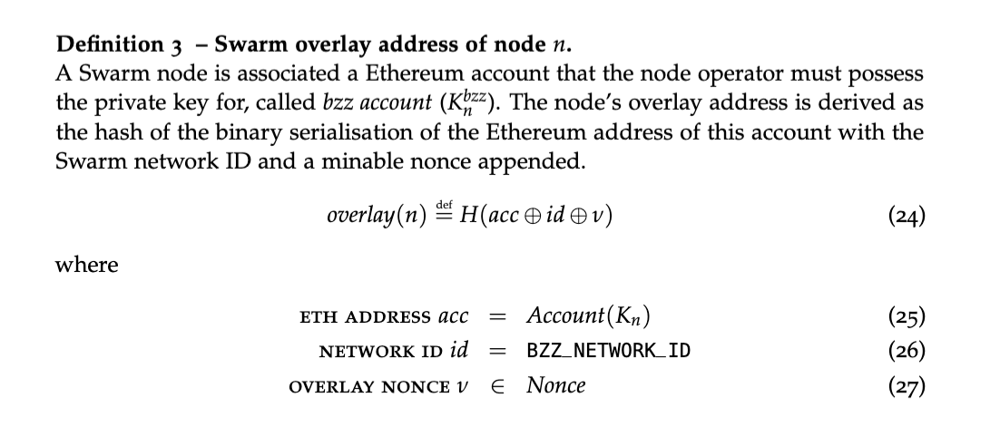

## Abstract

This SWIP describes how to support **neighbourhood hopping**, i.e., moving a node to another neighbourhood without the need to pay the stake each time.

## Objectives

The same node may change its overlay address while preserving the stake it already had.

## Context

Neighbourhood hopping is currently supported by the bee client. The overlay address (which specifies which neighbourhood the node falls into) is derived from the node key by hashing it together with an arbitrary overlay nonce chosen by the user (see figure below). 

Bee already supports putting one's node in an arbitrary neighbourhood by mining an overlay nonce that will result in the corresponding neighbourhood.

Currently, the staking smart contract associates a stake with an overlay address. Therefore, neighbourhood hopping requires the node operator to re-stake their node. This is considered unfair and against the spirit of the system, because the ability to change neighbourhoods is a prerequisite for the balanced distribution of nodes in the network.

## Specification

To support neighbourhood hopping with transferrable stakes, the staking contract should register the user's Ethereum address, not their overlay address.

## Implementation notes

The implementation requires two indices: one keyed by the Ethereum address and another one keyed by the overlay address (as before). The staking API already requires the sender to send the so-called overlay nonce  to the nodes to calculate the overlay address. Therefore, there is no change in the interface functions. However, their semantics will be changed: now, in the case of a new overlay nonce, the old node overlay address should be deleted.

The stake endpoint:
1. Look up stake in the index by Ethereum address.
2. If not found, insert it in the same index with overlay calculated from the address and the nonce sent as part of transaction data. Then go to 4.
3. If found, remember old overlay, and update the entry of the Ethereum address with it into the same index.
4. Remove the old entry in the other index (keyed by overlay), and insert new overlay value updated with additional funds.

## Backward compatibility

Since we are changing how information is passed (both the overlay address and the Ethereum address), this change is not backwards-compatible.

## Test cases

Case study, with individual items needing to be tested:
1. Can one stake a node?
2. Is it then possible to change neighbourhoods?
3. If so, then did that happen with the stake transferred without a change?

## Copyright

Copyright and related rights waived via [CC0](https://creativecommons.org/publicdomain/zero/1.0/).
