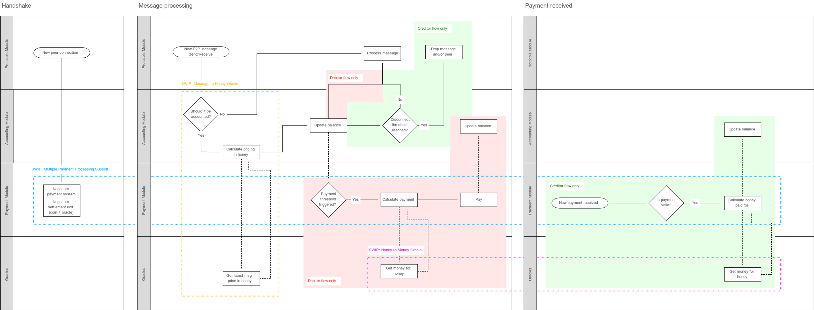

<!--You can leave these HTML comments in your merged SWIP and delete the visible duplicate text guides, they will not appear and may be helpful to refer to if you edit it again. This is the suggested template for new SWIPs. Note that a SWIP number will be assigned by an editor. When opening a pull request to submit your SWIP, please use an abbreviated title in the filename, `SWIP-draft_title_abbrev.md`. The title should be 44 characters or less.-->
 
## Simple summary
<!--"If you can't explain it simply, you don't understand it well enough." Provide a simplified and layman-accessible explanation of the SWIP.-->
Swarm needs a mechanism to set prices which makes sense relative to other (distributed storage) services in the market. As the absolute price of using Swarm is defined by the cost of honey (Swarm's internal accounting unit), this SWIP proposes a minimal interface to enable updating honey prices, network-wide and for all nodes. The specifics on what an efficient price should reflect and how the update process looks like is *not* part of this SWIP.

## Abstract
<!--A short (~200 word) description of the technical issue being addressed.-->
We define `honey` as the Swarm accounting unit. Since `honey` is not a currency in which nodes can settle their balances with each other there should exist a mechanism to convert honey to a given currency: the honey-to-money oracle.

It is expected that the price of using Swarm will change over time to reflect the changing economic landscape as well as to facilitate experimentation. Such price updates must happen atomically to prevent accounting unbalances from appearing. To lay the groundwork for enabling such price changes, this SWIP proposes a minimal interface for a *price-oracle*. Furthermore, this SWIP includes a proposal for implementing an *on-chain* price oracle, governed by Swarm developers and stakeholders to allow for experimentation.
 
This SWIP is part of a series of SWIPs (but can be implemented on its own). To see the full picture, please refer to [swip-message_to_honey](https://github.com/Eknir/SWIPs/blob/SWIP-message_to_honey/SWIPs/swip-message_to_honey.md), [swip-multiple_payment_processing_support](https://github.com/Eknir/SWIPs/blob/SWIP-multiple_payment_processing_support/SWIPs/swip-multiple_payment_processing_support.md) and the diagram below:

 
## Motivation
<!--The motivation is critical for SWIPs that want to change the Swarm protocol. It should clearly explain why the existing protocol specification is inadequate to address the problem that the SWIP solves. SWIP submissions without sufficient motivation may be rejected outright.-->
Nodes keep track of balances relative to each other using an internal reference unit: honey. Since honey is not a currency in which nodes can settle their balances with each other—it is merely a unit of account—there is a requirement to facilitate converting honey to a currency. Furthermore, it is desirable that this conversion rate can fluctuate to reflect the changing economic landscape and facilitate experimentation.

This update process should be atomic: either all nodes update or none of them do. The current implementation hardcodes honey prices in the source code. This violates the atomicity requirement as there is no guarantee that all Swarm nodes are on the same release. By externalizing the price to an oracle, Swarm completely decouples its core functions from price discovery. By building support for price oracles, it will be possible to coordinate price changes across the network and set the stage for future experimentation with various mechanisms for setting prices, from fixed prices to DAOs or to bonding curves.

## Specification
<!--The technical specification should describe the syntax and semantics of any new feature. The specification should be detailed enough to allow competing, interoperable implementations for the current Swarm platform and future client implementations.-->
* The `honeyToMoneyOracle` (being an instance which runs on the Swarm node) fetches its data from one specific endpoint (the external oracle). This endpoint is included as a part of the `honeyToMoneyOracle` implementation in the Swarm source-code, but can be adjusted by the node if so desired (e.g. via config and/or flag).
* If two nodes query the external oracle at the same time, the external oracle gives the same answer.
* A `honeyToMoneyOracle` returns the most up-to-date `honeyPrice` to other components of the Swarm.
* Internally, the `honeyPrice` is decided by the `honeyToMoneyOracle` by building a strucure like the `honeyPrice` object. `honeyPrice` specifies a `Time To Live (TTL)` in seconds and a `price` object. The `price` object maps all `validFrom` entries to their respective `price`. `validFrom` is a UNIX timestamp and `price` is the price of one honey unit, denominated in `currency`. It is up to the implementation of the `honeyToMoneyOracle` to decide on the actual structure to use. To summarize, the oracle may return:
```
{
   "honeyPrice": {
       "TTL": <TTLValue>,
       "price": {
           "validFrom0": <price0>,
        …,
           "validFromN": <priceN>
       },
       "currency": "currencyX"
   }
}
```
An example of this could be:
```json
{
   "honeyPrice": {
      "TTL": 3600,
       "price": {
           "1566396921": 80000,
           "1566400521": 80800
       },
       "currency": "Wei"
   }
}
```
where we see that the TTL is `3600` (1 hour), and that the oracle has quoted a total of two prices. If the current time is in between `1566396921` and `1566400521`, the `honeyToMoneyOracle` will return the price of `80000`, if the time is after `1566400521`, it will return the price of `80800`. Since the `TTL` is `3600`, `honeyToMoneyOracle`s are guaranteed to have queried the external oracle in between this time, thus ensuring that they all update simultaneously.
* Any answer from the external oracle will be valid to the `honeyToMoneyOracle` for `TTL` seconds.
* The applied price is chosen by looking up the price corresponding to the `validFrom` which is in the most recent past.
* Upon receipt of payment or intent to send a payment, nodes will query the `honeyToMoneyOracle` who checks its local cache for the `honeyPrice` object. If it is not valid anymore or non-existent, the external oracle will be queried. Otherwise, the cached price which is in the most recent past will be returned.


## Rationale
<!--The rationale fleshes out the specification by describing what motivated the design and why particular design decisions were made. It should describe alternate designs that were considered and related work, e.g. how the feature is supported in other languages. The rationale may also provide evidence of consensus within the community, and should discuss important objections or concerns raised during discussion.-->
### General rationale for choosing oracles
There exists a need for the price of Swarm to change over time. However, due to the nature of Swarm, there is a need for this price to be decided network-wide, instead of peer-to-peer. Specifically:
#### Connectivity
In order for a node to have Kademlia connectivity, it must be connected to all peers in his most proximate bin and *at least* one peer for each proximity order up to the saturation depth (see [architecture docs](https://swarm-guide.readthedocs.io/en/latest/architecture.html#overlay-network)). For SWAP to work, nodes must have the certainty that they will be able to reach an agreement on the price when they have to settle their balance. Hence, in the situation that nodes agree on the price peer-to-peer, this price *must* be decided upon the point when nodes connect. As it might happen that they don't come to an agreement on price and hence don't connect, Kademlia connectivity cannot be guaranteed when prices are to be decided peer-to-peer—in particular because of the requirement of connectivity to all nodes in the most proximate bin.
#### Market situation
Zero marginal costs of serving data with perfect competition means that when nodes would engage in peer-to-peer price discovery, the price will tend to zero and a sub-optimal equilibrium of near-zero prices will be reached.
#### High-volume
The high-quantity of transactions implies that nodes cannot engage in price-discovery for every byte of data transacted, meaning they have to agree *beforehand* on how they will come to a price *at a later time*.
#### Conduits
Nodes are most of the time just conduits for data and payments, meaning that most of the time data requests (and thus also payments) will take place because nodes want to send data to a peer who requested this data from them.

### Discussion on time differences causing imbalances
#### Delay between sending and receiving a payment
Nodes might apply different honey prices for the same payment, due to a time difference between applying a price for *sending* a payment and applying a price for *receiving* the same payment. The imbalances caused by this don't do significant harm if the sum of all imbalances is not greater than the disconnect threshold. Theoretically, if the overall price movement does not show a clear trend (either up or down) over the period where nodes do business with each other, or the two nodes are neither a net receiver nor a net provider to each other, accounting imbalances should offset each other. Furthermore, less frequent as well as small price updates should minimize the imbalances. If a clear trend exists and one node is a net receiver and the other a net provider, the disconnect threshold will eventually be reached. Research must be performed on how the strength of a trend influences the duration until a disconnect is reached for a given stream of traffic and whether this is expected to cause harm to the connectivity in Swarm. The assumption is that this will not be the case for a typical Swarm node. 

If there appears to be a problem with such imbalances, we see a possible solution: as nobody benefits from price imbalances, both the sender and the receiver of a payment are incentivized to apply a price which is not per their clock, but per the clock of the counterparty when they expect the counterparty to query or have queried the oracle. To assist in this, a payload might be sent with the transaction, specifying the clock with which the oracle price was applied.

#### Temporary hard forks
An on-chain oracle *might* give a different answer to two nodes when queried at the same time if there exists a (temporary) fork in the blockchain. If a imbalance due to such forks becomes common and causes the disconnect threshold to be reached for a significant number of nodes, we may require that any price update by the oracle is only valid after it has received a certain number of confirmations (i.e. has happened a certain number of blocks ago).

## Backwards Compatibility
<!--All SWIPs that introduce backwards incompatibilities must include a section describing these incompatibilities and their severity. The SWIP must explain how the author proposes to deal with these incompatibilities. SWIP submissions without a sufficient backwards compatibility treatise may be rejected outright.-->
Currently, Swarm is not running with a live testnet for setting prices. Therefore, no compatibility problems are expected if the SWIP is implemented before the currently implemented Swarm incentivisation goes live. Should that not be the case and this SWIP is adopted at a later stage, non-up to date nodes may be over time dropped due to different honey prices.

## Test Cases
<!--Test cases for an implementation are mandatory for SWIPs that are affecting changes to data and message formats. Other SWIPs can choose to include links to test cases if applicable.-->
Not currently available
 
## Implementations
<!--The implementations must be completed before any SWIP is given status "Final", but it need not be completed before the SWIP is accepted. While there is merit to the approach of reaching consensus on the specification and rationale before writing code, the principle of "rough consensus and running code" is still useful when it comes to resolving many discussions of API details.-->
* Swarm's initial implementation of the `honeyTo MoneyOracle` is composed of two pieces: a `honeyToMoneyContract` (which runs as a smart-contract on the Ethereum blockchain), and a `honeyToMoneyOracleWrapper` (which runs locally by the node). The responsibility of the `honeyToMoneyContract` is to emit all relevant information, while the responsibility of the `honeyToMoneyOracleWrapper` is to piece all this information together into a structure which is useful for the node. 
* The Swarm `honeyToMoneyOracle` will reference an Ethereum address of a `HoneyToMoney` price oracle smart contract. This smart contract will fulfill the role of the external oracle.
* The currency in which the oracle quotes its price is Wei.
* The `honeyToMoneyContract` implements the `HoneyToMoney` interface (to be specified). 
* The `HoneyToMoneyContract` will initially be governed in such a way that a subset of stakeholders can make decisions which are not high-impact (i.e. decide on small price changes) but the involvement of all stakeholders is required to make high-impact decisions (such as changing the implementation of the oracle, changing governance, deciding on big price changes, etc). This semi-governance structure is in place to allow experimentation with an update process of honey prices and is not a recommendation for a price update process when honey is quoted in a currency worth real money.

## Copyright Waiver
Copyright and related rights waived via [CC0](https://creativecommons.org/publicdomain/zero/1.0/).