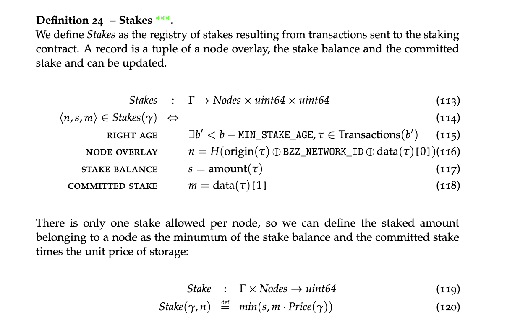

## Abstract

Currently, a storer node's stake to buy their way into the redistribution game, is permanently locked which means that returns on this stake are solely based on the ROI of the redistribution game. The purpose of this SWIP is to change this and allow users to withdraw part of their stakes.


## Objectives

Should the value of a user's stake increase, they should be able to withdraw the appreciation, i.e., the portion of the value that is above the amount required to play and safeguard the system.
How it works is if BZZ price goes up, more node operators join because of that, the storage price goes down which makes commitedStake value in BZZ lower than potentialStake, which means the node operator can take out funds.


## Context

Currently, the smart contract can only increase a node's stake by sending additional collateral. Importantly, it does not allow node operators to  decrease their stake or any other way to fully or partially withdraw their stake. This limitation is what will be changed with this feature.


## Specification

This section describes how stakes should be created, modified, computed, and withdrawn. Since this is orchestrated by the [**Staking Contract**](https://github.com/ethersphere/storage-incentives/blob/master/src/Staking.sol), implementing this SWIP consists predominantly of changes to this smart contract. 

### Concepts

#### *balance or potential stake*
The contract keeps a balance of bzz tokensw associated with a node (and not an overlay as of SWIP-19). Every time a `stakeDeposit` function is called, the amount of bzz sent with the transaction is added to this balance.

#### *committed stake*

The committed stake is interpreted as the stake that the staker commits to stake. It is denominated not in bzz, but the commodity unit that it is meant to secure: unit price of storage rent.
  
Expressed in bzz it is `committedStake * unitPrice`. Initially, the committed stake aligns with the balance, in that the node's committed stake in bzz is fully covered by the node's balance, however as the unitPrice changes (as a consequence of either cost changes, competition or bzz token price change), the committed stake can be under or overcollateralised by the actual stake balance.
 
#### *Effective stake*

The effective stake is the largest portion of the committed stake expressed in bzz that has 
collateral.


### The stake endpoint

through calling `manageStake` function 
1.  The Staking contract accepts the same arguments as before, which are addAmount and setNonce
2.  The contract then adds the amount to the stake entry for the address of `txorigin` and transfer funds from node to contract.
 This sum can be referred to as the *potential stake balance*, denoted as `potentialStakeBalance`.
3. Contract also calculates committedStake as value that is derived from addAmount/unitPrice, unitPrice is gathered from priceOracle contract with currentPrice() function

### The new withdraw stake endpoint
Withdrawal comprises the following steps:

1.  Calculate the *effective stake* as:
```
    effectiveStake = min(committedStake * unitPrice, potentialStakeBalance)
```
2.  Calculate the *surplus stake* as:
```
    surplusStake = potentialStakeBalance - effectiveStake
```
3.  If `surplusStake > 0` then send `surplusStake` back to `txorigin`

### The stake accessor endpoint

Most importantly, the function called by the redistribution contract that calculates the stake of an overlay should now return the *effective stake* (as per step 1 above) rather than the *potential stake balance* as it currently does.

```
    effectiveStake = min(committedStake * unitPrice, potentialStakeBalance)
```

The calculation of the stake amount used for the weights determining truth and winners



## Implementation notes

### Minimum stake

Currently, the minimum stake is checked [in the redistribution game contract](https://github.com/ethersphere/storage-incentives/blob/master/src/Redistribution.sol#L300). If the amount is found to be less than the minimum stake the commit fails.
Without any further changes to the contract, this is a discrepancy.
Instead, the staking contract should perform this check only once when the stake is registered for a particular node. Most importantly if the price of BZZ goes up and the committed stake is covered by less than 10BZZ, then the node is allowed to withdraw the surplus. It is important that in this case the minimum stake requirement is no longer enforced. 
Conversely, if the price of BZZ decreases and the minimum stake is worth less, no additional checks are required. 

### Neighbourhood hopping

We are modifying the contracts, specifically the staking contract, to attribute stake to the address rather than the overlay. This will facilitate stake mobility when changing neighbourhoods, allowing nodes to migrate and distribute themselves across the network. (see SWIP-19)

### Swarm API changes
- *API Stake endpoint:*
   For the staking node, the parametars that are set are same as in swip-19, which is sending value and nonce
- *API stake accessor:*
  When the sync
- *API support for withdraw:*
  API endpoint for excess stake withdrawal should be added to the client.

The client code should be amended to be compatible with new ABI for the staking contract.


### UX recommendations
Any UX for staking would benefit from displaying relevant context to users when they are selecting parameters:
- **Current value of (potential) stake balance:** Display the current amount of stake that has been staked by the user. 
- **Surplus balance:** Display any surplus balance that is available for withdrawal if any (how to calculate this is mentioned above).

  
## Backward compatibility

Upgrading the staking contract implies pausing the old version, making backward compatibility irrelevant.
Since new contract addresses are hard coded into the client code, operators should upgrade their client in order to participate in the storage incentive game.

<!-- Question: would currently staked nodes be able to withdraw after the upgrade, or would they need to re-stake, with the previous stake lost? -->

## Contract migration
Due to the contract upgrade, the deployment of this SWIP involves a migration process. As part of this, the old staking contract will be paused, allowing users to withdraw their stake and reinvest in the new staking contract with new parameters. This process facilitates free movement of stakes when changing neighbourhoods and necessitates a user-story testing session to ensure the migration steps are clear and functional.


## Test cases

0. Bootstrapping:
	- Manually set price oracle to a unit price of `0.1BZZ`
	- Set up nodes `A` and `B`
1. Initial staking
	- Check that staking below the required minimum fails with the appropriate error 
	- Ensure that staking A with 10BZZ and 101 as the value of committed stake fails with the appropriate error
	- Confirm that staking A with 10BZZ and 100 as the value for committed stake succeeds. 
	- Validate that staking B with 1,000BZZ and 10,000 as the value for committed stake succeeds. 
2. Modifying stake balance and committed stake
   - Check if increasing A's committed stake to 200 without sending extra BZZ fails with the proper error
	- Send A 10BZZ with a transaction to bring the total stake to 20, maintaining 100 as the committed stake
   - Send 90,000BZZ with a transaction to bring the total stake to 100,000, maintaining 10,000 as the committed stake 
  
3. Resetting committed stake
    - Manually change the price in the price oracle
    - Confirm if it is possible to withdraw funds from the stake after the change
    - Check if, when the price of BZZ goes up, you are be able to withdraw your excess  

## Copyright

Copyright and related rights waived via [CC0](https://creativecommons.org/publicdomain/zero/1.0/).
