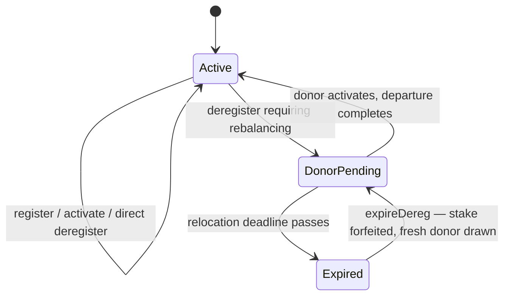
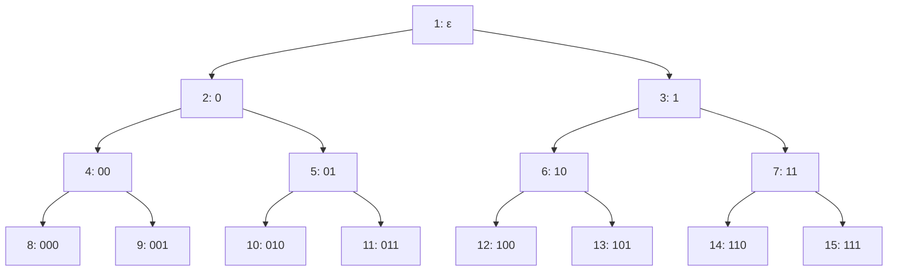
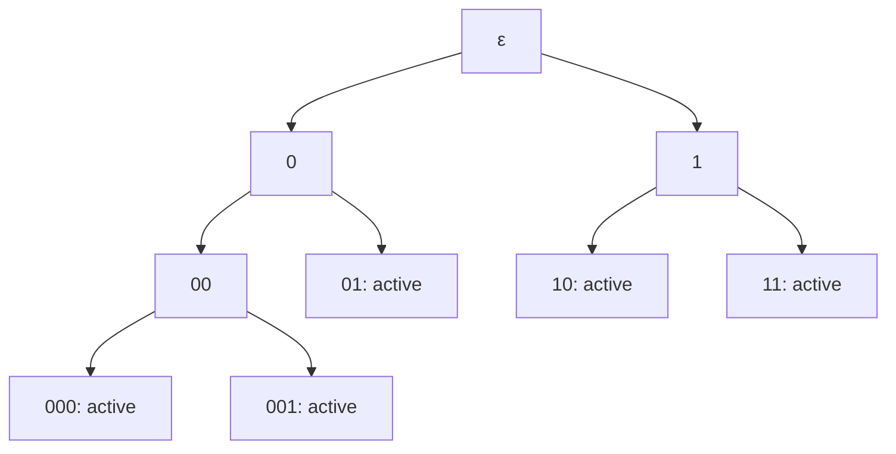
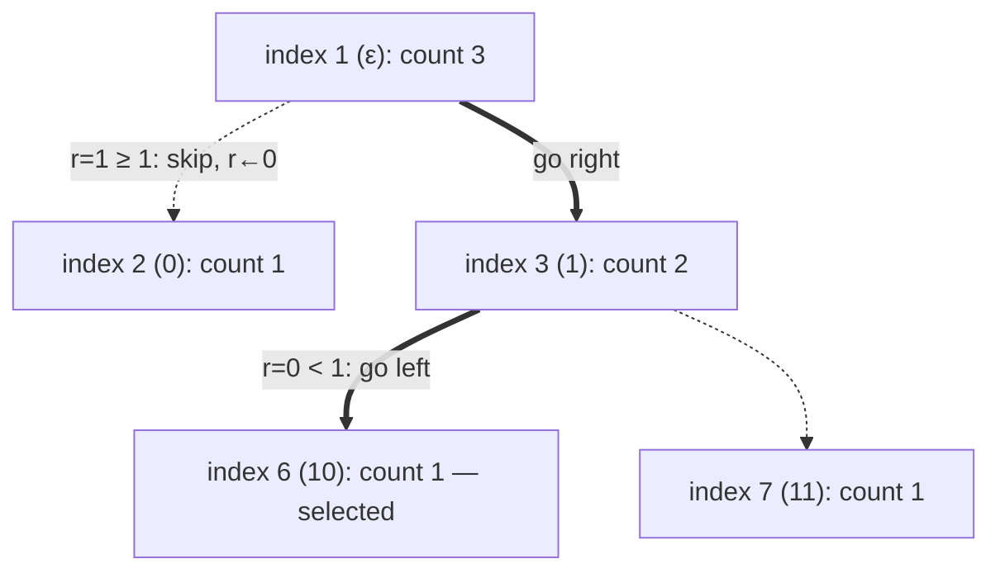

## Abstract

This SWIP specifies an on-chain registry that assigns participating Swarm nodes to overlay-address prefixes while maintaining balanced coverage of the address space. For $N$ active nodes, every node is assigned an area of responsibility at one of two adjacent depths, so the largest area is at most twice the size of the smallest.

A node joins in exactly two transactions: it first commits its identity, stake, and fee; then — after deriving its target prefix from post-commit blockchain entropy through a read-only calculation, with no reservation held by the registry — it mines a conforming overlay address and activates it. If the target neighbourhood is taken in the meantime, the calculation simply yields a new target. When a departure would violate the balance invariant, the registry reassigns an active node to the vacated position before completing the departure; the selected donor must relocate or else it is dropped and its stake forfeited.

The mechanism is intended to make targeted concentration in a particular neighbourhood probabilistic and costly, and to support balanced allocation of storage-incentive or decentralised-service workloads. It does not establish operator identity or prevent one operator from registering multiple nodes.

## Scope and goals

This SWIP defines the balance invariant maintained by the registry; the join, activation, and departure state transitions; the source and use of randomness; the contract state required to select prefixes and donor nodes; the integration points required by the swarm client; and the security and liveness assumptions of the mechanism.

The join procedure consists of two transactions, `register` and `activate`; everything between them — entropy finalization, target-prefix computation, and overlay mining — happens off-chain or through read-only calls. The registry holds no reservations: the target prefix is at all times a deterministic, read-only computation over current contract state. A target invalidated by an intervening activation simply yields a new target; under realistic churn such races are rare and cost only local mining work.

The mechanism is designed to achieve:

- complete coverage of the address space by disjoint areas of responsibility;
- a maximum factor of two between the largest and smallest areas;
- uniformly random selection among currently eligible split candidates or donor pairs;
- assignment that is unknown to an applicant when it commits stake and fees;
- a bounded, explicit procedure for failed joins and failed donor relocations;
- logarithmic contract work in the number of active nodes for selection and tree updates; and
- deterministic validation of assignments by the contract and swarm node clients.

The following are explicit non-goals:

- proving that two Ethereum addresses belong to different operators;
- enforcing one human or one operator per node;
- preventing a well-funded operator from registering many independently assigned nodes;
- defining the postage redistribution game itself;
- defining the stake amount, application fee, reward, or slashing schedule; and
- specifying the transfer of stored content between nodes (see [Data handover](#data-handover)).

Stake, fees, activation deadlines, and relocation deadlines are nevertheless security parameters. Their values MUST be specified by deployment configuration or by the staking specification on which a deployment depends.

### Terminology

**Address space** — the set $\Sigma^{256}$, where $\Sigma=\{0,1\}$.

**Overlay** — node overlay address derived from a node's public key, network ID, and overlay nonce using Swarm's canonical overlay derivation function.

**Prefix** — a bit string $p\in\Sigma^\ell$. Its length $\ell$ is its depth.

**Neighbourhood** — the subset of the address space that share a prefix.

**Leaf** — a prefix currently assigned to exactly one active node. Active leaves form a complete, prefix-free partition of the address space.

**Sibling/sister** — the other child of the same parent prefix. For $p=b_0\ldots b_{\ell-1}$, its sibling is $b_0\ldots(1-b_{\ell-1})$.

**Split candidate** — an active leaf at the current minimum depth $d$. A join splits this leaf into two child prefixes.

**Donor pair** — two active sibling leaves at depth $d+1$. One member can move to a vacated depth-$d$ leaf while the other expands to their shared parent.

**Registration** — a request to join that has committed an identity, stake, and fee before its assignment entropy is known.

**Deregistration** — a request to leave the sub-network.

**Pending departure** — a departure awaiting donor relocation.

**Active node count** — $N$, the number of activated nodes in the balanced partition. A pending registration is not active.

## Motivation

Swarm assigns work according to proximity in the overlay address space. A node is responsible for jobs, chunks, or protocol actions whose identifiers fall within an address range close to its overlay. If participating overlays cluster, some parts of the address space receive more providers than others, responsibility becomes uneven, and operators may deliberately co-locate identities.

A balanced registry replaces self-selected neighbourhood placement with random assignment among the prefixes that preserve complete coverage. Given uniformly distributed workload identifiers and broadly comparable job costs, balanced areas of responsibility provide approximately balanced expected work per node.

The mechanism is useful for a _decentralised service network (DSN)_: a set of nodes that commit to perform addressable jobs. It is also applicable to the postage redistribution game, where several nodes controlled by one operator should not be able to target the same storage neighbourhood cheaply and share a single reserve while presenting it as replicated storage.

Random assignment does not eliminate Sybil identities. It changes targeted placement from a direct choice into a probabilistic strategy. An operator attempting to acquire a particular prefix must fund multiple registrations, pay for abandoned or expired assignments, or operate nodes in all prefixes assigned to it. The economic effect therefore depends on the required stake, non-refundable fee, assignment deadline, and rules for selective aborts.

Fixed stake per active node is compatible with this construction because equally sized assignments then face the same nominal capital requirement. Variable stake may still be supported, but the reward and selection rules must not make a randomly assigned node systematically worse off merely because other nodes in the same neighbourhood carry more stake.

## Solution

Let $S=\{n_0,\ldots,n_{N-1}\}$ be the set of active nodes. Node $n_i$ has an Ethereum staking identity $a_i$, a Swarm node public key $P_i$, and an overlay $o_i\in\Sigma^{256}$. The staking identity MUST authorize the public key used to derive the overlay.

For a prefix $p\in\Sigma^\ell$, define:

$$
NH(p)=\{x\in\Sigma^{256}\mid \forall\,0\leq j<\ell,\ x[j]=p[j]\}.
$$

Equivalently, for a pivot address $x$ and depth $\ell$:

$$
NH(x,\ell)=\{y\in\Sigma^{256}\mid
\forall\,0\leq j<\ell,\ y[j]=x[j]\}.
$$

The registry associates each active node with one leaf prefix, and the node's overlay MUST fall within the neighbourhood designated by that prefix.

### Balance invariant

For $N=0$, the partition is empty. For $N\geq1$, define:

$$
d=\lfloor\log_2 N\rfloor.
$$

The active leaf set $L(S)$ is balanced if and only if:

1. every leaf has depth $d$ or $d+1$;
2. no leaf is a prefix of another leaf;
3. the leaves cover the entire address space; and
4. every leaf is assigned to exactly one active node whose overlay has that prefix.

The number of active leaves at each depth is:

$$
\left|\{p\in L(S)\mid |p|=d\}\right|=2^{d+1}-N,
$$

$$
\left|\{p\in L(S)\mid |p|=d+1\}\right|
=2N-2^{d+1}.
$$

These counts sum to $N$. There are $2^{d+1}-N$ split candidates and $N-2^d$ donor pairs.

Because a depth-$d$ neighbourhood has twice the address-space volume of a depth-$(d+1)$ neighbourhood, the largest area of responsibility is at most twice the smallest.

#### Preservation under insertion

If $N=0$, the first node is assigned the empty prefix $\epsilon$.

If $N\geq1$, a join selects one split candidate $p$ at depth $d$. Let the incumbent overlay's next bit be $b=o_{\mathrm{inc}}[d]$. The incumbent is reassigned to $p\mathbin\Vert b$, and the joining node is assigned:

$$
p_{\mathrm{new}}=p\mathbin\Vert(1-b).
$$

Replacing $p$ by its two children preserves disjointness and full coverage. When the insertion increases $N$ from $2^{d+1}-1$ to $2^{d+1}$, all leaves are at depth $d+1$, which becomes the new minimum depth.

#### Preservation under removal

Four cases exist:

1. If $N=1$, remove the sole root leaf and return to the empty partition.
2. If $N=2^d>1$, all leaves are at depth $d$. Remove the departing leaf and replace its sibling with their depth-$(d-1)$ parent.
3. If $N>2^d$ and the departing leaf has depth $d+1$, remove it.
4. If $N>2^d$ and the departing leaf has depth $d$, select _a donor pair_ at depth $d+1$, move one donor to the departing prefix.

Each transformation reduces $N$ by one and preserves the invariant once the required donor relocation has completed.

### Join protocol

The join protocol consists of exactly two transactions: `register` and `activate`. No reservation is held by the registry at any point.

#### 1. Register

The applicant submits:

- its staking identity $a_i$;
- its Swarm node public key $P_i$;
- the required stake;
- a non-refundable application fee.

The contract records the registration block height $h_i$ and appends the entry to the registration queue. An identity MUST NOT have more than one live registration or active assignment, so registrations are keyed by the staking identity itself — no separate request ID exists. The stake remains locked until the registration activates or expires according to the staking rules.

Registering does not modify the active prefix tree.

The registration is valid for a _validity window_ of $VW$ blocks. In practice $VW < 256$, the number of blocks for which a block hash remains available from within the EVM. Since block heights in the registration queue are monotonically increasing, entries expire from the front; a permissionless `expireReg` call advances the queue head past expired entries and burns their fees, without ever iterating the full queue.

#### 2. Compute the target prefix

After the configured entropy delay has passed, the applicant's target prefix is a deterministic, read-only computation over current contract state: the contract derives a seed as specified in [Randomness and anti-grinding measures](#randomness-and-anti-grinding-measures) and selects a split candidate uniformly among those currently eligible.

The computation is exposed as a read-only call taking the applicant's identity and returning the current constraint prefix and the registration deadline. Calling it repeatedly MAY return a different prefix if another activation landed in between; nothing is locked on the applicant's behalf.

For $N=0$, selection is omitted and the target is the empty prefix. There is no incumbent.

#### 3. Mine an overlay

The applicant mines a nonce $\nu_i$ such that Swarm's canonical overlay derivation:

$$
o_i=\operatorname{Overlay}(P_i,\operatorname{networkID},\nu_i)
$$

starts with the target prefix.

For a prefix of length $\ell$, mining takes $2^\ell$ trials in expectation. Implementations SHOULD expose progress and the registration deadline to the operator.

#### 4. Activate or expire

Before the deadline, the applicant submits $\nu_i$ and any proof required to bind the call to $a_i$. The contract:

1. derives or verifies $o_i$;
2. recomputes the target prefix from current state and verifies that $o_i$ starts with it;
3. either creates the root leaf when $N=0$, or replaces the selected leaf with the incumbent and applicant child leaves;
4. marks the applicant active;
5. updates aggregate tree counters; and
6. removes the registration from the queue.

If the tree changed between mining and activation, the recomputed target may differ and verification fails; the applicant recomputes and re-mines within its validity window. If the window lapses without activation, the registration expires and the application fee is forfeited. Additional stake penalties, if any, are defined by the staking specification.

### Departure and rebalancing

Nodes are free to deregister at any time. For registration and deregistration the contract maintains two distinct commit queues, $C_R$ and $C_D$, extended by the `register`/`deregister` transactions and cleaned by `expire`.

#### Direct collapse

Direct collapse applies when either:

- $N>1$ is a power of two; or
- $N$ is not a power of two and the departing leaf has depth $d+1$.

In both cases the departing node has an active leaf sibling, and collapsing that sibling to their parent produces the depth distribution required for $N-1$. The departure completes immediately: the contract removes the departing leaf, moves the sibling to the parent, and releases the departing stake as permitted.

If $N=1$, there is no sibling. The registry MAY remove the sole root assignment after the configured departure delay, leaving the service with no coverage. User interfaces MUST make this consequence explicit.

#### Donor relocation

If $N>2^d$ and the departing node is a depth-$d$ leaf, direct collapse would violate the invariant. The contract therefore relocates a donor:

1. the departure is committed by the `deregister` call, recording its block height before donor-selection entropy is known;
2. the contract selects a donor pair uniformly and one member of the pair as the moving donor;
3. the donor's own leaf is taken over by its sibling — the donor is removed exactly as if it had chosen to leave itself, which is a balanced removal since the sibling becomes unique at depth $d$;
4. the donor is entered into the commit queue as if newly registering, except that its recorded block height is the one set by the `deregister` call, and its target is fixed to the sibling prefix of the departing node;
5. the donor mines a new conforming overlay and activates it within the validity window; and
6. upon the donor's activation, the departing assignment is removed and the departure completes.

The donor MAY operate its old and new overlays concurrently during the transition.

If the donor fails to activate within the validity window, it is dropped from the registry and its stake is forfeited; a fresh donor is drawn with new entropy and the procedure repeats. The departing node remains active until a donor completes.

Any number of departures MAY pend concurrently: each records its own donor and relocation deadline, and a stalled donor delays only its own departure. Concurrent draws never collide, because the donor's sibling takeover is applied to the tree at draw time, so every draw selects from the currently remaining pairs. A leaf whose departure is pending is excluded from split-candidate eligibility, so a join cannot split a neighbourhood that is about to be vacated.

#### Data handover

This SWIP specifies only the assignment of nodes to neighbourhoods; the handover of stored content during relocation is deliberately left unspecified. A relocated node is expected to synchronise the reserve of its newly assigned neighbourhood, while the neighbourhood it vacated retains the data with the sibling node. With upcoming durability guarantees, such relocation gaps become repairable events; in particular, a newly assigned node need not sync its reserve live from its sibling but may instead acquire the neighbourhood's content from cold storage.

### Randomness and anti-grinding measures

For a registration by identity $a$, committed in block $h_a$, let the entropy block be:

$$
t_a=h_a+\Delta,
$$

where $\Delta\geq1$ is a configured delay. The seed becomes computable only after $t_a$ has the configured number of confirmations, and remains computable only while its block hash is available to the contract.

The seed is domain-separated:

$$
\rho_a=\operatorname{keccak256}(
\texttt{"SWIP39"}\parallel
\operatorname{chainID}\parallel
\operatorname{contractAddress}\parallel
a\parallel
\operatorname{blockhash}(t_a)).
$$

The deployment MUST specify $\Delta$, the confirmation delay, and the validity window. On an EVM deployment using the `BLOCKHASH` opcode, activation MUST occur before the referenced hash becomes unavailable.

The block hash is unpredictable to the applicant at registration under the assumed chain model, but it is not a perfect randomness beacon. A proposer may have limited influence through block construction, withholding, or censorship. Deployments requiring stronger guarantees SHOULD replace the block-hash source with a verifiable randomness mechanism while retaining the same domain separation and request binding.

Selection MUST be uniform over the eligible count $m$. Directly computing $\rho\bmod m$ introduces modulo bias unless $m$ divides $2^{256}$. Implementations MUST use rejection sampling:

$$
L=2^{256}-(2^{256}\bmod m).
$$

Interpret successive domain-separated hashes as integers until $x < L$, then select rank:

$$
r=x\bmod m.
$$

The following measures limit assignment grinding:

- stake is locked before entropy is known;
- an identity has at most one live registration;
- the application fee is not refunded after entropy becomes available;
- an expired registration forfeits its fee;
- the registering identity is included in the seed; and
- selection is computed from contract state, not from a caller-supplied list.

These measures price selective aborts but do not prevent one operator from funding multiple identities. Security analysis MUST therefore express resistance in economic and probabilistic terms rather than as a one-operator-one-node guarantee.

### Contract state and transitions

The registry is deployed alongside the current staking contract (cf. the [swarm storage incentive staking contract](https://github.com/ethersphere/storage-incentives/blob/master/src/Staking.sol)), and it is the staking contract that uses the registry: assignment, balance bookkeeping, and donor selection live here, while custody of stake and the freezing and slashing logic driven by the redistribution game remain the staking contract's concern. The registry only reports assignment events — activation, expiry, donor default — and never holds or slashes stake itself. This strict separation of concerns improves both the security of locked funds and the upgradability of either contract.

The registry maintains:

- `activeCount`: the number $N$ of active nodes;
- `leaves`: trie leaves containing owner, public-key commitment, and overlay;
- `participants`: staking identity to active assignment;
- `registrations`: staking identity to registration record;
- `registrationQueue` ($C_R$) and `departureQueue` ($C_D$): pending identities in commit order;
- subtree counts for split-candidate and donor-pair selection;
- `pendingDepartures`: for each departure awaiting donor relocation (recorded in $C_D$), the drawn donor and its relocation deadline; and
- configuration parameters and references to the staking contract.

Joins require no coordination state: registrations queue freely and activations validate against current state. Only donor relocations pend, and any number of them may be in flight at once, each independent of the others. The lifecycle of any one departure:

| State | Meaning | Permitted terminal action |
|---|---|---|
| `Active` | No pending rebalancing | Registrations, activations, and direct departures proceed freely |
| `DonorPending` | Donor drawn, relocation in progress | Donor activates and the departure completes; the deadline passing moves to `Expired` |
| `Expired` | Donor missed its relocation deadline | `expireDereg` forfeits the donor's stake and draws a fresh donor |



Contract methods and swarm client HTTP endpoints are distinct interfaces. A reference contract is expected to expose operations equivalent to:

- `register(publicKeyCommitment)`;
- `target(identity)` (read-only): the current target prefix of a live registration;
- `activate(nonce, authorization)`;
- `expireReg()`: clean the registration queue;
- `deregister()`;
- `expireDereg(identity)`: forfeit a defaulted donor and redraw;
- `getPrefix(identity)` (read-only): the assigned prefix of an active node; and
- `nodeFor(address)` (read-only): the active node closest to an address.

All state-changing methods MUST validate the expected state and deadline. External calls to staking or proof-verification contracts MUST follow checks-effects-interactions or an equivalent reentrancy-safe pattern.

## Implementation

This section describes one implementation strategy. The invariant and state transitions are normative; the exact storage layout is not.

### Trie representation and algorithms

An _implicit complete binary trie (ICBT)_ uses one-based heap indices; no pointers are stored, and the represented tree is traversed using basic arithmetic on the indexes. The root has index $1$; each trie node corresponds to a neighbourhood, with the shared prefix expressed by the traversal (left is 0, right is 1):

| Description | Notation | Definition |
|---|---|---|
| depth of $i$ | $\operatorname{Depth}(i)$ | $\lfloor\log_2 i\rfloor$ |
| parent of $i$ | $\operatorname{Parent}(i)$ | $\lfloor i/2\rfloor$ |
| left child of $i$ | $\operatorname{Left}(i)$ | $2i$ |
| right child of $i$ | $\operatorname{Right}(i)$ | $2i+1$ |
| sibling of $i$ | $\operatorname{Sibling}(i)$ | $i+1-2(i\bmod 2)$ |
| position of $i$ within its level | $\operatorname{Position}(i)$ | $i-2^{\operatorname{Depth}(i)}$ |
| index of prefix $p$ with $\lvert p\rvert=\ell$ | $\operatorname{Index}(p)$ | $2^\ell+\operatorname{uint}(p)$ |

The binary representation of $\operatorname{Position}(i)$, padded to $\operatorname{Depth}(i)$ bits, is exactly the prefix designated by index $i$ — so the constraint prefix handed to the miner can be read off the index alone, with no storage access. The first three levels:



Each stored trie record may contain:

- an active leaf assignment, if one exists at that exact prefix;
- `splitCount`, the number of eligible split candidates in its subtree; and
- `donorCount`, the number of eligible donor-pair parents in its subtree.

Only nodes on a modified leaf-to-root path require counter updates, giving $O(\log N)$ tree writes per activation or completed departure. The stored trie is sparse and requires $O(N)$ assignment records.

The ICBT SHOULD be implemented as a self-contained container data-structure contract (or library) exposing only the generic trie operations — insert, remove, ranked selection, counter maintenance, and closest-match lookup — which the balancing registry contract then merely uses. This separation keeps the data structure independently testable against a reference model, reusable by other registries, and auditable in isolation from the protocol logic.

#### Rank selection

Given a zero-based rank $r < c(1)$, where $c(i)$ is the relevant aggregate count for the subtree rooted at $i$, selection descends as follows:

```text
selectByRank(r, count):
    i = 1
    while i is not an eligible terminal:
        left = 2 * i
        if r < count(left):
            i = left
        else:
            r = r - count(left)
            i = left + 1
    return i
```

Selection is read-only. Counters are updated only when an assignment activates, a departure completes, or a donor is dropped. The implementation MUST NOT decrement aggregate counters merely because a view function was called.

The target prefix can be accumulated bit by bit during the same descent — shift left on every step, set the low bit when going right — and extended by one final bit chosen as the complement of the incumbent's next overlay bit, so that the applicant takes the free child:

```text
targetPrefix(r):
    i = 1
    c = 0                            # accumulated prefix bits
    while Depth(i) < d:
        c = c << 1
        i = Left(i)
        if r >= splitCount(i):       # not enough candidates on the left
            r = r - splitCount(i)
            i = i + 1                # continue in the right subtree
            c = c | 1
    b = overlay(i)[d]                # incumbent's next bit
    return (c << 1) | (1 - b)        # applicant takes the sibling child
```

Since the prefix equals the binary representation of $\operatorname{Position}(i)$, the accumulator `c` is redundant with the final index — it is shown for clarity; an implementation may just return $\operatorname{Position}$ of the selected child.

Donor selection descends the same way over `donorCount`, terminating at a depth-$d$ parent whose two children are active leaves, and then consumes one further random bit to pick the moving donor from the pair:

```text
selectDonor(r, s):                   # rank r over donor pairs, s one extra seed bit
    i = 1
    while Depth(i) < d:
        i = Left(i)
        if r >= donorCount(i):       # not enough pairs on the left
            r = r - donorCount(i)
            i = i + 1                # continue in the right subtree
    j = Left(i) + s                  # choose one of the two siblings uniformly
    return leaf(j)                   # the moving donor
```

The bit $s$ is taken from the same seed $\rho_a$ (e.g. the next bit after those consumed by rejection sampling), so the choice within the pair is as unpredictable as the pair itself. The donor's sibling $\operatorname{Sibling}(j)$ takes over the pair's parent prefix $i$, which is what makes the donor's removal a balanced one.

#### Commit queues and expiry

Both queues $C_R$ and $C_D$ hold entry structs $e=\langle a,h\rangle$ — the committing identity and its commit block height — as append-only arrays with a head index. Since block heights are recorded in commit order, they are monotonically increasing, and expired entries are always contiguous at the front. `expire` therefore never scans the whole queue: it advances the head past entries older than the validity window, burning their fees, and stops at the first valid entry:

```text
expire(queue, maxSteps):
    steps = 0
    while queue.head < queue.length and steps < maxSteps:
        e = queue[queue.head]
        if e.height + VW >= currentBlock: break   # first valid entry
        burnFee(e)
        queue.head = queue.head + 1
        steps = steps + 1
```

This is $O(1)$ amortized and bounded per call by `maxSteps`. The public entry points `expireReg` and `expireDereg` apply it to $C_R$ and $C_D$ respectively, and it SHOULD also run at the start of `activate` and `deregister` processing, so the queues are clean before any state transition; afterwards, checking that a registration is live reduces to verifying that its entry sits at or beyond the head.

A donor's re-entry is pushed with the block height recorded by the `deregister` call, so it expires on the same schedule as the departure that caused it. A defaulted donor's entry is passed over like any expired entry — its stake forfeited by `expireDereg`, which pushes the fresh donor's entry at the current height.

For $N\geq1$, joining terminals are active leaves at depth $d$. Donor-selection terminals are depth-$d$ parents whose two children are active leaves. The contract MUST assert before selection that the root count equals the count implied by the invariant:

$$
\operatorname{splitCount}(1)=2^{d+1}-N,
$$

$$
\operatorname{donorCount}(1)=N-2^d.
$$

For $N=0$, the implementation uses the empty prefix as a single bootstrap slot and has no donor pair.

These assertions provide useful invariant checks in tests even if production code omits them for gas reasons.

### Client integration

The swarm node client software requires an operator-facing workflow for both initial assignment and relocation:

1. create or load the node key;
2. register its public-key commitment through the staking/registry integration;
3. wait for the entropy delay;
4. query the current target prefix and deadline;
5. mine an overlay nonce satisfying that prefix;
6. submit activation (re-querying and re-mining if the target changed);
7. start or update the node with the activated overlay; and
8. expose registration and relocation progress.

The contract and the swarm node client MUST use exactly the same overlay derivation function, field encoding, network ID, and bit ordering. These values MUST be fixed by test vectors before deployment.

For relocation, the swarm node client SHOULD support a staging mode in which the old overlay continues serving while the new overlay is mined and synchronized. What data moves, and how, is outside this SWIP (see [Data handover](#data-handover)).

Read-only client endpoints MAY expose registry state, but they MUST NOT be confused with contract methods. Suggested client operations are:

- begin or inspect registration;
- report the current target prefix and expiry;
- begin nonce mining;
- report mining progress;
- report synchronization status; and
- finalize activation or departure.

## Security

The registry improves distribution only under explicit identity, randomness, and chain-finality assumptions. It must be evaluated together with staking and the storage-proof or service protocol.

### Threat model

The adversary may:

- create and fund multiple Ethereum identities;
- operate multiple Swarm nodes;
- abandon an assignment after learning its prefix;
- reorder, front-run, or censor transactions when it controls block production;
- attempt to bias a future block hash;
- cause nodes to go offline during joins or relocations;
- submit stale state or invalid overlay nonces;
- target contract operations with large queues or expensive cleanup;
- exploit reentrancy or inconsistent cross-contract state; and
- withhold stored data after relocating.

The adversary is not assumed to:

- break the hash function or signature scheme;
- predict an honest future entropy source before registration; or
- revert finalized chain history beyond the deployment's confirmation assumption.

#### Sybil concentration

If there are $m$ equally eligible split candidates and an attacker finalizes $q$ independent registrations, the number assigned to any particular candidate follows a binomial distribution with success probability $1/m$, subject to the tree changing after each successful activation. The exact multi-round probability depends on those state changes.

The proposal does not impose a global-majority threshold below which concentration is impossible. Instead, each additional trial requires capital and exposes the attacker to a non-refundable fee or to operating the node at its assigned prefix. Deployment analysis SHOULD estimate the cost of obtaining a target concentration at expected network size.

#### Assignment races

Because no reservation is held, two applicants may compute the same target, or an activation may change the tree while another applicant mines. The activation transaction validates against current state, so consistency is never at risk; the cost is wasted mining work for the loser, who recomputes and re-mines. Under realistic churn rates such collisions are rare, and their cost falls entirely on the colliding applicants.

#### Selective abort and liveness

A participant can refuse to activate an undesirable target, and a selected donor can refuse to relocate. Fees, deadlines, and stake forfeiture make these choices costly, while permissionless expiry and redraw calls restore progress. Since joins are not serialized, a stalling applicant delays nobody but itself; a stalling donor delays only the departure it was drawn for, bounded by the validity window, after which its stake is forfeited and a fresh donor is drawn.

#### Entropy manipulation

Future block hashes provide applicant unpredictability, not cryptographic proof of unbiased randomness. Confirmation delays reduce reorganization risk but do not remove proposer influence. High-value deployments SHOULD use a stronger beacon or verifiable randomness function.

#### Contract denial of service

Queue processing MUST be bounded per transaction. Expiry SHOULD advance a queue head or process a caller-specified maximum number of entries; it MUST NOT require iterating through all historical registrations.

No transition should require iteration over all active leaves. Ranked subtree selection and path updates keep work logarithmic in $N$.

#### Storage handover

The registry tracks the assignment of address ranges, not possession of data. Whether and how stored content moves when assignments change is outside this SWIP (see [Data handover](#data-handover)): the vacated neighbourhood retains the data with the sibling node, and durability guarantees make relocation gaps repairable events.

#### Shadow-world fabrication

Balanced assignment can force an attacker seeking control of selected neighbourhoods to acquire assignments across the global prefix space. It does not by itself prove that the attacker's stored view matches the live network or that advertised stamp utilization is genuine.

Any claimed cost ratio for a shadow-world attack depends on the postage-game sampling rule, utilization measurement, reward size, and the attacker's ability to reuse data. Those assumptions and the resulting derivation SHOULD be specified in the postage redistribution SWIP rather than asserted here without a model.

### Gas and performance analysis

Let $d=\lfloor\log_2 N\rfloor$.

- Selecting a split candidate or donor pair takes $O(d)$ trie reads.
- Activating a join or completing a departure updates $O(d)$ aggregate records.
- Active assignment storage is $O(N)$.
- Registration and expiry are $O(1)$ amortized when implemented with mappings and a monotonic queue head.
- Overlay mining for an $\ell$-bit prefix requires $2^\ell$ hashes in expectation.

Since $\ell$ is approximately $\log_2N+1$, expected overlay-mining work grows approximately linearly with the number of registered nodes. This off-chain cost is a material scalability constraint and MUST be benchmarked for target network sizes and supported hardware.

Donor relocation adds nonce mining bounded by the validity window; its completion time is governed by mining and transaction finalization, not by data transfer, which is out of scope.

The reference implementation SHOULD report gas for:

- registration;
- activation at several tree depths;
- direct departure;
- donor selection;
- donor activation;
- expiry and redraw.

## Migration and backwards compatibility

Deployment requires coordinated changes to the staking contract, registry contract, and swarm node client software. Existing nodes have self-selected overlays and cannot simply be inserted into a balanced registry without either relocation or an explicitly temporary imbalance.

A migration plan MUST specify:

1. the snapshot or eligibility rule for existing stake;
2. whether existing nodes retain their identities and keys;
3. how initial prefixes are assigned;
4. the time allowed to mine new overlays and synchronize reserves;
5. whether old and new redistribution games overlap;
6. how stake moves between old and new contracts;
7. rollback conditions; and
8. the block or condition at which the new registry becomes authoritative.

A safe staged migration is:

1. deploy and audit the new staking and registry contracts;
2. register existing operators without yet making the registry authoritative;
3. assign prefixes and allow nodes to mine overlays;
4. synchronize new reserves while old overlays remain active;
5. verify minimum coverage and client readiness;
6. activate the new game at a declared boundary; and
7. retire old assignments only after the transition criteria are met.

Fixed stake per node is recommended if reward eligibility is intended to correspond directly to the number of independently operated reserves. If variable stake remains supported, its interaction with random assignment and expected revenue MUST be specified separately.

## Worked examples

Let $\epsilon$ denote the empty prefix. One possible balanced progression is:

| $N$ | $d$ | Active leaf prefixes |
|---:|---:|---|
| 1 | 0 | $\epsilon$ |
| 2 | 1 | $0,1$ |
| 3 | 1 | $00,01,1$ |
| 4 | 2 | $00,01,10,11$ |
| 5 | 2 | $000,001,01,10,11$ |
| 6 | 2 | $000,001,010,011,10,11$ |
| 7 | 2 | $000,001,010,011,100,101,11$ |
| 8 | 3 | $000,001,010,011,100,101,110,111$ |

Every row is prefix-free and covers the full address space. For $N=5$, three leaves have depth $2$, two leaves have depth $3$, and the largest area is twice the smallest.

The five-node state can be visualized as:



Only the labelled active leaves form the partition. Internal prefixes such as $0$, $00$, and $1$ are not assignments.

### Join from five to six nodes

Assume the active leaves are:

$$
\{000,001,01,10,11\}.
$$

Here $N=5$, $d=2$, and the split candidates are:

$$
\{01,10,11\}.
$$

Thus:

$$
\operatorname{splitCount}(1)=2^{3}-5=3.
$$

Suppose uniform selection yields leaf $10$, and the incumbent overlay starts with $100$. The incumbent keeps child $100$, while the applicant targets $101$. After activation:

$$
\{000,001,01,100,101,11\}.
$$

There are now two depth-$2$ leaves and four depth-$3$ leaves, matching:

$$
2^{3}-6=2,
\qquad
2(6)-2^3=4.
$$

### Direct departure from five to four nodes

Start from:

$$
\{000,001,01,10,11\}.
$$

If node $001$ departs, its sibling $000$ expands to their parent $00$. The result is:

$$
\{00,01,10,11\}.
$$

All four leaves are at depth $2$.

### Donor relocation

Start from the same five-node state:

$$
\{000,001,01,10,11\}
$$

and remove the depth-$2$ leaf $01$. Although $01$'s sibling prefix $00$ exists in the trie, it is not an active leaf: it has been split into the donor pair $000,001$. Select $001$ as the moving donor:

1. $000$ takes over the pair's parent $00$ — the donor $001$ is removed exactly as if it had chosen to leave, a balanced removal;
2. $001$ re-enters the commit queue with the block height recorded by the `deregister` call and target $01$;
3. $001$ mines a new overlay under $01$ and activates it; and
4. upon activation, the departing $01$ node is removed.

The final active leaves are:

$$
\{00,01,10,11\}.
$$

Note that the donor's removal is itself just a balanced removal — the departure of the donor and the departure of the deregistering node are the same operation, differing only in who initiated it.

### Uniform rank selection

For the five-node join example, suppose rejection sampling produces rank $r=1$ over the ordered candidates:

$$
[01,10,11].
$$

Rank selection returns $10$. If the left subtree contains one candidate, then $r\geq1$, so traversal subtracts one and continues right with rank zero. This illustrates why zero-based selection uses `r < leftCount` for the left branch and not `r <= leftCount`.

The descent through the ICBT, with `splitCount` shown at each visited index:



Solid arrows mark the traversal; the dashed branches are only inspected for their counts. The incumbent at $10$ has next bit $0$ (overlay starts $100$), so `targetPrefix` returns $10\mathbin\Vert 1=101$.

## Reference implementation

A conforming reference implementation should include:

- a registry contract implementing the state machine;
- a staking-contract adapter;
- a Swarm client integration for registration, nonce mining, and relocation;
- deterministic overlay-derivation test vectors;
- property tests for the balance invariant;
- adversarial tests for expiry, redraw, selective aborts, and queue growth;
- gas benchmarks across representative values of $N$; and
- an executable migration test.

At minimum, property-based tests MUST verify after every completed transition that:

$$
|L(S)|=N,
$$

the sub-network has full coverage:

$$
\bigcup_{p\in L(S)}NH(p)=\Sigma^{256},
$$

nodes have disjoint neighbourhoods:

$$
\forall p,q\in L(S),\ p\neq q
\Longrightarrow NH(p)\cap NH(q)=\varnothing,
$$

the nodes are balanced:

$$
\forall p\in L(S),\ |p|\in\{d,d+1\},
$$

and that every active overlay starts with its assigned prefix.

The implementation SHOULD also generate random valid sequences of joins, direct departures, donor relocations, expiries, and redraws, comparing contract state against a simple off-chain model after each completed transition.

The exact Solidity ABI, client API paths, economic parameters, and deployment addresses remain to be supplied before this SWIP can advance beyond Draft.
