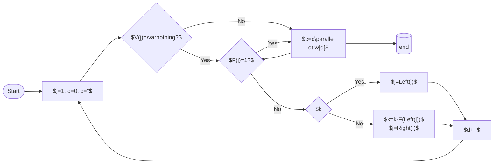
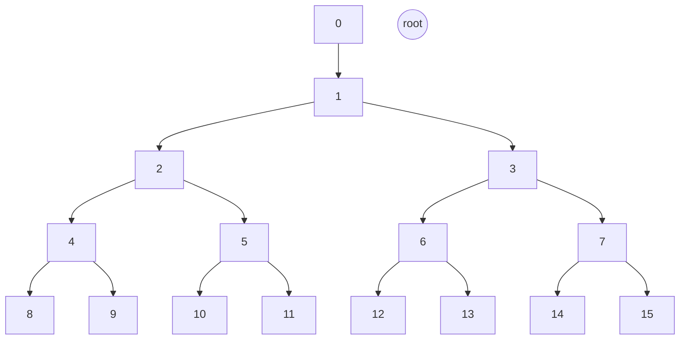

# Balanced Neighbourhood Registry aka Smart Neighbourhood Management

## Abstract

This SWIP introduces a systematic way for node operators to enter the Swarm network in such a way that they form a _balanced subnetwork_.
In the context of this SWIP, _balance_ means that the distribution of nodes participating in the subnetwork be as dispersed as possible across the Swarm address space.

## Motivation

### Balance and area of responsibility

The most obvious use case for a balanced sub-network is a _decentralised service network_ _(DSN)_, a set of nodes that commit to collectively perform some task. Instances of this task submitted by the  users of the DSN
are best thought of as a partially ordered set of _input/output jobs_. These jobs are then assigned to the service nodes in the DSN based on whether the _job ID_ falls within the node's _area of responsibility_. Execution is load balanced, as long as:

- jobs are of comparable complexity,
- job IDs are random and uniform within the address space (the hash of their description), and
- nodes' areas of responsibility are address ranges of equal size.

_Areas of responsibility_ are defined by _proximity_, ie., a contiguous range of addresses close to each other and to    the node's ID (i.e., the node overlay address is in the same address space) using logarithmic distance  as a metric.

The design achieves

- fairness,
- bounded cost of operation, and
- resistance to manipulation.

### Further support when applied to the current postage redistribution game

#### Sybil attacks

The neighbourhood sybil attack is when the same operator runs several nodes (or runs one client node, but plays with several) in the same neighbourhood. This would allow them to share storage without replication and yet get paid.
To mitigate this we resort to the rather weak incentive of additive stake as a proof of redundancy. If stake is variable and is linearly proportional to earnings, then, mutatis mutandis,  due to the added operational costs, it is always more economical for one operator in a neihgbourhood to run just one node with all the stake than several nodes.
Random NH assignnment makes it impractical (expensive) for any operator to  attempt to place several nodes in the same storage neighbourhood  The proposed scheme solves the problem of "one operator, one node in a neighbourhood".

#### Fixed stake

Variable stake is not really compatible with random assignment. If a candidate node is assigned a neighbourhood with high stake density, it can earn less with the same stake, which is not really fair. Fixed stake across neighbourhoods, on the other hand, does not imply any a priori (dis)advantage. Uniform prices could and should allow changes over time.

#### Shadow world fabrication attack

In order to control the stamp at game time, attackers must invest the same amount of stamp resources as the entire swarm's used capacity. Assuming that the average utilisation rate over a relavant period is $0<u\leq 1$,  the reward/cost ratio for the attacker for any wins is $r=1+\frac{1}{u}$. This implies that the attacker needs to win at least once every  $r$ rounds in order just to break even.

## Solution

_Address ranges (neighbourhoods)_ are defined by a shared prefix in the binary representation of an address, ie., a neighbourhood designated by $a$ of depth $d$. This SWIP describes an on-chain DSN registry, where nodes identified by their ethereum addresses are assigned a neighbourhood at random. This involves a 2-step interaction with the blockchain; in the initial transaction, candidate nodes commit to participate by registering their address and record the blockheight.

Randomness is derived from on-chain entropy after registration, so assignment is unpredictable at commit time and reproducible at validation time.
The assigment is done by constraining the overlay address to have the initial $d$ specific bits.
The choice of constraint is donen so that the system continuously enforces _balanced coverage_.
The exact node ID is determined outside the protocol,
Using the entropy of an arbitrary nonce, then, candidate nodes are able to find (mine) a suitable overlay address that  satisfies the constraint.

When  nodes want to leave the network, rebalancing may be necessary.

### Formal exposition

Let the set of active nodes be denoted by:
$$
S = \{n_0, n_1, \ldots\}, \quad N = |S|.
$$
Each node is identified by an Ethereum address $a_i \in \mathbb{\Sigma}^{160}$ and an overlay address $o_i \in \mathbb{\Sigma}^{256}$, where $\mathbb{\Sigma}=\{0,1\}$.

A _neighbourhood_ (designated by pivot address $p$ and depth $d$) is an address range characterised by sharing  bit prefix with $p$ with length $>d$.
$$
NH(p,d)=\left\{a\in\mathbb{\Sigma}^{256} \,\mid\,a[0:d]=p[0:d]\right\}
$$
Given a set of nodes $S$, a node $n_i\in S$ is _unique at depth_ $u_i$ if $u_i$ is the smallest integer such that no other node fall  in its neighbourhood (designated by its overlay $o_i$ at depth $u_i$):
$$
\forall 0\leq j<N, j\neq i \longrightarrow o_j\notin NH(o_i,u_i)
$$
This allows us to define _balance(dness)_. We say that a set of nodes $S$ is _balanced (at depth)_ $d$, if each node is _unique at depth_ $d$ or $d+1$: $S$ is _balanced_ iff
$$
\{ u_0, u_1, \ldots , u_{N-1}\} = \begin{cases}
\{d\} & \text{if }N=2^D \text{ for some }D \\
\{d,d+1\} & \text{ otherwise}
\end{cases}
$$
Now we can show that
\begin{enumerate}
\item $d=\lfloor \text{log}_2(N) \rfloor$, and
\item $D=\text{log}_2(N)$, and
\item $\mid\{ n_i\in S \mid u_i = d+1 \}\mid = 2(N-2^d)$.
\end{enumerate}

Let us define a node's _unique neighbourhood_ wrt.~S as the neighbourhood designated by the node's overlay address $o_i$ at their unique depth $u_i$:
$$
NH_{i,S} := o_i, u_i
$$
The address space is fully partitioned by the nodes in S at all times, each address falls within a subnetwork node's unique disjoint neighbourhood.
$$
\forall a\in\mathbb{\Sigma}^{256}, a\in NH_i  \text{, for some }0\leq i<N
$$
as a flwoer
$$
\forall 0\leq i<j<N, |NH_i|=|NH_j| \lor |NH_i|=2\cdot|NH_j|
$$

This entails that the  depth that all nodes are unique at are equal or just has 1 as a difference:
$$
\forall 0\leq i, j ,<N, abs(u_i-u_j) \leq 1
$$
and finally, that
$$
\forall 0\leq i\le N, u_i=d \text{ or }u_i=d+1
$$
where
$$
d=\lfloor log N\rfloor
$$

The system maintains a depth parameter $d \in \mathbb{N}$ such that
$$
2^{d-1} < N \le 2^d.
$$
Neighbourhoods are represented as indices in a complete binary space:
$$
I : \{0, \ldots, 2^d - 1\} \to \mathbb{\Sigma}^{256} \cup \{\varnothing\},
$$
where $I[i] = \varnothing$ denotes an empty slot. A reverse mapping
$$
J : o_i \mapsto j
$$

The system enforces the condition
$$
\forall i, \quad I[2i] \neq 0 \;\lor\; I[2i+1] \neq 0,
$$
which ensures that every prefix of length $d-1$ contains at least one node. This invariant defines the admissible states of the system.

## Architecture

This contract is deployed together with a staking contract similar to the [swarm storage incentive staking contract](https://github.com/ethersphere/storage-incentives/blob/master/src/Staking.sol). This contract will retain the total stake treasury, as well as enabling a node operator to deposit, withdraw and maintain their stake. Concerns should be strictly separated to improve security of locked funds and upgradability of both contracts.

The node assignment contract is composed of several transactional endpoints:

### Registering and Random Assignment

Candidate nodes end up assigned to a random free neighbourhood in a way that all the potential free neighbourhoods had the same chance of being selected.

#### Registration

In the first step, a node's intention to participate as a provider in the service network gets recorded in the _commit queue_ $C$.
The current blockheight $h_i$ is recorded together with the ether address by pushing the entry struct ($e_i = \langle a_i,h_i\rangle$) to the end of commit queue.

At the time of registering, we check if the node's ether address is not already on the list.
In order to prevent repeated trials, each node must be registered only once.
A non-refundable application fee ${\$_a}$ is deposited.

### Get prefix 

### Get an overlay prefix assigned

This function includes a read-only call that and returns the neighbourhood that the node is currently assigned to. This call is public so that the client can enquire about the neighbourhood they are assigned to

This public read only call takes as argument a node's ether address $a_i$ returns the current prefix contraing the overlay assignment.
Note that calling the function twice may result in a different constraint prefix if there is another successful assignment in between the two calls.

If the resulting overlay address falls into the neighbourhood that the registrant was assigned to, i.e., the correctness of the nonce submitted from the perspective of the staking contract.

## Assign

The assign call is the second transactional endpoint called by the staking contract. It takes the provider's ether address as well as the mined overlay as arguments.

### Expiry

The entry is valid for a period of $G$ blocks after the registration. In practice, $G$ must be less than $256$, the number of blocks for which the blockhash is available from within the EVM.

Since the blockheight values of the commit queue items are monotonically increasing, entries at the beginning of the list expire first. By iterating upto the first valid entry, expired entries can be iterated on efficiently.

The `expire` function call iterates the commit queue from the oldest, going through all expired entries, burns their deposit, and, by setting the head of the list to the first valid item, removes them from the front of the commit queue.

After calling `expire`, the validity of the registration is checked by finding the entry for the ether address in the commit queue.

### Entropy

Nodes derive randomness from a high entropy seed
$$
\rho_i = H(\text{blockhash}(h_i+1) \parallel h_i \parallel a_i),
$$
which is not known at the time of registration. The _validity window_ $VW < 256$ ensures that the referenced blockhash remains accessible.

### Mine a nonce

The commited node,  upon learning the neighbourhood $\mathit{nh}_i$, find a nonce $\nu_i$ to generate the overlay address which is:
$$
o_i := \mathit{H}(a_i \parallel networkID \parallel \nu_i)
$$
that falls in the correct neighbourhood.
$$
\nu_i \leftarrow \mathbb{\Sigma}^{256}, \quad o_i\gg(255-d)=\mathit{nh}_i
$$
The mined overlay $o_i$ must be submitted to the contract, which once the overlay is verified, removes the entry from the commit queue.

Given $F(1)=2^{d+1} - N$ is the number of free neighbourhoods currently free. A node computes
$$
k_i = \rho_i \bmod 2^{d+1}-N.
$$

The neighbourhoods nodes can be allocated to a cell $j=c_{k_i}$ only if $Free(j)$ is true.
The assigned index is determined by descending the trie. At a node index $j$, $F(Left(j))$ denotes the number of free slots in the left subtree. If $k < F(Left(i))$, the traversal continues to the left child. Otherwise, the traversal continues to the right child with updated rank $k_i \mapsto k_i - F(Left(i))$:

## Deregistration and Rebalancing

Nodes are free to deregister at any time. 
If the sister node exists, removal proceeds directly and the invariant remains satisfied.

If removal would leave both child of the parent empty, then _rebalancing_ is required. A donor pair is selected using the same rank-based traversal over $F(c)$. From the selected pair, one of the two nodes is chosen and removed. The donor node is reinserted into the commit queue and assigned to the empty pair.

The original node is removed only after the donor successfully completes reassignment, ensuring that the invariant is never violated. In order that the rebalancing cannot be manipulated, ie., the selected node reinserted into the neighbourhood of the deregistrant, the donor must to be selected with proper randomness, not known at the time of deregistration.  

Given $\mathbb{F}(1)=N-2^{d}$ is the number of free neighbourhoods currently full (doubly filled). A node computes
$$
k_i = \rho_i \bmod N-2^{d}
$$

The neighbourhoods nodes can be allocated to a cell $j=c_{k_i}$ only if $Free(j)$ is true.
The assigned index is determined by descending the trie. At a node index $j$, $F(Left(j))$ denotes the number of free slots in the left subtree. If $k < F(Left(i))$, the traversal continues to the left child. Otherwise, the traversal continues to the right child with updated rank $k_i \mapsto k_i - F(Left(i))$:

## Specification

### Registration

An initially empty list (_commit queue_) of _entry struct_ types holds the current committers. The struct holds information about the ether address of the node and the blockheight the address registered at.

## Data Structure

The assignment structure is implemented as an implicit complete binary trie over the index space. Each node $v$ of the trie corresponds to a contiguous interval of indices. The subtrie has the role of maintaining two quantities.

### Counting free neighbourhoods for candidate assignment

The first quantity stands for the number of free slots in the subtree rooted at index $i$; these are tracking the number of candidate neighbourhoods to assign.
$$
F: \mathbb{N}\to\mathbb{N}\\
F(i) = \begin{cases}
F(Left(i)) + F(Right(i))&\text{if } Depth(i)<d-1\\
1&\text{if } Depth(i)=d-1\text{ and }{Free}(i)\\
0&\text{otherwise}
\end{cases}
$$
When the trie becomes fully balanced with a number of nodes turning $N = 2^d-1$, then each neighbourhood at level $d-1$ is free, i.e., has exactly one assignable child:
$$
\forall i, 2^{d-1}\leq i< 2^{d} \longrightarrow F(i)=1
$$
In this case,
$$
\forall 0< i<2^{d}, \quad F(i) = 2^{d -Depth(i)}.
$$
By the time the next depth is reached, $N=2^{d+1}-1$-th element is assigned, all
of the free neighbourhoods got allocated, thus:
$$
\forall i, 2^{d-1}\leq i< 2^{d} \longrightarrow F(i)=0
$$
and therefore:
$$
\forall 0< i<2^{d}, \quad F(i) = 0.
$$

#### Counting fully saturated leaves for donor selection

The second quantity stands for the number of nodes on level $d-1$ with both their children assigned in the subtree: these correspond to _candidate donor pairs_.

$$
S: \mathbb{N}\to\mathbb{N}\\
S(i) = \begin{cases}
S(Left(i)) + S(Right(i))&\text{if } Depth(i)<d-1\\
1&\text{if } Depth(i)=d-1\text{ and }Full(i)\\
0&\text{otherwise}
\end{cases}
$$

When the trie becomes fully balanced with a number of nodes turning $N = 2^d-1$, then each neighbourhood at level $d-1$ has exactly one child, none can be or need be selected as donor:
$$
\forall i, 2^{d-1}\leq i< 2^{d} \longrightarrow S(i)=0
$$
In this case,
$$
\forall 0< i<2^{d}, \quad S(i) = 0.
$$
By the time $2^{d-1}$ nodes are assigned and the trie is again balanced having $N=2^{d}-1$ nodes, all
of the free neighbourhoods got allocated, thus:
$$
\forall i, 2^{d-1}\leq i< 2^{d} \longrightarrow S(i)=1
$$
and therefore:
$$
\forall 0< i<2^{d}, \quad S(i) = 2^{d -Depth(i)}.
$$

Surely, initially, when $N=0$, $d=0$, then $F(0)=1$, and $S(0)=0$

Updates propagate along the path from a leaf to the root, resulting in logarithmic complexity.

## Data Structure Illustration

## Data Structure

The assignment structure is implemented as an implicit complete binary trie over the index space. The index space starts with 1, only entries are

The implicit binary structure means the represented tree can be traversed using basic arithmetic on the indexes:

$$
\begin{array}{l|l|l}
\mathrm{description} & \mathrm{notation} & \mathrm{definition}\\\hline
\text{parent of }i& \mathrm{Parent}(i) & i/2 &\\
\text{left child of }i&\mathrm{Left}(i) & 2i\\
\text{right child of }i& \mathrm{Right}(i) & 2i+1\\
\text{sister of }i& \mathrm{Sister}(i) & \mathrm{Parent}(i\mathrm{Parent}(i)) + \mathrm{abs}(\mathrm{Right}(\mathrm{Parent}(i)))\\
\text{depth of }i& \mathrm{Depth}(i) & \mathrm{Floor}(\log_2(i))\\
\text{position of }i& \mathrm{Pos}(i) & i \mod \mathrm{Depth}(i)
\end{array}
$$

When the index structure is used as a map, the rule of interitance allows you to look up a value that was 'inherited' from an earlier stage (inserted at a shallower depth). We can define $V$ as a lookup function for a map over the above index structure, then $V!$ is

$$
V!(i)=\begin{cases}
V(\mathrm{Parent}(i)) &\text{if } V(i)=\varnothing\text{ and }i>1\\
V(i) &\text{otherwise}
\end{cases}
$$

We can define the predicate _not assigned_ as follows:
$$
NA(i) \leftrightarrow V!(i) = \varnothing .
$$
This allows us to define free and fully assigned neighbourhoods:
$$
\mathrm{Free}(i) \leftrightarrow NA(\mathrm{Left}(i))  \lor NA(\mathrm{Right}(i))
$$
and
$$
\mathrm{Full}(i) \leftrightarrow !NA(\mathrm{Left}(i)) \land !NA(\mathrm{Right}(i))
$$

The data structure operations all enforce the condition

$$
\forall i, \mathrm{Depth}(i)< d\longrightarrow V(i)\neq \varnothing \lor V(i+1)\neq \varnothing
$$

which ensures that every prefix of length $d-1$ contains at least one node. This invariant contrains the admissible states of the system.

##

The IBT is used to

- assign neighbourhoods for new applicants
- find candidate donors for rebalancing  
- find the closest node to an address

### Further endpoints

A public read-only endpoint exists for querying neighbourhoods as well as nodes. Accessor for $d$ and $N$ will return the current neighbourhood depth and the current number of assigned neighbourhoods. A public accessor for $A_d$ will  return for a neighbourhood (between $0$ and $2^d-1 inclusive) the overlay of the node assigned to that neighbourhood. Another endpoint will return for any overlay $o$ the closest node, so that the network service can find responsible nodes for (i.e., closest to) any address in the space shared by overlays:

$$
g(a)=O![a\gg(255-d)]
$$

### Changes to the bee client

A new endpoint to bee client must be added to register a node that is not yet registered to be assigned a neighbourhood. Once the neighbourhood is known, the client can mine the nonce needed to place the overlay in the required neighbourhood.

### Migration

Since a new updated staking contract, a stake migration will be needed for the upgrade. Before the change, all the simplification of the staking contract is recommended, especially to allow fixed stake  in order to realign redundancy of storage and monetary incentive: with a fixed amount staked, total stake is linearly proportional to the number of nodes, and therefore comparisons across neighbourhoods can be made based on the number of nodes. In particular, the random balanced assignment makes sense in terms of incentives (expected revenue).

### Putting a node in each neighbourhood

## Contract
