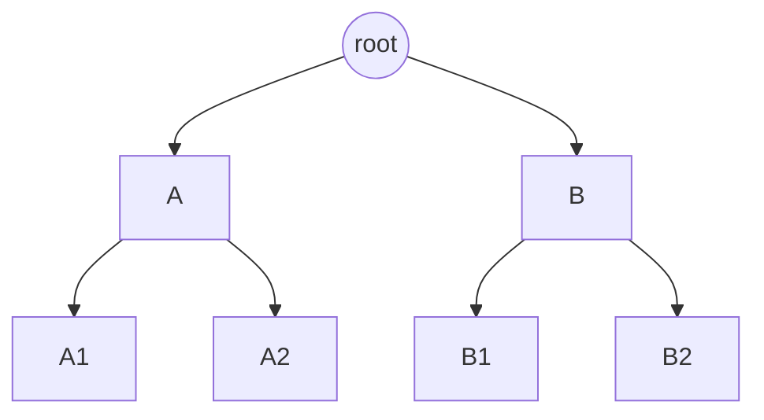
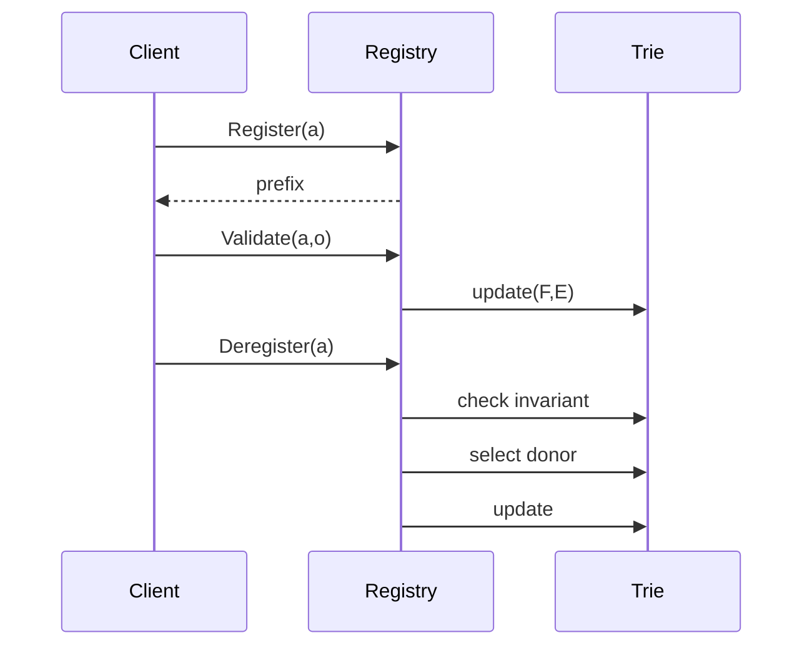

# Balanced Neighbourhood Registry aka Smart Neighbourhood Management

## Abstract

This proposal defines a protocol mechanism that enforces uniform distribution of nodes across the Swarm address space while preventing adversarial positioning. Nodes commit to participation and are assigned neighbourhoods through delayed entropy derived from on-chain randomness. The assignment is therefore unpredictable at commit time and reproducible at validation time. Since a joining node operator is unable to position themselves at a specific point in the network without a significant time or financial penalty, attack vectors that rely on this are rendered infeasible.

The system maintains a structural invariant over the address space ensuring that no prefix of length $d-1$ is empty. This invariant is preserved through strictly local operations, namely assignment, deregistration, and rebalance, without requiring global restructuring. The design achieves fairness, bounded operational cost, and resistance to manipulation.

## Motivation

There are multiple considerations that motivate such a scheme: 

- **load-balancing**: a decentralised service network will be fair if tasks are distributed to nodes so that the workload assigned to each participant is roughly equal. Presuming load balancing is achieved if tasks[^1] are assigned based on uniform random label (i.e., the content hash of the descriptor) and nodes providing the service are balanced in the address space.

[^1]: it is assumed that average resource utilisation (network/computation/storage requirements) of tasks over a typical period of payment remains within a tolerable variance.

- **arbitrary neighbourhood assigment**: the system needs to make sure that assignment of an overlay address to participant nodes is arbitrary. In particular, it is impractical (expensive) for any operator to attempt to place several nodes in the same storage neighbourhood without truely replicating storage and yet get paid. Note that, this scheme constitutes an effective solution to the problem of "one operator, one node in a neighbourhood". Taking the storage incentive system as an example, this will mitigate this sybil attack, without resorting to the rather weak incentive of additive stake as a proof of redundancy.[^2]

[^2]: the idea is that if stake is variable and earnings are linearly proportional to earnings then, mutatis mutandis, it is always more economical for one operator to run just one node with all the stake than several nodes due to the added operational costs. ↩

- **extensible and user friendly approach**: the current approach taken by swarm is based on the idea is that, if stake is variable and earnings are linearly proportional to earnings then, mutatis mutandis, it is always more economical for one operator to run just one node with all the stake than several nodes due to the added operational costs. While this has proven to be an effective means to secure the protocol, it has also led to some confusion and it's complexity means it is difficult to develop. The proposed system is intended to be much simpler to reason with and for operators to use and understand.

A decentralised service network assumes that workload is distributed according to a uniform random process over the address space. This assumption only holds if the distribution of nodes itself is approximately uniform. In practice, allowing operators to influence their placement leads to clustering and adversarial positioning, while global rebalancing mechanisms are impractical in a smart contract setting due to their cost and coordination requirements.

The present design replaces behavioural assumptions with structural guarantees. Node placement is determined externally by the protocol, and the system continuously enforces coverage through a local invariant that is preserved under all admissible transitions.

---

## Model and Notation

Let the set of active nodes be denoted by

$$
S = \{a_0, \ldots, a_n\}, \quad N = |S|.
$$

Each node is identified by an Ethereum address $a^\Xi$ and an overlay address $a^\theta \in \mathbb{O}_{32}$.

The system maintains a depth parameter $d \in \mathbb{N}$ such that

$$
2^{d-1} < N \le 2^d.
$$

Neighbourhoods are represented as indices in a complete binary space:

$$
I : \{0, \ldots, 2^d - 1\} \to \mathbb{O}_{32} \cup \{0\},
$$

where $I[i] = 0$ denotes an empty slot. A reverse mapping

$$
J : a^\Xi \mapsto i
$$

associates each node with its assigned index.

For each index $i$, define the pair

$$
\mathcal{P}_i = \{2i, 2i+1\}.
$$

---

## Structural Invariant

The system enforces the condition

$$
\forall i, \quad I[2i] \neq 0 \;\lor\; I[2i+1] \neq 0,
$$

which ensures that every prefix of length $d-1$ contains at least one node. This invariant defines the admissible states of the system.

---

## Data Structure

The assignment structure is implemented as an implicit complete binary trie over the index space. Each node $v$ of the trie corresponds to a contiguous interval of indices and maintains two quantities.

The first quantity $F(v)$ denotes the number of free slots in the subtree rooted at $v$. Formally, if $L(v)$ denotes the set of leaf indices under $v$, then

$$
F(v) = |\{ i \in L(v) \mid I[i] = 0 \}|.
$$

The second quantity $E(v)$ denotes the number of indices $i$ in the subtree such that both elements of $\mathcal{P}_i$ are occupied. These correspond to candidate donor pairs.

Both quantities satisfy recursive relations

$$
F(v) = F(v_L) + F(v_R), \quad E(v) = E(v_L) + E(v_R),
$$

where $v_L$ and $v_R$ denote the left and right children of $v$. Updates propagate along the path from a leaf to the root, resulting in logarithmic complexity.

---

## Data Structure Illustration

Each leaf corresponds to an index. Internal nodes aggregate subtree quantities $F$ and $E$.

---

## Entropy

A node that registers at block height $h$ derives its randomness from

$$
\rho = H(\text{blockhash}(h+1) \parallel a^\Xi \parallel h),
$$

which is not known at the time of registration. The validity window $B < 256$ ensures that the referenced blockhash remains accessible.

---

## Assignment

Let $M = 2^d - N$ denote the number of free slots. A node computes

$$
k = \rho \bmod M.
$$

The assigned index is determined by descending the trie. At a node $v$, let $F(v_L)$ denote the number of free slots in the left subtree. If $k < F(v_L)$, the traversal continues to the left child. Otherwise, the traversal continues to the right child with updated rank $k \leftarrow k - F(v_L)$. This procedure terminates at a leaf index $i$ such that $I[i] = 0$.

---

## Deregistration and Rebalancing

Consider a node occupying index $r$. Let $i = \lfloor r/2 \rfloor$ be the corresponding pair index.

If the sibling index in $\mathcal{P}_i$ is occupied, removal proceeds directly and the invariant remains satisfied.

If removal would leave $\mathcal{P}_i$ empty, a rebalance is required. A donor pair is selected using the same rank-based traversal over $E(v)$. From the selected pair, one of the two nodes is chosen and removed. The donor node is reinserted into the commit queue and assigned to the empty pair.

The original node is removed only after the donor successfully completes reassignment, ensuring that the invariant is never violated.

---

## Depth Reduction

If $N = 2^{d-1}$, every pair contains exactly one node and no donor exists. In this case, the representation is reduced by setting $d \leftarrow d-1$ and mapping each pair to a single index. This transformation is deterministic because no pair contains more than one node.

---

## Interface

| Function | Description |
|----------|------------|
| Register(a) | Records commitment and blockheight |
| GetPrefix(a) | Returns assigned index |
| Validate(a,o) | Verifies overlay matches assigned index |
| Insert(a,o) | Inserts node and updates structure |
| Deregister(a) | Initiates removal |
| Remove(i) | Removes node from index |
| Rebalance(i) | Repairs invariant |

---

## Sequence Diagram

---

## Economic Considerations

Fairness of the system requires that each node is associated with a fixed stake. Under this assumption, total stake is proportional to the number of nodes,

$$
\text{Total stake} \propto N,
$$

and no operator gains advantage by concentrating stake into fewer nodes. This aligns economic incentives with the structural invariant.

---

## Impact

The system achieves uniform distribution of nodes, resistance to adversarial placement, and predictable operational costs. Rebalancing introduces a dependency on donor behaviour; however, the resulting delay is bounded and practically absorbed by the off-boarding process, which already operates as a queue. Consequently, rebalance latency does not introduce observable instability.

---

## Security Analysis

The commit-and-delay entropy mechanism prevents nodes from predicting or influencing their placement. Structural constraints prevent clustering, making Sybil attacks costly and ineffective. Validator influence is limited to a single block and does not provide sufficient control to bias assignment.

Rebalancing cannot be blocked as long as $N > 2^{d-1}$, since a donor must exist. If a donor fails to complete reassignment, expiry ensures that another donor is selected, guaranteeing progress.

---

## Testing

Correctness requires verifying that the invariant is preserved under all state transitions. Simulation should confirm that assignment remains uniform, that rebalancing converges, and that depth transitions occur at the correct thresholds.

---

## Conclusion

This proposal replaces global restructuring with local invariant enforcement over a compact data structure. It achieves fairness, efficiency, and robustness through deterministic rules and probabilistic assignment, making it suitable for large-scale decentralised operation.
