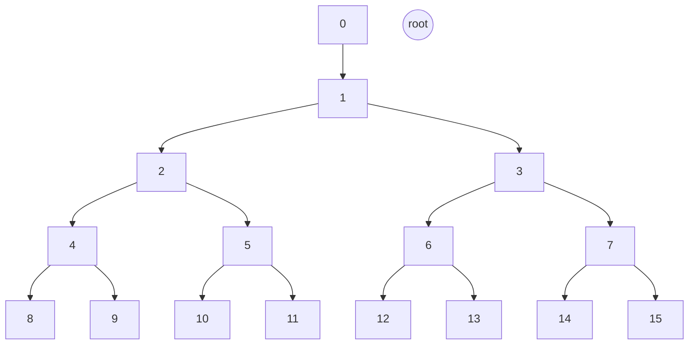

# Balanced Neighbourhood Registry aka Smart Neighbourhood Management

## Abstract

This SWIP introduces a systematic way for node operators to enter the Swarm network in such a way that they form a _balanced subnetwork_.
In the context of this SWIP, _balance_ means that the distribution of nodes participating in the subnetwork be as dispersed as possible across the Swarm address space.

## Motivation

### Balance and area of responsibility

The most obvious use case for a balanced sub-network is a _decentralised service network_ _(DSN)_, a set of nodes that commit to collectively perform some task. Instances of this task submitted by the  users of the DSN
are best thought of as a partially ordered set of _input/output jobs_. These jobs are then assigned to the service nodes in the DSN based on whether the _job ID_ falls within the node's _area of responsibility_. Execution is load balanced, as long as:

- jobs are of comparable complexity,
- job IDs are random and uniform within the address space (the hash of their description), and
- nodes' areas of responsibility are address ranges of equal size.

_Areas of responsibility_ are defined by _proximity_, ie., a contiguous range of addresses close to each other and to    the node's ID (i.e., the node overlay address is in the same address space) using logarithmic distance  as a metric.

The design achieves

- fairness,
- bounded cost of operation, and
- resistance to manipulation.

### Further support when applied to the current postage redistribution game

#### Sybil attacks

The neighbourhood sybil attack is when the same operator runs several nodes (or runs one client node, but plays with several) in the same neighbourhood. This would allow them to share storage without replication and yet get paid.
To mitigate this we resort to the rather weak incentive of additive stake as a proof of redundancy. If stake is variable and is linearly proportional to earnings, then, mutatis mutandis,  due to the added operational costs, it is always more economical for one operator in a neihgbourhood to run just one node with all the stake than several nodes.
Random NH assignnment makes it impractical (expensive) for any operator to  attempt to place several nodes in the same particular storage neighbourhood. The proposed scheme solves the problem of "one operator, one node in a neighbourhood" unless the operator globally owns the majority of the nodes.


#### Fixed stake

Variable stake is not really compatible with random assignment. If a candidate node is assigned a neighbourhood with high stake density, it can earn less with the same stake, which is not really fair. Fixed stake across neighbourhoods, on the other hand, does not imply any a priori (dis)advantage. Uniform prices could and should allow changes over time.

#### Shadow world fabrication attack

In order to control the stamp at game time, attackers must invest the same amount of stamp resources as the entire swarm's used capacity. Assuming that the average utilisation rate over a relavant period is $0<u\leq 1$,  the reward/cost ratio for the attacker for any wins is $r=1+\frac{1}{u}$. This implies that the attacker needs to win at least once every  $r$ rounds in order just to break even.

## Solution

_Address ranges (neighbourhoods)_ are defined by a shared prefix in the binary representation of an address, ie., a neighbourhood designated by $a$ of depth $d$. This SWIP describes an on-chain DSN registry, where nodes identified by their ethereum addresses are assigned a neighbourhood at random. This involves a 2-step interaction with the blockchain; in the initial transaction, candidate nodes commit to participate by registering their address and record the blockheight.

Randomness is derived from on-chain entropy after registration, so assignment is unpredictable at commit time and reproducible at validation time.
The assigment is done by constraining the overlay address to have the initial $d$ specific bits.
The constraint is chosen so that the system continuously enforces _balanced coverage_.
The exact node ID is determined outside the protocol:
using the entropy of an arbitrary nonce, then, candidate nodes are able to find (mine) a suitable overlay address that  satisfies the constraint.

When  nodes want to leave the network, rebalancing may be necessary.

### Formal exposition


Let the set of active nodes be denoted by:
$$
S = \{n_0, n_1, \ldots\}, \quad N = |S|.
$$
Each node is identified by an *Ethereum address* $a_i \in \mathbb{\Sigma}^{160}$ and an *overlay address* $o_i \in \mathbb{\Sigma}^{256}$, where $\mathbb{\Sigma}=\{0,1\}$.

A _neighbourhood_ (designated by pivot address $p$ and depth $d$) is an address range characterised by sharing  bit prefix with $p$ with length $>d$.
$$
NH(p,d)=\left\{a\in\mathbb{\Sigma}^{256} \,\mid\,a[0:d]=p[0:d]\right\}
$$
Given a set of nodes $S$, a node $n_i\in S$ is _unique at depth_ $u_i$ if $u_i$ is the smallest integer such that no other node fall  in its neighbourhood (designated by its overlay $o_i$ at depth $u_i$):
$$
\forall 0\leq j<N, j\neq i \longrightarrow o_j\notin NH(o_i,u_i)
$$
This allows us to define _balance(dness)_. We say that a set of nodes $S$ is _balanced (at depth)_ $d$, if each node is _unique at depth_ $d$ or $d+1$: $S$ is _balanced_ iff
$$
\{ u_0, u_1, \ldots , u_{N-1}\} = \begin{cases}
\{d\} & \text{if }N=2^D \text{ for some }D \\
\{d,d+1\} & \text{ otherwise}
\end{cases}
$$
Now we can show that
$$
\begin{align}
\circ\ & d=\lfloor \text{log}_2(N) \rfloor\text{, and} \\
\circ\ & \mid\{ n_i\in S \mid u_i = d+1 \}\mid = 2(N-2^d).
\end{align}
$$

Let us define a node's _unique neighbourhood_ wrt.~$S$ as the neighbourhood designated by the node's overlay address $o_i$ at their unique depth $u_i$:
$$
\mathit{nh}_{i,S} := NH(o_i, u_i)
$$
When S is balanced, the address space is fully partitioned by the nodes in S at all times: *each address falls within a subnetwork node's unique disjoint neighbourhood.*
$$
\forall a\in\mathbb{\Sigma}^{256}, a\in \mathit{nh}_{i,S}  \text{, for some }0\leq i<N
$$
and as a corollary:
$$
\forall 0\leq i<j<N, |\mathit{nh}_i|=|\mathit{nh}_j| \lor |\mathit{nh}_i|=2\cdot|\mathit{nh}_j|
$$


In other words, balanced sets always have *full coverage* and tend towards *equality* (of coverage, workload, responsibility).


Since, by definition, an overlay of any node is in the nodes unique neighbourhood,
$$
\forall i\in S, o_i\in \mathit{nh}_{i, S}
$$
Now, given full coverage, the newly added nodes overlay belongs to a unique neighbourhood of $S$:
$$
\exists k\neq n, o_n\in \mathit{nh}_{k,S},  
$$
and from disjointness, it follows that no other neighbourhood 
$$
\forall i\neq k\in S, o_n \notin \mathit{nh}_{i,S}
$$
In general, it is true that adding nodes can only make neighbourhoods narrower:
$$
\forall S, S', S\subset S'\Rightarrow \forall i\in S, \mathit{nh}_{i, S'}\subseteq \mathit{nh}_{i, S'}.
$$
If we want to add a node $n$ to $S$ resulting in
$$
S'= \{n\}\bigcup S,
$$
and 
$$
o_n\in \mathit{nh}_{k, S} 
$$
and 
$$
o_n \notin \mathit{nh}_{k, S'}
$$
which entails that node $k$'s neighbourhood does change between $S$ and $S'$:
$$
\mathit{nh}_{k, S'}\subset \mathit{nh}_{k, S}.
$$
This can only happen if $k$'s uniquness depth increases, from which it follows that, for set $S$,
$$
u_k = d,
$$
and for $S'$,
$$
u_k = d+1.
$$
In other words, any node added to $S$ must join a free neighbourhood $\mathit{nh}_{k,S}$ but must not match the $d+1$-th bit of $o_k$. 
Conversely, when a node $g$ is removed, it must have a sister so that after removal, that balancedness remains invariant. This may necessiate rebalancing first, i.e., in case $g$'s removal would result in a non-balanced set,  requires finding a random donor $j$ with $u_j=d+1$ to be reinserted as $g$'s sister.[^donor]

[^donor]: In fact, the donor could just reinsert at $g$'s spot, however, any short overlap of activity is easier to handle if donor is $g$'s sister.

## Architecture

This contract is deployed together with a staking contract similar to the [swarm storage incentive staking contract](https://github.com/ethersphere/storage-incentives/blob/master/src/Staking.sol). This contract will retain the total stake treasury, as well as enabling a node operator to deposit, withdraw and maintain their stake. Concerns should be strictly separated to improve security of locked funds and upgradability of both contracts.

The node assignment contract is composed of several transactional endpoints:

### Registering and Random Assignment

Candidate nodes end up assigned to a random free neighbourhood in a way that all the potential free neighbourhoods had the same chance of being selected.

#### Registration

In the first step, a node's intention to participate as a provider in the service network gets recorded in the _commit queue_ $C$.
The current blockheight $h_i$ is recorded together with the ether address $a_i$ by pushing the entry struct ($e_i = \langle a_i,h_i\rangle$) to the end of commit queue.

At the time of registering, we check if the node's ether address is not already on the list.
In order to prevent repeated trials, each node must be registered only once.
A non-refundable application fee is deposited.

#### Expiry


The entry is valid for a period of $G$ blocks after the registration. In practice, $G$ must be less than $256$, the number of blocks for which the blockhash is available from within the EVM.

Since the blockheight values of the commit queue items are monotonically increasing, entries at the beginning of the list expire first. By iterating upto the first valid entry, expired entries can be iterated on efficiently.

The `expire` function call iterates the commit queue from the oldest, going through all expired entries, burns their deposit, and, by setting the head of the list to the first valid item, removes them from the front of the commit queue.

After calling `expire`, the validity of the registration is checked by finding the entry for the ether address in the commit queue.

#### Entropy

Nodes derive randomness from a high entropy seed
$$
\rho_i = \mathit{H}(\text{blockhash}(h_i+1) \parallel h_i \parallel a_i),
$$
which is not known at the time of registration. The _validity window_ $VW < 256$ ensures that the referenced blockhash remains accessible.

#### ANeighbourhood assignment

Assignment of a node to a neighbourhood must observe balancedness of the set as an invariant. Since 
$2^{d+1} - N$ is the number of free neighbourhoods. A node computes
$$
r_i = \rho_i \bmod 2^{d+1}-N.
$$
Let $f_0, f_1, \ldots, f_{F-1}$ be the indexes of free neighbourhoods, these are available for assignment. Out of these free neighbourhoods, one is chosen wiht equal probability: 
$$
k=f_{r_i}
$$

This calculation is made available as a read-only call. It takes as argument a node's ether address $a_i$ returns the current prefix constrainng the overlay assignment.[^format]

[^format]: the result is formatted the same way as given to the bee client as the target of mining: `010101010101`

Calling the function multiple times may return a different constraint prefix if there is another successful assignment in between the two calls.


### Mining an overlay nonce

The commited node,  upon learning the neighbourhood $k$, must find a nonce $\nu_i$ to generate the overlay address which is:
$$
o_i := \mathit{H}( \nu_i \parallel a_i \parallel networkID )
$$
that falls in the correct neighbourhood.
$$
\nu_i \leftarrow \mathbb{\Sigma}^{256},\text{ such that }  o_i\gg(255-d)=k \land o_i\gg(254-d)&&1
$$

## Assigning the complete overlay

The assign call is the second transactional endpoint called by the staking contract. It takes the provider's ether address as well as the mined overlay as arguments.
The mined overlay $o_i$ must be submitted to the contract, which, once the overlay is verified, removes the entry from the commit queue and then records the complete overlay $o_i$ associated to the node's ether address $a_i$ (it does make a difference what data structure is used, see section X.X)

## Deregistration and Rebalancing

Nodes are free to deregister at any time. 
If the sister node exists, removal proceeds directly and the invariant remains satisfied.

If removal would leave both child of the parent empty, then _rebalancing_ is required: one *donor pair* of nodes is selected from among the non-free neighbourhoods of depth $d$. From the selected pair, one of the two nodes is chosen and removed. The donor node is reinserted into the commit queue and gets assigned the sister neighbourhood of the node to be removed.

The original node is removed only after the donor successfully completes reassignment, ensuring that the invariant is never violated. In order that the rebalancing cannot be manipulated, ie., the selected node reinserted into the neighbourhood of the deregistrant, the donor must be selected with proper randomness, not known at the time of deregistration.  This randomness is derived the same way as when we add a node: deregistration call just records the blockheight $h_i$, and the following blockhash serves as the high entropy seed for randomness:
$$
\rho_i = H(\text{blockhash}(h_i+1) \parallel h_i \parallel a_i),
$$

Given the number of free neighbourhoods currently full (doubly filled) is $N-2^{d}$. A node computes
$$
r_i = \rho_i \bmod N-2^{d}
$$

Let $f_0, f_1, \ldots f_{N-2^{d}-1}$ be the sorted list of indexes for doubly-filled (non-free) neighbourhoods, i.e., those whose continuations are both unique at $d+1$.

## Specification

### Registration

## Data Structures

For registration and deregistration the contract maintains two distinct commit queues $C_R$ and $C_D$.
This initially empty list of _entry_ struct types holds information about the node that committed to enter or leave the DSN. The entry struct holds information about the ether address of the node and the blockheight the address registered at.

The queues are always expanded by the `(de)register` functions (tx-s) and cleaned by `expire` (called by `add/remove`).

$$
C_X : [\,]\mathit{entry}
$$

Mappings on both overlay ($O$),
$$
O : \mathbb{\Sigma}^{256} \mapsto \mathbb{N},
$$
and ethereum address ($A$) are maintained:
$$
A : \mathbb{\Sigma}^{160} \mapsto \mathbb{N}.
$$
Given an active set of nodes $S$, such that for any node with address $a$,  $A(a)=N=\mid S\mid$ where $N$ is the number of nodes in $S$ when (ie just before)  $n$ is inserted. In other words, if $A(a)=n$ then node with address $a$ was inserted as the $n$-th node.[^total]

[^total]: The total number is 

### ICBT

The association of neighbourhoods and nodes is stored in a data structure we call *implicit complete binary trie (ICBT)*. Each node $v$ of the trie corresponds to a neighbourhood (the shared prefix is expressed by the traversal, ie., left is 0, right is 1). 

This data structure has the role of maintaining the number of neighbourhoods that are (free = assignable to a new peer, or full = selectable as donor) under a node.
$$
I : \mathbb{N}\to \mathit{node} \cup \{\varnothing\},
$$
where $I[i] = \varnothing$ (nil value) denotes an empty slot. 

If $A(a)=n$ then its index in the trie is the depth at which it is unique ($i=u_i+2^d$)
$$
I[i]=\langle o_i, 0 \rangle
$$



The implicit binary structure means the represented tree can be traversed using basic arithmetic on the indexes:

$$
\begin{array}{l|l|l}
\mathrm{description} & \mathrm{notation} & \mathrm{definition}\\\hline
\text{parent of }i& \mathrm{Parent}(i) & i/2 &\\
\text{left child of }i&\mathrm{Left}(i) & 2i\\
\text{right child of }i& \mathrm{Right}(i) & 2i+1\\
\text{sister of }i& \mathrm{Sister}(i) & i + 1 - 2 (i \bmod 2)\\
\text{depth of }i& \mathrm{Depth}(i) & \mathrm{Floor}(\log_2(i))\\
\text{position of }i& \mathrm{Pos}(i) & i \mod \mathrm{Depth}(i)
\end{array}
$$

When the index structure is used as a map, the rule of interitance allows you to look up a value that was 'inherited' from an earlier stage (inserted at a shallower depth). We can define $V$ as a lookup function for a map over the above index structure, then $V!$ is

$$
V!(i)=\begin{cases}
V(\mathrm{Parent}(i)) &\text{if } V(i)=\varnothing\text{ and }i>1\\
V(i) &\text{otherwise}
\end{cases}
$$

We can define the predicate _not assigned_ ($\mathit{NA}$) as follows:
$$
\mathrm{NA}(i) \leftrightarrow V!(i) = \varnothing .
$$
This allows us to define free and fully assigned neighbourhoods:
$$
\mathrm{Free}(i) \leftrightarrow \mathrm{NA}(\mathrm{Left}(i))  \lor \mathrm{NA}(\mathrm{Right}(i))
$$
and
$$
\mathrm{Full}(i) \leftrightarrow !\mathrm{NA}(\mathrm{Left}(i)) \land !\mathrm{NA}(\mathrm{Right}(i))
$$

The data structure operations all enforce the condition

$$
\forall i, \mathrm{Depth}(i)< d\Rightarrow V(i)\neq \varnothing \lor V(i+1)\neq \varnothing
$$

which ensures that every prefix of length $d-1$ contains at least one node. This invariant contrains the admissible states of the system.


### Counting free neighbourhoods for candidate assignment

Function $F_0(i)$ on the index tracks the number of free slots (candidate neighbourhoods to assign) in the subtree rooted at index $i$:
$$
F_0: \mathbb{N}\to\mathbb{N}\\
F_0(i) = \begin{cases}
F_0(Left(i)) + F_0(Right(i))&\text{if } Depth(i)<d-1\\
1&\text{if } Depth(i)=d-1\text{ and }{Free}(i)\\
0&\text{otherwise}
\end{cases}
$$
When the trie becomes fully balanced with a number of nodes turning $N = 2^D$, then each neighbourhood at level $D$ is free, i.e., has exactly one assignable child:
$$
\forall 2^{D-1}\leq i< 2^{D}, \quad F_0(i)=1
$$
In this case,
$$
\forall 0< i<2^{D}, \quad F_0(i) = 2^{D-Depth(i)}.
$$
By the time the next depth is reached, $N=2^{D+1}-1$-th element is assigned, all
of the free neighbourhoods got allocated, thus:
$$
\forall 2^{D}\leq i< 2^{D+1}, \quad F_0(i)=1
$$
and therefore:
$$
\forall 0< i<2^{D}, \quad F_0(i) = 0.
$$

#### Counting fully saturated leaves for donor selection

The second quantity one needs to track is the number of nodes in the subtree with both their children assigned on level ${d}: these correspond to _candidate donor pairs_.
We can use F_1
$$

S: &\mathbb{N}\to\mathbb{N}\\
F_1(i) &T= \begin{cases}
F_1(Left(i)) + F_1(Right(i))&\text{if } Depth(i)<d-1\\
1&\text{if } Depth(i)=d-1\text{ and }Full(i)\\
0&\text{otherwise}
\end{cases}
$$

When the trie becomes fully balanced with a number of nodes turning $N = 2^D$, then each neighbourhood at level $D$ has exactly one child, none can be or need be selected as donor:
$$
\forall 2^{D-1}\leq i< 2^{D}, \quad F_1(i)=0
$$
In this case,
$$
\forall 0< i<2^{D}, \quad F_1(i) = 0.
$$
By the time $2^{D}$ nodes are assigned and the trie is again balanced having $N=2^{D+1}$ nodes, all
of the free neighbourhoods got allocated, thus:
$$
\forall 2^{D-1}\leq i< 2^{D}, \quad F_1(i)=1
$$
and therefore:
$$
\forall 0< i<2^{D-1}, \quad F_1(i) = 2^{D-Depth(i)}.
$$

Surely, initially, when $N=0$, $d=0$, then $F_0(0)=1$, and $F_1(0)=0$
Note that when $D=0, N=2^0=1$:
$$
F_0(1)+F_1(1)=2^D
$$
From the definition it is also clear that, for all other situations when $2^d<N$, 
Updates propagate along the path from a leaf to the root, resulting in logarithmic number of updates.

The assigned index is determined by descending the trie. At a node index $j$, $F_0(Left(j))$ denotes the number of free slots in the left subtree. If $k < F_0(Left(i))$, the traversal continues to the left child. Otherwise, the traversal continues to the right child with updated rank $k_i \mapsto k_i - F_0(Left(i))$:

```
  FOR j=1, d=0, c=''; 
    IF V!(j)==NIL THEN
      F_0(j)="$w=V(j)$"]
  DD --> CC 
  CC -->|Yes| DD["$c=c\parallel \not w[d]$"]
  DD --> X[(end)]
  CC -->|No| B{"$k<F_0(Left(j))?$"}
  B -->|Yes| C["$j=Left(j)$"]
  B -->|No| D["$k=k-F_0(Left(j))$<br>$j=Right(j)$"]
  C --> E["$d++$"]
  D --> E
  E --> AA
```


##

The IBT is used to

- assign neighbourhoods for new applicants
- find candidate donors for rebalancing  
- find the closest node to an address
W### Further endpoints

A public read-only endpoint exists for querying neighbourhoods as well as nodes. Accessor for $d$ and $N$ will return the current neighbourhood depth and the current number of assigned neighbourhoods. A public accessor for $A_d$ will  return for a neighbourhood (between $0$ and $2^d-1 inclusive) the overlay of the node assigned to that neighbourhood. Another endpoint will return for any overlay $o$ the closest node, so that the network service can find responsible nodes for (i.e., closest to) any address in the space shared by overlays:

$$
g(a)=O![a\gg(255-d)]
$$

If the resulting overlay address falls into the neighbourhood that the registrant was assigned to, i.e., the correctness of the nonce submitted from the perspective of the staking contract.

### Changes to the bee client

A new endpoint to bee client must be added to register a node that is not yet registered to be assigned a neighbourhood. Once the neighbourhood is known, the client can mine the nonce needed to place the overlay in the required neighbourhood.

### Migration

Since a new updated staking contract, a stake migration will be needed for the upgrade. Before the change, all the simplification of the staking contract is recommended, especially to allow fixed stake  in order to realign redundancy of storage and monetary incentive: with a fixed amount staked, total stake is linearly proportional to the number of nodes, and therefore comparisons across neighbourhoods can be made based on the number of nodes. In particular, the random balanced assignment makes sense in terms of incentives (expected revenue).

### Putting a node in each neighbourhood

## Contract
