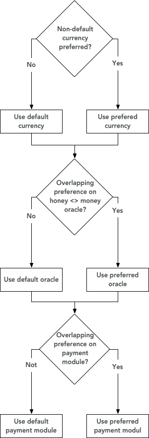

---
SWIP: 4
Title: Choose payment module and honeyMoney oracle
Author: Aron Fischer <aron@ethswarm.org>, Rinke Hendriksen <rinke@ethswarm.org>, Vojtech Simetka <vojtech@ethswarm.org>
Disscussions-to: URL will be provided
Status: Draft
Type: Standards track
Category: Core
Created: 31-07-2019
---

## Simple summary
If we want to allow for multiple payment modules to co-exist on the same network, then nodes must have the possibility to come to an agreement on which payment module to use. We propose that nodes can mention their preferences in a list, where the preferences are normalized and weighted and that, when nodes don't have overlapping prefences or non of the prefences have a higher score than the default option, then the default option will be chosen which is paying in ether by the cheqeubook contract, using the default honey/money payment oracle.
## Abstract 
To be defined
## Motivation
SWIP [PaymentModule](https://github.com/Eknir/SWIPs/edit/master/SWIPs/swip-3.md) laid the ground for supporting multiple payment modules by standardizing the default payment module of SWARM. Allowing multiple payment modules is beneficial for SWARM as it will make the network more resilient (i.e. if one payment module fails, others might still work) and it will make SWARM attractive to a wider user-base by allowing nodes to pay in their currency of preference. If we want to allow different payment modules to co-exist on the same network, there must be a possibility for nodes to list their preference for this payment module. Furthermore, if a payment module implies a different base currency, there must also be the possibility to set the preference for a different HoneyMoney price oracle. Making it a possibility for nodes to set their preference for a payment module will incentivize developers to implement payment modules on SWARM as it will be easy for users to actually choose to pay out with this module. As it is essential for the nodes on the network to be able to always connect even in the case of heterogeneous preferences, there must be a fallback option provided for both the honeyMoney oracle and the payment module. 
## Specification
- Nodes can specify their preference for both payment module, as well as price oracle in a list in a configuration file. The preferences are normalized and weighted.
- For any preference list, the chosen option will be the option which has the highest cumulative preference.
- The preference list has two dimensions. Which will be resolved from high to low:
1) Currency to use

2a) Price oracle to use

2b) payment method to use

- Nodes must be able to reach an agreement in any dimension of the preference list, or the fallback option will be chosen.
The fallback option for the preference list is:

1) wei (Ether)

2a) HonMon oracle <SWIP reference>

2b) chequebook <SWIP reference>
  
- For any payment module where the private key of the standard payment module cannot be used to authorize or receive payments, the payment module implementation should be responsible in making sure that the user manages a valid private key to receive / make payments before they are due. 
Please refer to the picture below to see how preferences are resolved during the handshake:

## Rationale
To-be-defined
## Backwards Compatibility
This SWIP creates no issues with backwards compatability as SWARM nodes that don't implement this SWIP yet, will be considerd by nodes who implement this SWIP as listing the default preference for currency, payment module and honeyMoney oracle.  
## Test Cases
Not currently defined

## Implementations 
Not currently defined

## Copyright Waiver
Copyright and related rights waived via [CC0](https://creativecommons.org/publicdomain/zero/1.0/).
