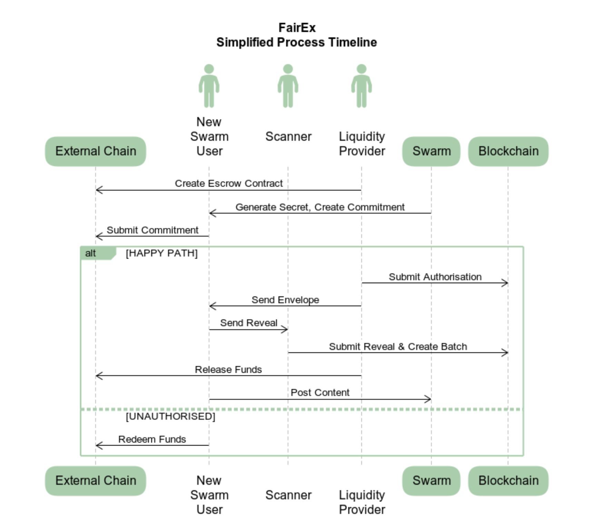
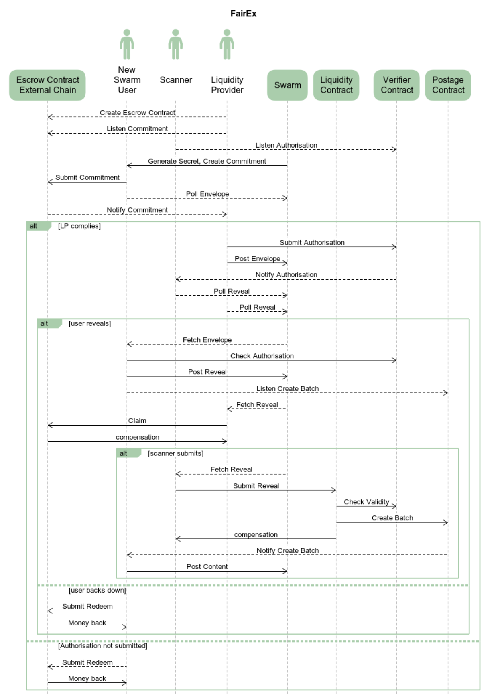

## Abstract
This SWIP  describes a solution for smooth interoperability between swarm users within the broader  crypto ecosystem. A decentralised architecture is offered that eliminates the need for swarm native token to enjoy Swarm's utility.


## Motivation

### Objective

Facilitate quick onramp for users in the broad crypto ecosystem through providing zero-BZZ entry.
Significantly lower the barrier of entry to using Swarm (for upload/download) by eliminating the need for BZZ (Swarm's native token) and xDai (the transactional currency of the Gnosis layer 2), which are otherwise necessary to use the network. Instead, offer options for users to pay for Swarm services with the token native to their chain/platform. 

### Target usecase 
A user from a different blockchain or layer 2 ecosystem should be able to obtain all they need to interact with Swarm (upload and download at their will) relying solely on their wallet and funds in the native currency/token. 

In particular, we aim to provide an add-on service that allows users to directly purchase access to Swarm's services. This solution ultimately enables payments made in an arbitrary crypto asset without having $BZZ (Swarm's native ecosystem coin) or $xDAI (the transactional currency of its host chain, the Gnosis Chain).


## Specification


### Synopsis of the process
0. *Prerequisites*
Liquidity providers (LPs) accepting payments in coin C must have a smart contract deployed on C's host chain. This contract functions essentially as an extension of a wallet.

1. *Commitment*
Incoming payments are first recorded alongside the sender's Ethereum address, the commit hash (the hash of a secret random 256-bit integer), and the validity period, with the payments assumed to be in escrow. This commitment serves as evidence of sufficient funds and can also be thought as a request for quote.

2. *Authorisation*
In response to the commitment, the LP registers an Authorisation for the user (U) on the host chain, serving as a binding offer or quote. 

3. *Reveal*
If the user accepts the offer, they reveal their secret. Due to the conditional authorisation, this action guarantees the payment for the postage batch created for their use.
The revealed secret also serves as the proof that the new 
user approves of the release of their funds in escrow. 

4. *Settlement*
By submitting the secret, the owner of the contract (the LP) can withdraw the funds until the end date of validity, plus an additional grace period. After this time, the prospective Swarm user, i.e., the originator of the commitment transaction, can reclaim their money.


### Limitations and prerequisites
The solution for cross-chain compatibility is underpinned by a decentralised system of liquidity providers that act as bridges between a potentially vast range of cryptocurrencies and the swarm.

#### Network of providers

The solution specifies a protocol  that regulates interactions between users and liquidity providers, enforced through a suite of smart contracts.
The system implements escrow to ensure safety for both parties, therefore liquidity can be provided trustlessly. The incentives are designed to promote desirable dynamics of interaction, assuming that all protocol participants follow a profit-maximising rationale.
 

#### Eligible coins

A blockchain is eligible if it:
1) Supports transactions with a escrow contract: i.e., a smart contract that records pending transactions along with user data and keeps them in escrow.
2) Implements 256-bit Keccak SHA3 encryption.

#### Tooling

Liquidity providers are solicited to participate by virtue of having set up an escrow contract on their respective chains. The correctness of this contract is crucial for maintaining the security of the protocol. The EVM version of this escrow contract is included in the first release and therefore providers for EVM-compatible layer-1 or layer-2 chains simply need to  deploy their instance.

In addition to deploying an escrow, LPs are assumed to have access to Swarm services, including submitting transactions to Swarm's host chain. In other words, they must operate at least a light node with a sufficiently funded wallet. 

For ease of integration, we propose that all interactions with Swarm and the Gnosis chain be supported as API calls to the Bee client. See section on Swarm API.


## Architecture

### Components

Components of fairs are concepts in three dimensions: 
- participant roles:  representing a user of a particular functionality
- transaction components: the array of actions carried out by a single agent that as part of the batch purchase transaction
- smart contracts: ones that are involve in orchestrating the batch purchase transaction.


#### Participant roles

Participants of FairX can assume one or several of the following 3 distinct roles.
- *new swarm users (U)*
  Users are expected to operate at least a light node, i.e., have read access to the blockchain (a connection to Gnosis). They are not assumed to have any BZZ, ETH, DAI, or any other means to send a transaction.
- *liquidity providers (LP)* 
  Liquidity providers are traders who supply BZZ tokens and cover the transaction costs in xDAI necessary to purchase and pay the postage batch. This batch is a prerequisite for users to perform uploads to Swarm. Providers accept payments in various currencies and commit to recording these transactions on the Gnosis Chain upon receipt.
- *scanners (SC)*
  Scanners monitor the Swarm for the reveal single-owner chunk (SOC) which, when found, is retrieved and sent to the postage purchaser contract. 
  

#### Main concepts

- *Commitment*
  The new swarm user makes a commitment to buy a postage batch with parameters B for a price P, denominated in an external currency, by sending amount P to the contract with LPID L. The transaction data include the Ethereum address of the user's Swarm node `A` and commit hash `C`, which is the Keccak hash of a random 32-byte secret `S`.
- *Authorisation*
  The liquidity provider submits the Authorisation to the Validator contract on the Gnosis Chain.   The Authorisation includes V(B) = the BZZ-denominated price of B, node address A, commit hash C, and the LP's Ethereum address.
- *Envelope*
  The envelope contains a postage stamp signed by the LP against the Reveal's SOC address.   The envelope is posted as a SOC with address LPID and ID C. 
- *Reveal*
  Reveal serves as the proof of payment by the user. The  reveal is posted on Swarm as a SOC using the Envelope with address A, ID C and payload S.   It is scanned and picked up by a scanner who sends it to the Liquidity Contract as a transaction. The reveal SOC is ultimately presented to the Verifier Contract to be checked against the Authorisation.

#### Smart contracts

The FairX protocol is orchestrated by a suite of 4 smart contracts. 
- *escrow* 
  The escrow contract accepts a commitment transaction with an amount of X. The transaction amount will be recorded as balance alongside a commit hash (the Keccak SHA3 hash of a random secret) and the sender's ETH address sent as transaction data.
- *verifier*
  A record with the same information as the escrow commitment is inserted under the LP's Ethereum address used on the Gnosis Chain.
- *liquidity pool*
  Acts as the agent that will purchase the batch for the user upon the scanner submitting the reveal SOC signature. It uses the [EIP-3668 standard](https://eips.ethereum.org/EIPS/eip-3668) for soliciting external data for validation via the verifier contract.
- *batch contract*
  This is part of the swarm storage incentive contracts.

### The transaction timeline


   

#### Phases
 
When the commitment has been paid, the swap transaction enters the *pending* phase until the liquidity provider picks it up and authorises it. 
Once the authorisation transaction executes succesfully, the swap enters the *authorised* phase. This lasts until the user posts their reveal in the envelope, which shifts the transaction to the *revealed* state. Once a scanner finds the envelope, they use it to purchase a postage batch for the user, thereby rendering the transaction *complete*.
In the case that the user refuses to reveal after an expiry period, they can reclaim the funds on the external chain.

#### Information flow

In order to submit the Authorisation, the LP needs to monitor the external chain for a log event indicating a new commitment sent by the prospecting user. In EVM, such log events and listeners are available. 

To send the prepaid envelope, the LP will use a SOC with themselves as the owner and the commit hash as the ID.
The new Swarm user can then easily access this using free retrieval.

In order to trigger reveal, the client monitors the blockchain for log events indicating the authorisation. The reveal is done after the client made sure that authorisation is in place (and therefore the verifier will evaluate their reveal as valid and purchase). Reveals are issued by the prospective swarm user who has got no bzz am. Since this is their only 'write' operation to be done

Lastly, scanners collect the reveal through the listening to reveal SOCs of those who they identify by listening to Authorisations which is done via subscribing to the log events of the smart contract.
The detailed process diagram below illusrates the setup and transaction timelines including the means of communication.

#### Detailed Process diagram
 


### Discovery 
Liquidity providers advertise the deal they offer, which includes: 
- contract address and service endpoints
- coin/chain and
    - price of BZZ 
    - fee structure
    - volume limitations
    - start/end date of validity 
- solicited additional data required in the transaction
    - service parameters
    - BZZ amount


### Security

#### Economic incentives

Since the system is decentralised, agents' adherence to the protocol must not be taken for granted. Instead, each action dictated by the protocol must align with the economic incentives of the parties involved. 

The detailed process timeline diagram shows all the actions defining the complete SWAP transaction. We now analyse each action, discuss potential ways of protocol violation, and identify incentives to adhere to the protocol. 

#### Liquidity


The LP is required to submit an Authorisation to the Verifier Contract. This contract accepts commitments under the condition that the necessary total of BZZ, summed over all pending batch purchases, is covered by the collateral in the Liquidity Contract.

#### Operational feasibility

Deploying this system without at least a small number of coins already supported by LPs would likely give an impression of operational flaws to users.

Without sufficient marketing, it is unlikely that there will be a sudden influx of users to Fairex overnight, making the prospect of operating an LP less financially attractive initially. Given this, we recommend that the Swarm Foundation partners up with willing liquidity providers (potentially incentivised by grants) to commit to at least some period of operation.

## Backwards Compatibility
Nothing written up in this SWIP suggest any change that would cause backward incompatibility in the DISC protocol.
However, due to the proposed new API endpoints, implementing the SWIP would necessitate the release of a new (minor) version of the client.

## Test Cases

MVP test for definition of done: upload minimal test content with a batch of arbitrary depth using only one of: 
1. XDAI/DAI
2. USDC
3. MATIC
4. ETC


## Implementation

Components: To implement full support for all roles within FairX, we need to address 

- smart contracts for 
	- validator
	- batch-purchaser
	- liquidity pool
- blockchain log event listeners 
	- commitment logs for LPs
	- authorisation logs for Users and Scanners
	- reveal logs for LPs and Users
- transaction handlers
	- authorise for LP
	- reveal for Scanner
	- liquidity topup for LP
- SOC polling on Swarm
	- envelope SOC polling for Users
	- reveal SOC polling for Scanners
- SOC posting
	- envelope for LPs
		- this requires a new API endpoint in Swarm for `/stamp/export` to support canonical serialised stamps
	- reveal for User
- LP base package for EVM compatible Blockchains
	- liquidity pool entry/topup for LPs
	- init setup for LPs
	- commit for User
	- claim for LP
	- redeem for User


### FairX proxy server

THe FairX proxy server is a stand-alone app connecting to Swarm, the participants' native chain and to the host chain of Swarm. It provides HTTP interfaces for the UIs or scripts running 1) liquidity provider services or 2) zero-cash entry users bootstrapping into the network. 3) scanners relaying zero-entrants reveals for a fee.

#### deploy contract for liquidity provider service (LP)

```
POST /fairx/deploy
{
 chain: <label>,
 token: <token>,
 native-chain-url:  <native-chain-url>,
 host-chain-url:    <host-chain-url>,
 token-address:     <token-contract-address>,
 auth-address:      <validator-contract-address>
 native-address:    <native-address>,
 host-address:      <host-address>,
}
```

responds with

`201  Created`
- setup an escrow on a native chain of choice (phase 0)
- sets native address as owner authorised to withdraw.
- sets host chain address and other params

#### modify settings of the pool (LP)

`PUT /fairx/<chain-label>/<token>-BZZ/`
- using the same scheme as deploy

#### fund/top up the pool (LP)

`PUT /fairx/<chain-label>/<token>-BZZ/add/<amount>`
- add amount to `<token>-BZZ` liquidity pool

#### start the liquidity pool service (LP)

`POST /fairx/<chain-label>/<token>-BZZ/start`
- start operating a `<token>-BZZ` liquidity pool
- connected to both chains
- triggered by commitments on native chain (phase 3)
- submit authorisation to swarm host chain (phase 1)
- triggered by reveals (phase 3)
- submit claim (phase 2)

#### stop the pool (LP)

`DELETE /fairx/<chain-label>/<token>-BZZ/stop`
- stop operating a `<token>-BZZ` liquidity pool

#### poll the status of the pool (LP)

`GET /fairx/<chain-label>/<token>-BZZ/status`
- get status of `<token>-BZZ` liquidity pool
	- get status of escrow contract
	- get status of  validator contract
	- get status of  purchase contract

#### user initiate transaction 
```
POST /fairx/<chain-label>/<token>-BZZ/tx
{
   batch: {
       depth: <depth>,
	   amount: <amount>,
	   mutable: <mutable>,
   },
   offer: <offer-id>
}
```

- connected to both chains
- sends commitment (phase 1)
- listen to authorisation log events (phase 3)
- poll for envelope SOC (phase 3)
- upload reveal SOC (phase 1)
- listen to purchase log (phase 3)
- locally create a batch (phase 4)

#### get status of transaction 

`GET /fairx/tx/<tx-id>/status`

responds with 

`200   { tx: <tx-id>, status: "pending|authorised|revealed|completed" } `

#### start scanner service  

`POST /fairx/<chain-label>/<token>-BZZ/scan/start`

- listen to authorisation log (phase 3)
- poll for reveal SOC (phase 3)
- submit reveal (phase 1)
- listen to purchase log (phase 3)


### Roadmap 

The roadmap is structured such a way that maximises the useable end-to-end system, yet provides a healthy iteration of agile sprints:

- **phase 0**: *setup and commit*
  - LP escrow contrac: deployment and commit endpoint
  - Purchaser contract:  deposit liquidity and reveal  endpoint
  - tooling: to enable LP init setup and liquidity deposit
  - two chain setup for testing
- **phase 1**: *authorise and reveal*
	- define reveal SOC and provide purchaser contract reveal endpoint
	- validator contract: authorisation and verify endpoints
	- Purchaser contract: verifying authorisation via call to validator
	- LP submit authorisation 
	- reveal submission  for scanner
- **phase 2**: *claim and redeem*
	- expiries cleared up
	- release claim and redeem functions in escrow
	- LP claim
	- User use the batch
- **phase 3**: *conditional triggers* 
	- log listeners
		- LP for commitment
		- User for authorisation
	- SOC posting:
		- LP sends envelope
	- SOC polling:
		- User for envelope
		- Scanner for reveal
- **phase 4**:
	- piecing it all together
	- integration testing for potential other chains
	- complete documentation
	- ensure CLI- and BeeJS support


## Further benefits

The solution allows scanners to earn BZZ by submitting the reveal SOCs to the contract. 

By introducing a new parameter for *start of validity*, the scheme allows the trading of *bzz utility future options*dz.


## Copyright
Copyright and related rights waived via [CC0](https://creativecommons.org/publicdomain/zero/1.0/).
