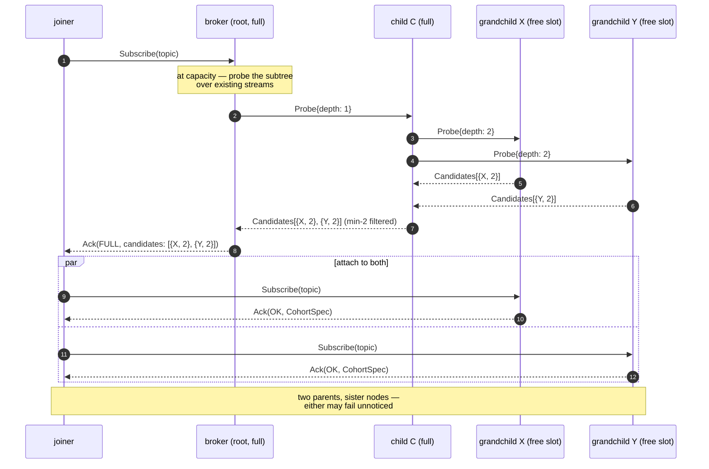
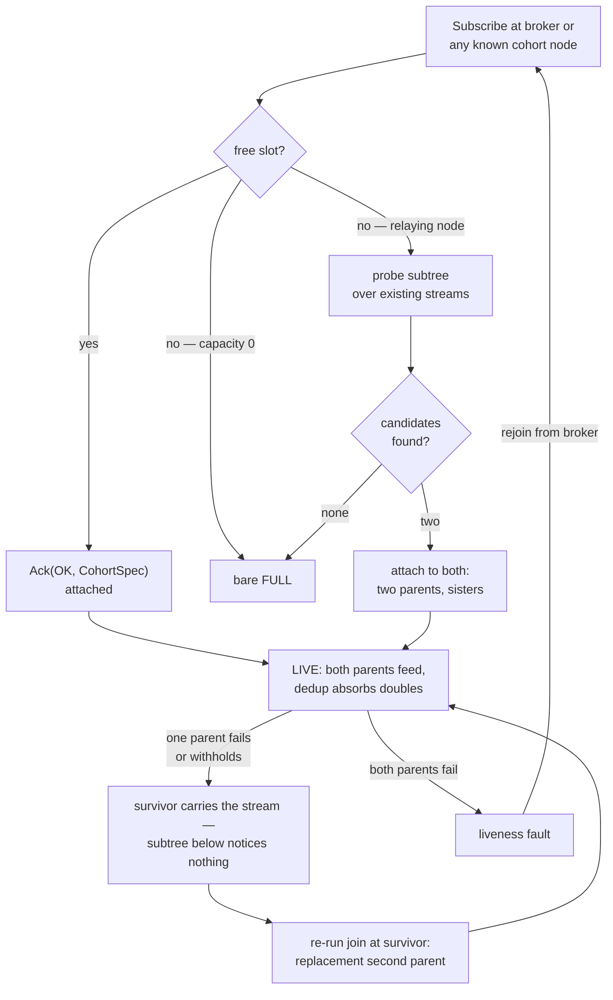

- **Business line**: audiences beyond one node's capacity — live streaming and event
  fan-out scaled by recruiting subscribers as relays, so a cohort's capacity grows with
  its audience instead of being fixed by the broker's stream limit — and streams that
  survive relay churn without interruption.
- **Dev line**: fill three reserved `Broadcast` control-plane fields of
  [bps.proto](assets/swip-61/bps.proto) (`Reparent`, `Probe`, `Candidates`), extend `Ack` with
  attachment candidates, and implement three behaviours — subtree probing, dual-parent
  maintenance, make-before-break reparenting; done when a cohort scales past a single
  node's capacity, masks a single relay failure with no delivery gap, and unmodified
  SWIP-60 clients attach as leaves.
- DISC: the first time proper **forwarding by consumers** (subscribers as
  relays) is implemented; a wire-protocol change (reserved frames become normative),
  no storage or Bee-API change.
- Bandwidth-incentive integration is a separate SWIP (bps-bw-incentives).

## Simple Summary

SWIP-60 bounds a topic's audience by one broker's per-topic capacity. This SWIP removes
the ceiling: a full node answering a `Subscribe` **probes its own subtree over the
streams it already has** and returns the two shallowest free attachment points — and
the joiner attaches to **both**. Every node thus keeps two parents (typically sister
nodes): both feed it, duplicates are absorbed by SWIP-60's dedup rule, and the loss of
any single relay or link is masked, not suffered — the subtree below never notices,
while the affected node self-heals by re-running the join. A subscriber that accepts a
child thereby becomes a **relay**; the tree grows first-come-first-served, with no
control traffic while nobody is joining. End-to-end authentication is unchanged: a
relay can withhold, never forge — and with two feeds to compare, withholding shows.

## Motivation

One principle carries over from SWIP-60 and does all the work here: **forwarders are
subscribers**. A forwarder is simply a subscriber that fans out messages to subscribers
of its own; singlehop is the depth = 1 variant of the same structure, and the broker
remains the root in every configuration. Scaling to large audiences is then not a new
protocol but the removal of one restriction — the singlehop rule "at capacity, refuse
with `FULL` and nothing else" is replaced by referral to where capacity is. Placement
quality is explicitly **not** the join protocol's problem: FCFS means the first free
slot found wins. What multihop must not compromise is the contract itself: messages
arrive at **all subscribers** — a live stream that drops messages on relay churn is
broken, so churn tolerance is built into the topology, not patched on.

## Specification

### The seam from SWIP-60

Everything in SWIP-60 stands — cohort genesis (`CohortSpec` untouched), bindings and
dedup rules, publisher legitimacy, the `Open`/`Subscribe`/`Ack` establishment,
self-contained SOC frames, end-to-end verification — with exactly one amendment:

**The capacity rule.** A relaying node at capacity answering a `Subscribe` MUST NOT
bare-refuse; it probes its subtree and answers `Ack(FULL)` **with the two shallowest
attachment points found** (new `candidates` field). A SWIP-60-only client ignores the
unknown field and reads a plain refusal.

There is **no depth bound**: the tree grows as deep as joins take it. Depth is
self-limiting — per-hop pricing (bps-bw-incentives) charges upstream by depth, so
joiners are economically steered toward the root; a protocol bound would only duplicate
the price signal. And the one configuration that genuinely needs depth = 1 — the closed
cohort, where all and only publishers subscribe — is **structurally** singlehop already:
publishers connect directly to the root.

Invariant: **publishers (and the opener) still connect directly to the root.** Multihop
restructures the audience side only.

### Roles

- **Broker** — as in SWIP-60: root of the tree, target of `Open`, sole entry point for
  publishers, default entry point for joins.
- **Relay** — a subscriber with children: re-broadcasts every SOC frame down its own
  direct streams, answers `Subscribe` like any parent, and forwards and aggregates
  probes. There is no promotion step: **accepting your first child is what becoming a
  relay means.** Relay capability is latent in every subscriber — the `Ack`-echoed
  `CohortSpec` from its own join is exactly what it echoes to children of its own. Any
  full-node subscriber is relay-eligible; NAT'd and light-client relays are reachable
  if the transport can dial them (see NAT'd relays below), not required — a node unable
  or unwilling to relay simply has capacity 0 and refuses.
- **Leaf** — a subscriber with no children; the SWIP-60 subscriber role verbatim. A
  SWIP-60 client is a conformant leaf (single-parented — it forgoes the resilience,
  not the stream).

### Join: probe and attach (FCFS)

A joiner sends `Subscribe(topic)` to the broker (or any cohort node it already knows).
A node with a free slot accepts on the spot: `Ack(OK, CohortSpec)`. A full relaying
node **searches its own subtree before answering** — over the streams it already has:

1. **Probe down.** The full node sends `Probe{depth}` to its children, `depth` being
   the receiver's depth (root's children = 1). A full child forwards the probe to its
   own children, incrementing `depth`; a child with a free slot replies instead of
   forwarding; a capacity-0 child replies empty (or not at all — see below).
2. **Filter up.** A node with a free slot answers `Candidates` naming itself
   `{addr, depth}`. A forwarding node collects its children's replies within a bounded
   wait (parameter), keeps the **two smallest-depth** candidates, and passes
   them up.
3. **Answer.** The originating node answers the joiner `Ack(FULL, candidates)` — the
   two shallowest attachment points of its subtree. No candidates ⇒ bare `Ack(FULL)`:
   the probe came back empty, the subtree genuinely cannot host the joiner.
4. **Attach — to both.** The joiner `Subscribe`s at **both candidates**: the two
   resulting streams are its two parents (see Resilience). A candidate lost to a race
   is replaced by re-`Subscribe`ing at the origin. **A join is ideally a two-step
   process** — one round to learn where, one to attach — regardless of tree size.

The probe wave stops at the first non-full node on every path: nothing below a free
slot is ever searched. Depth travels **in the probe itself**, incremented hop by hop —
no node knows or stores its own position, so there is nothing to go stale when the tree
is reorganised. And there is no standing state anywhere: an idle cohort is perfectly
silent, state is gathered on demand and discarded. A node MAY reuse candidates from a
just-completed probe for immediately subsequent joins instead of re-probing.

Preferring shallow slots is deliberate: min-depth filtering fills the tree
breadth-first, keeping delivery paths short — and it agrees with the incentive gradient
(upstream pricing is depth-scaled), so the protocol default and the economics point the
same way. It is still FCFS, not optimality: candidates race, replies are best-effort
within the wait bound, and the first slot won wins.

### Resilience: two parents

Churn-related misses are not tolerated: the contract says messages arrive at all
subscribers, and a live stream cannot pause for tree repair. So redundancy is
structural:

- **Every node maintains two parents** — the probe's two candidates; by min-depth
  filtering these sit at (near-)equal depth, typically **sister nodes**. The two
  parents MUST be distinct; while the cohort is too small to offer two (e.g. the
  broker's first children), a node stays single-parented and upgrades when it can.
- **Both parents feed.** Each parent treats the node as an ordinary child and streams
  every frame; frames are self-contained SOCs and the binding's dedup rule (SWIP-60)
  suppresses the duplicate — this is the make-before-break overlap made permanent.
- **Single failure masks.** If a relay or a link fails, every child of the failed node
  keeps receiving through its other parent, so **the subtree below notices nothing**;
  masking is recursive — each level's redundancy protects the level below.
- **Self-healing is the join protocol re-run.** The half-orphaned node acquires a
  replacement second parent by `Subscribe`ing at its surviving parent (accepted
  directly, or answered with fresh candidates via probe). No dedicated repair
  machinery.
- **Withholding becomes visible.** With two independent feeds, a parent whose stream
  persistently lags its sister's is caught by comparison; the node drops it and
  replaces it the same way — demotion, not detection heroics.

The price is stated, not hidden: each subscription consumes two tree slots and every
message crosses every level twice, roughly doubling bandwidth. Resilience is bought,
and per-hop pricing (bps-bw-incentives) is what will price it; an active/standby
variant (second parent connected but mute until asked) trades the gap-free guarantee
for half the traffic and is deliberately **not** specified here.

### Reparenting (`Reparent`) — make-before-break

`Reparent{to}` is the parent→child instruction to move: the child `Subscribe`s to the
new parent, waits for `Ack(OK)` confirming the stream is live, and **only then** drops
the old stream. During the overlap the dedup rule absorbs doubles, as everywhere.

Two cases:

- **graceful leave** — a departing relay `Reparent`s each child toward a replacement
  (its own parents, or spread over its children **(?)**) before closing; the child's
  flow continues on its other parent throughout the move;
- **churn repair** — is the *absence* case: BPS has no keepalive, so a parent's death
  surfaces as a transport-level stream reset or connection loss; no `Reparent` arrives,
  the surviving parent carries the stream, and the node re-runs the join for a
  replacement.

Only a *simultaneous* loss of both parents opens a delivery gap; that is then a
liveness fault like any other — repaired by rejoin from the broker, with no recovery of
the gap itself (a resumed subscriber is in the same position as a fresh one).

### NAT'd relays

Reaching a NAT'd relay is the transport's business, not this protocol's: libp2p circuit
relay + DCUtR hole punching (the dcutr work item, bee
[#5355](https://github.com/ethersphere/bee/issues/5355)). BPS carries no signalling for
it — the only tree-relevant observation is that a NAT'd child's **parent is its natural
circuit relay**, so a candidate a probe returns can be handed out under an address the
transport knows how to dial.

### Information flow (probe and attach)



### Process: a subscriber's lifecycle



### Wire protocol

Amendments to [bps.proto](assets/swip-61/bps.proto) — three reserved `Broadcast` control-plane fields
become normative, the rest stay reserved; control frames ride the `Broadcast` envelope
in **both directions** on a (peer, topic) stream (`Candidates` flows child→parent);
frame type and direction disambiguate. On submission the amended file goes to
`assets/swip-61/`. `CohortSpec` is untouched:

```proto
message Ack {
  Status     status = 1;
  CohortSpec cohort = 2; // set iff status == OK
  repeated Candidate candidates = 3; // set iff FULL at a relaying node: the two
                                     // shallowest attachment points the probe found
}

message Broadcast {
  oneof frame {
    Soc        soc      = 1; // as SWIP-60
    Reparent   reparent = 2; // parent -> child
    Probe      probe    = 3; // parent -> child: find free slots below
    Candidates found    = 4; // child -> parent: probe reply, min-2 filtered
    // 5–15 remain reserved
  }
}

// parent -> child: re-point, make-before-break
message Reparent {
  bytes to = 1; // overlay address of the new parent
}

// depth of the receiver, incremented at each forwarding hop —
// no node stores its own position
message Probe {
  uint32 depth = 1;
}

// at most two, smallest depth first
message Candidates {
  repeated Candidate candidates = 1;
}

message Candidate {
  bytes  addr  = 1; // overlay address of a node with a free slot
  uint32 depth = 2; // its depth at probe time
}
```

## Rationale

**Why no standing capacity state — beacons, slot counts, subtree summaries?** Because
any standing summary must be kept fresh on every edge forever and is stale by
construction. The probe gathers exactly the state one join needs, at the moment of
needing it, and discards it; an idle cohort is perfectly silent — the same philosophy
that keeps keepalives and capacity advertisement out of BPS altogether (SWIP-60).

**Why does the tree search, and not the joiner?** Cost asymmetry. A probe hop rides a
stream that already exists — one frame each way; a joiner's probe is a fresh dial to a
stranger — connection setup, handshake, possibly NAT traversal. Letting the tree run
the search over its own edges and handing the joiner two ready candidates turns a chain
of expensive dials into a wave of cheap frames plus two dials.

**Why two live parents rather than a standby?** Because the failure this design must
mask is precisely the one a standby cannot: messages sent during the window between a
parent dying and anyone noticing. There is no keepalive to notice with — liveness is
the transport's job, and transport-level detection has latency. Two always-on feeds
close that window structurally, cost 2×, and come with a side effect no standby offers:
withholding is caught by comparing the feeds.

**Why no depth bound?** Because depth already has a price. Per-hop publish pricing
(bps-bw-incentives) is depth-scaled upstream, so joiners are economically steered
toward the root and deep chains cost their occupants; a protocol-level `max_depth`
would duplicate that signal with a blunter instrument — and give the tree a notion of
"full" it doesn't otherwise need. The closed cohort, the one shape that must stay
depth 1, is structurally singlehop: publishers connect directly to the root.

**Why do relays get nothing here?** They do — later. Metered per-hop pricing is
bps-bw-incentives' business; this SWIP keeps the edges it will price. Until then,
relaying is the same volunteer economics as singlehop brokering.

**Why is withholding still tolerable with more intermediaries?** Unchanged from
SWIP-60 in principle — authentication is structural (SOC signature against the topic
binding, verified against the `Ack`-echoed `CohortSpec` at any depth), so adding relays
adds withholding points but no forging points — and strengthened in practice: a
withholding parent is exposed by its sister's feed and replaced by the ordinary
self-healing path.

## Out of scope (deliberately)

Paying for forwarded messages (bps-bw-incentives); message history — delivery of
messages from before the subscription (bps-history); broker discovery (SWIP-59 MEX);
NAT traversal — circuit relay and hole punching are transport business (dcutr item);
dynamic publisher-list changes (out of scope in SWIP-60, unaffected here).

## Conformance (definition of done)

An implementation is conformant when:

1. a relaying node at capacity answers `Subscribe` with `Ack(FULL, candidates)` — the
   two smallest-depth attachment points its probe returned; bare `FULL` only on an
   empty probe, or from a node that cannot or will not relay;
2. a probe wave terminates: nodes with a free slot reply and do not forward, and
   forwarding nodes answer within the wait bound with the min-2-by-depth filter of what
   arrived;
3. an accept carries the echoed `CohortSpec`;
4. absent races, a join completes in two steps: one probe round, one (dual) attach;
5. a node offered two distinct parents maintains both; duplicate deliveries never
   surface past the binding's dedup rule;
6. the failure of any single relay or link causes no delivery gap anywhere below it;
   the half-orphaned children re-acquire a second parent via the ordinary join;
7. every reparent is make-before-break;
8. an unmodified SWIP-60 client attaches as a leaf anywhere in the tree and cannot
   distinguish its parent from a singlehop broker;
9. a subscriber at any depth re-verifies every message end-to-end; loss of both
   parents is a liveness fault repaired by rejoin.

## Backwards compatibility

Same stream name `pubsub/1.0.0`, no version bump: `Reparent`, `Probe` and `Candidates`
fill `Broadcast` oneof fields reserved by SWIP-60, and the single new `Ack` field
is invisible to old implementations — an old client ignores `Ack.candidates` and reads
a plain `FULL`. A SWIP-60 leaf that receives a `Probe` ignores the unknown frame and
never replies — exactly the empty answer the bounded wait absorbs, which is why old
leaves are compatible by construction (single-parented, without the resilience).
`CohortSpec` is untouched. SWIP-60's conformance item 4 ("`FULL` — and nothing else")
is superseded for nodes implementing this SWIP.

## References

[SWIP-60](https://github.com/ethersphere/SWIPs/pull/104) / PR
[#104](https://github.com/ethersphere/SWIPs/pull/104) · wire: [bps.proto](assets/swip-61/bps.proto) ·
origin: [PR #93](https://github.com/ethersphere/SWIPs/pull/93) "Add: pubsub" ·
implementation groundwork: bee [#5435](https://github.com/ethersphere/bee/pull/5435) ·
dCUTr: [bee#5355](https://github.com/ethersphere/bee/issues/5355)

## Copyright

Copyright and related rights waived via [CC0](https://creativecommons.org/publicdomain/zero/1.0/).
