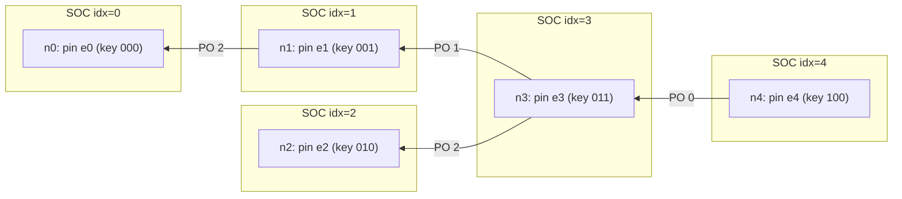

<!-- The sequential construction promised by SWIP-60 ("self-indexed feeds, SWIP-65
(forthcoming)") — binding-semantics note and API frame-prefix rule both anchor here. -->

- **Business line**: live streams that persist themselves — every live message is already
  a feed update, and every update carries the complete index of its history. Late
  joiners, seekers and after-the-fact viewers need only the latest message; a missed
  message is recoverable from storage, not lost. This alone unlocks HLS-style live video
  with no manifest republication, and collaborative editing with catch-up.
- **Dev line**: no new wire frames and no proto change; implement (1) the `FEED_TOPIC`
  SOC assembly/validation rule — bare-index frames per SWIP-60's API
  ([#104](https://github.com/ethersphere/SWIPs/pull/104)), groundwork in bee
  [#5435](https://github.com/ethersphere/bee/pull/5435) — (2) publisher-side whirl-only
  pot maintenance (bee-js **(?)**), (3) subscriber-side gap detection and feed recovery;
  done per the conformance section.
- **DISC: NO** — SOCs, feeds, postage, push-sync and retrieval are all used exactly as
  they are; this is a chunk-payload convention plus BPS client behaviour over SWIP-60.
  No storage-layer change, no new protocol.

## Simple Summary

Under explicit publisher regimes the SOC id does no protocol work (SWIP-60), so this
SWIP gives it one: the publisher uses a plain sequence number, **signs each message as a
feed update** (signed id = `keccak256(topic ‖ index)`) **but carries only the bare
index** — the topic is implicit in the channel, so any receiver reconstructs the signed
id from channel topic + index. Each message is thereby simultaneously a live BPS message
and a retrievable feed update: an index gap is detectable at the next frame and the
missed update is fetched from storage by its feed address. On top of this, each update's
payload is a node of a **whirl-only pot** over all previous updates — the feed carries
its own index, so the latest update alone gives ordered playback, random access and
range queries over the entire history, with zero auxiliary chunks.

## Motivation

SWIP-60 deliberately left the sequential construction open: under explicit publishers,
legitimacy is list membership, the id is unconstrained, and publishers MAY use sequence
numbers. This SWIP is that construction, made to settle three things at once: dedup
needs no per-binding special cases, missed live messages stop being unrecoverable, and
SWIP-61's dual-parent bandwidth cost becomes a choice instead of a necessity. The pot
layer then answers the question every streaming design on Swarm trips over: how does a
late joiner get the history without the publisher republishing an ever-growing manifest?

## Specification

Notation: `H` = keccak256, `H_BMT` = BMT hash, `‖` = concatenation. `IDX` is a uint64,
big-endian, starting at 0, incremented by 1 per update.

### The construction: signed as a feed update, carried as the bare index

Update `i` by owner `O` on topic `TOPIC` is the SOC ⟨`a`, `c`⟩:

```
id  = H(TOPIC ‖ IDX)                                  // the signed id: a feed update
a   = H(id ‖ OWNER)                                   // SOC address in storage
sig = SIG_O( H( id ‖ H_BMT(SPAN ‖ PAYLOAD) ) )
c   = IDX ‖ sig ‖ SPAN ‖ PAYLOAD                      // carried content: bare index
```

In storage this is byte-for-byte an ordinary sequential feed update — any feed client
can follow it with no knowledge of BPS. Within a cohort (p2p frames and WS bridge
frames alike) the 32-byte id field carries the 8-byte `IDX` instead: `TOPIC` is fixed
by the channel, so carrying `H(TOPIC ‖ IDX)` would transmit an opaque digest of a value
the receiver needs in the clear — the index is what makes gaps *visible*. Every
receiver reconstructs `id`, verifies `sig`, and where it stores or forwards outside the
cohort, reassembles the standard SOC.

### Validation and dedup — no special rules

A broker (and every verifying receiver) on a `FEED_TOPIC` cohort with explicit
publishers checks exactly SWIP-60's list: signature recovers an owner in the genesis
publisher list, and the chunk address `a` — computable from channel topic + carried
index + recovered owner — is not a duplicate. **Dedup is on chunk address, as for every
implicit binding, and needs nothing else**: distinct indices give distinct addresses by
construction, so the SWIP-61 dual-parent overlap, make-before-break reparenting and
history replay all dedup through the one existing rule. The broker MUST NOT enforce
index monotonicity or contiguity — frames may arrive reordered, and gap handling is the
subscriber's business (below).

Two valid SOCs sharing an index but not a payload are an **equivocation**: both pass
dedup (distinct addresses), and the pair is self-evidencing publisher misbehaviour —
two signatures by one owner over one id. Detection is free; response policy is out of
scope **(?)**.

### The payload is the index: whirl-only pot

Let `e_0, e_1, …` be the content of the updates — for streaming, each `e_i` a CAC
(a media segment, a document delta) — and let

```
KEY : e ↦ uint64 (big-endian)
```

be a key projection that is **strictly monotone over the sequence**: `KEY(e_i) <
KEY(e_j)` for `i < j`. Media presentation timestamps qualify; so does `IDX` itself,
which is the default **(?)**.

The `PAYLOAD` of update `i` is the canonical serialization of `n_i`, the top node of
the **whirl-only pot** (proximity order trie maintained exclusively by whirls, per
[Trón & Verbin](https://github.com/ethersphere/SWIPs) **(?)** — reference to be pinned)
over `{e_0, …, e_i}` keyed by `KEY`:

- `n_i` **pins** the newest element: ⟨`KEY(e_i)`, `ref(e_i)`⟩;
- its **forks** are Swarm references to earlier nodes `n_j`, `j < i`.

Three properties of pots carry the whole design:

1. **One new node per insert.** A whirl-only insertion creates exactly one new node —
   `n_i` itself. So the index has **no chunks of its own**: every node of the pot over
   `{e_0, …, e_i}` is the wrapped payload of some earlier update. Publishing update `i`
   publishes the message *and* the index delta in the same chunk.
2. **Iteration is history.** XOR distance from key 0 is the key's numeric value, so
   ascending iteration from 0 enumerates the elements in `KEY` order — which by
   monotonicity is publication order: `Iter(n_i, 0, ASC) = e_0, …, e_i`, retrieving
   every node exactly once. Descending iteration from key `2^64 − 1` yields
   newest-first: the live window is its first `k` elements.
3. **Random access.** Lookup of any key (a seek to a timestamp) is a descent from the
   latest node: `O(log n)` chunk retrievals **(?)**.

The sequence of updates and the index they weave (indices 0–4, `KEY = IDX`, 3-bit keys
for legibility; every arrow is a fork — a Swarm reference to the wrapped chunk of an
earlier update):



A fork reference names the earlier update's **wrapped CAC**, not its SOC address:
integrity by content hash at every hop, and generic pot tooling works unmodified. The
alternative — referencing update `j`'s (computable) SOC address, saving the double
upload below — would put a signature check on every descent hop and tie the pot format
to feeds; rejected **(?)**.

The pot layer is a **profile**: a cohort whose payloads need no history (pure signal)
MAY run the bare construction above and skip it **(?)**.

### Gap detection and recovery

A subscriber tracks the highest contiguous index `w` it has verified. A frame with
`IDX > w + 1` is evidence of `IDX − w − 1` missed updates, each individually
addressable: update `j` lives at `H( H(TOPIC ‖ j) ‖ OWNER )`. The subscriber retrieves
it from storage as an ordinary feed update; a recovered update passes the same
verification as a live one and MUST be indistinguishable to the dApp (delivered through
the same session, same serialization). Recovery is silent self-healing, not an error
path — and it doubles as **withholding evidence**: a parent whose stream shows gaps its
recovered chunks prove existed is caught without a second feed to compare against.

### Persistence: what recovery presupposes

Recoverability presupposes the updates reach storage. When persistence is on, the
publisher's node uploads each update under a valid postage stamp, push-synced as usual:
the SOC (feed lookup resolves), and the wrapped node chunk (index descent resolves) —
the storage-side counterpart of `swarm-cache-wrapped-chunk` **(?)**. A cohort without
persistence still gets gap *detection* and dedup for free; it forgoes recovery and
history, and SWIP-61's masking is then the only gap protection — the trade below.

### Consequences for SWIP-61: masking becomes a choice

SWIP-61 buys gap-freedom structurally: every node keeps two live parents, 2× bandwidth
at every level, single failures masked with no gap. Self-indexing changes what a gap
*is* — detectable at the next frame, repairable from storage — so a delivery gap
degrades from a contract violation to recovery latency, and the dual-parent cost stops
being mandatory:

1. For self-indexed cohorts, the SWIP-60 contract ("messages arrive at all
   subscribers") is satisfied by **deliver-or-recover**; dual parenting is no longer
   the only conformant means. SWIP-61's conformance items 5–6 are accordingly relaxed
   for such cohorts: maintaining a second parent is RECOMMENDED, not required **(?)**.
2. The trade is real and stated: masking pays 2× continuously and closes the gap
   entirely; recovery pays nothing until a fault, then pays storage round-trip latency.
   Collaborative editing barely notices recovery latency; the live edge of a video
   stream might — a viewer at `latest` cannot wait out push-sync plus retrieval.
3. Mechanically this is a **per-subscriber choice needing no protocol change**: SWIP-61
   trees already seat single-parented nodes (SWIP-60 leaves), and a single-parented
   relay endangers only itself — its children hold their own second parents. Whether a
   cohort should also fix a default at genesis (a resilience flag in `CohortSpec`) is
   left open; recommendation: leave it per-node, keeping `CohortSpec` untouched — the
   cost is local, so the decision should be too **(?)**.

### API

SWIP-60's bridge already carries this SWIP's frame rule: for feed bindings the inbound
and outbound frame prefix is the bare index, signed id `keccak256(topic ‖ index)`.
Amendments **(?)**:

- `swarm-soc-fields` gains an `index` field — the bare uint64, so a dApp on a
  self-indexed stream reads its position without recomputing ids;
- a postage batch supplied on the WS session (`swarm-postage-batch-id`) switches
  persistence on: the node uploads each published update (SOC + wrapped chunk) as it
  publishes; absence means live-only;
- recovered updates are injected into the session in index order; the bridge delivers
  frames as they arrive and back-fills, it does not reorder the live stream **(?)**.

### Worked example: HLS-style live video

`e_i` = the i-th media segment (CMAF fragment, 2–6 s); `KEY` = presentation timestamp
in ms, or `IDX` for fixed-duration segments. **The pot is the manifest**:

- **live** — subscribe via BPS: each frame's payload pins the newest segment; the
  player's live window is the first `k` elements of descending iteration;
- **seek** — to timestamp `t`: XOR-nearest descent from any recent node, `O(log n)`
  retrievals;
- **join late / VOD** — the latest update alone is the complete recording:
  `Iter(n_latest, 0, ASC)` plays start to finish; when the stream ends, the final feed
  update is the permanent artifact;
- **missed segment** — an index gap; fetched by feed address while playback continues
  from buffer.

Contrast the status quo: HLS on Swarm republishes a growing playlist on every segment —
`O(n)` bytes a time, `O(n²)` cumulative — and players poll it. Here the manifest delta
rides inside the segment's own update, history included, nothing republished, nothing
polled.

## Rationale

**Why carry the index instead of the id?** The id is a hash of the index; within the
channel the topic half of its preimage is known to every party. Carrying the digest
hides the one number that makes sequence position, gaps and recovery addresses
computable — and buys nothing, since the id is reconstructible either way. The bare
index is the same information, usable.

**Why is this the dedup story?** (nugaon's first argument.) Sequential indices make the
address-dedup rule that implicit bindings already use sufficient for feeds too: no
per-binding special cases, no highwater marks in brokers, no ordering assumptions in
the forwarding plane. The forwarding plane stays dumb; sequence is meaning the edges
attach.

**Why challenge double parenting?** (nugaon's second argument.) SWIP-61's 2× is the
price of masking *undetectable* loss. Self-indexing makes loss detectable and
repairable, so paying 2× at every tree level forever is no longer the only way to keep
the contract — it is a latency product some cohorts (live video) may still buy, and
others (collaborative editing) should not have imposed on them.

**Why recoverable rather than resent?** (nugaon's third argument.) The publisher
already persisted the update as a feed chunk — recovery is a storage read, needs no
publisher cooperation after the fact, no broker buffering, no retransmission protocol,
and works for a subscriber who was offline for the whole outage, not just a blip.

**Why a whirl-only pot rather than a linked list or a republished manifest?** A
back-pointer list gives ordered history at `O(n)` traversal and no random access; a
republished manifest gives random access at `O(n)` republication per update. The
whirl-only pot gives both at one chunk per update — the theoretical floor, since the
update itself is already a chunk — because whirl insertion creates exactly one node and
that node is the update. Monotone keys make XOR-from-zero iteration coincide with
publication order, so no separate ordering structure exists either.

## Out of scope (deliberately)

Dynamic publisher lists (out of scope since SWIP-60); history *delivery* over BPS
streams (bps-history — though this SWIP's pot descent is the obvious mechanism for it
**(?)**); equivocation response policy; multi-publisher merge semantics — one
self-indexed feed has one owner; a multi-publisher cohort is one feed per publisher,
composition above **(?)**; encryption of payloads and segments (orthogonal).

## Conformance (definition of done)

An implementation is conformant when:

1. a publisher node assembles the SOC from a bare-index frame (reconstruct id, sign
   client-side per SWIP-60's key-holding rule), and every verifying receiver validates
   it with SWIP-60's checks alone — dedup on chunk address, no index monotonicity or
   contiguity enforcement anywhere in the forwarding plane;
2. in storage, an update is an ordinary sequential feed update: an unmodified feed
   client follows the stream with no BPS knowledge;
3. with the pot profile on, publishing update `i` creates exactly one new chunk, whose
   payload is the whirl-only pot node over all elements so far; ascending iteration
   from the latest update enumerates the full history in publication order retrieving
   each node exactly once, and key lookup costs `O(log n)` retrievals;
4. a subscriber detects any index gap at the next verified frame and (persistence on)
   recovers each missed update from storage; recovered updates are indistinguishable
   from live ones at the dApp boundary;
5. with persistence on, both the feed lookup (SOC address) and the index descent
   (wrapped chunk address) of every update resolve from the network;
6. an unmodified SWIP-60 `FEED_TOPIC` cohort interoperates: frames are byte-identical,
   and a SWIP-61 subscriber on a self-indexed cohort MAY hold one parent without
   breaking any tree invariant.

## Backwards compatibility

No new frames, no proto change, no version bump: this SWIP realises semantics SWIP-60
reserved for it (id unconstrained under explicit regimes; bare-index frame prefix for
feed bindings). Storage-side artifacts are ordinary feeds — legacy feed clients
interoperate by construction. SWIP-61 is amended, not broken: its dual-parent
requirement (conformance items 5–6) is relaxed to RECOMMENDED for self-indexed cohorts
**(?)**; trees mixing single- and dual-parented subscribers were already well-formed.

## References

[SWIP-60](https://github.com/ethersphere/SWIPs/pull/104) (requires) ·
[SWIP-61](https://github.com/ethersphere/SWIPs/pull/105) (consequences) · pots:
Trón & Verbin, *Proximity Order Tries* (2026) **(?)** — pin a public link · origin:
[PR #93](https://github.com/ethersphere/SWIPs/pull/93) "Add: pubsub" · implementation:
bee [#5435](https://github.com/ethersphere/bee/pull/5435),
[#5486](https://github.com/ethersphere/bee/pull/5486),
[#5497](https://github.com/ethersphere/bee/pull/5497), bee-js
[#1151](https://github.com/ethersphere/bee-js/pull/1151)

## Copyright

Copyright and related rights waived via [CC0](https://creativecommons.org/publicdomain/zero/1.0/).
