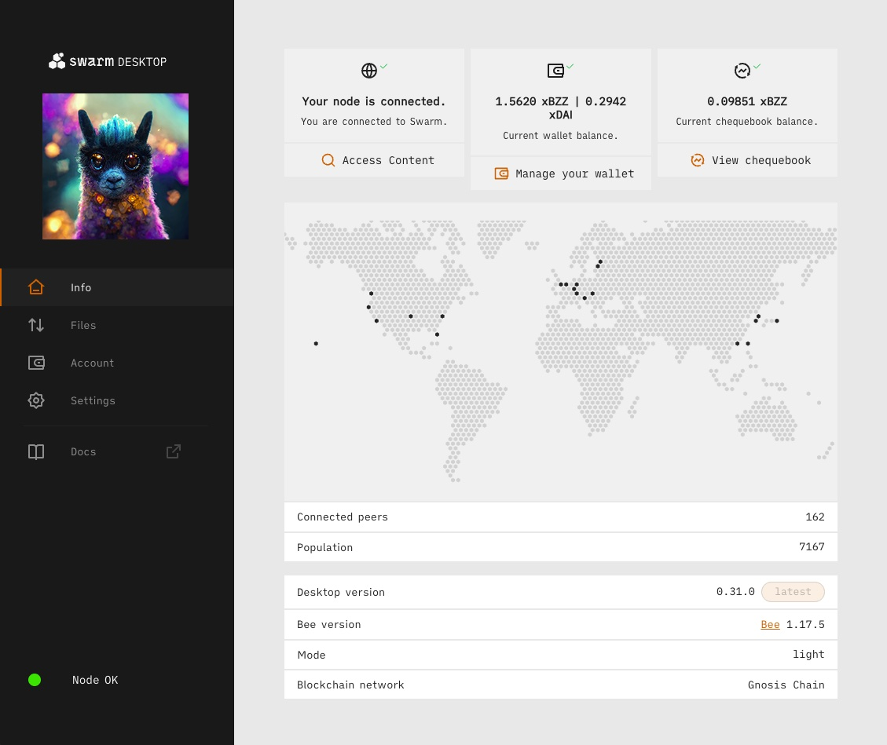

<!--You can leave these HTML comments in your merged SWIP and delete the visible duplicate text guides, they will not appear and may be helpful to refer to if you edit it again. This is the suggested template for new SWIPs. Note that a SWIP number will be assigned by an editor. When opening a pull request to submit your SWIP, please use an abbreviated title in the filename, `SWIP-draft_title_abbrev.md`. The title should be 44 characters or less.-->

## Simple Summary
A modification to the Swarm Desktop App allowing it to display an NFT as a welcoming image on the home screen.

## Abstract
Modification for the Desktop App so that, upon starting, will check NFTs stored in the Node and display the image stored in the NFT's metadata as a welcoming screen. Users can specify the contract address of the desired NFT collection through an input field in the settings. Only NFTs sent to the running Swarm node address will be considered.

## Motivation
To enhance the user experience by personalizing the Swarm Desktop App. Paired with dynamic NFTs in Swarm, it offers a powerful and ever-changing welcoming experience.

## Specification
1. An input field will be added to the settings for users to include the NFT collection's contract address.
2. Both ERC-721 and ERC-1155 standards will be supported.
3. If a collection address is specified, only NFTs from that collection will be displayed. When multiple NFTs are present, the first will be prioritized.
4. The app will fetch and refresh the displayed image daily or upon client reload.

## Rationale
Leaving open the possibility for any NFT collection, ensuring simplicity and functionality, aligning with Swarm's core values.

## Backwards Compatibility
Implementation of this feature will not disrupt the main functionalities of Swarm's Desktop App.

## Test Cases
A dynamic NFT that evolves over time, exhibiting novel images upon each application load, can be used to test the effectiveness of this feature.

## Copyright
Copyright and related rights waived via [CC0](https://creativecommons.org/publicdomain/zero/1.0/).
