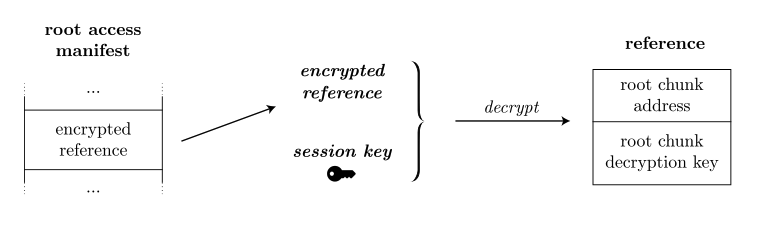
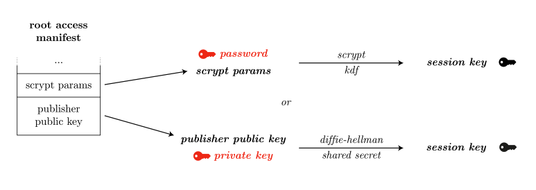
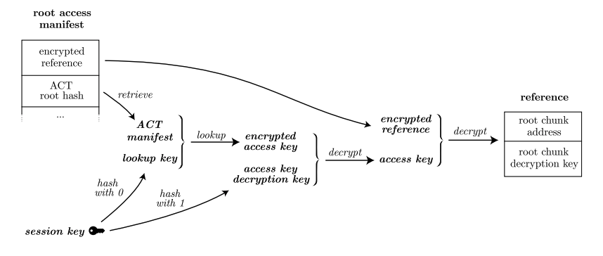

<!--You can leave these HTML comments in your merged SWIP and delete the visible duplicate text guides, they will not appear and may be helpful to refer to if you edit it again. This is the suggested template for new SWIPs. Note that a SWIP number will be assigned by an editor. When opening a pull request to submit your SWIP, please use an abbreviated title in the filename, `SWIP-draft_title_abbrev.md`. The title should be 44 characters or less.-->

# Access Control Trie (ACT)

## Simple Summary

Within decentralized public data storage systems like Swarm, where data resides across multiple nodes, ensuring
confidentiality, integrity, and availability becomes paramount. The Access Control Trie (ACT) is a data structure that
stores access control information for Swarm nodes. It is used to
determine whether a node has permission to access a particular resource.

## Abstract

Access control and encryption in a distributed public data storage system, such as Swarm, is crucial. It is inadequate
to rely on server-based access control to ensure confidentiality and proper end-to-end encryption is a necessity. This
SWIP describes the operation of encryption at the chunk level, with the presence of a decryption/encryption key being
the only distinction between accessing private and public data.

The process to obtain the full reference to the encrypted content, which makes granted access possible, is
explained in it. It is noted that root access does not require special privileges, while granted access
necessitates both root access and the ability to retrieve access credentials.

For the management of access by multiple parties (grantees), an additional layer is introduced to derive the access key
from the session key. This is implemented as an access control trie (ACT) in Swarm manifest format. The paths in the ACT
correspond to the lookup keys, and manifest entries contain the ciphertext of the encrypted access keys as metadata
attribute values.

The SWIP further discusses the concept of access hierarchy, which allows for a tree-like hierarchy of roles, potentially
reflecting an organisational structure in the future.

In summary, it provides a comprehensive overview of how access control and encryption are managed in a distributed
public data storage system. The importance of these mechanisms in ensuring data confidentiality and managing access
rights is emphasised.

## Motivation

### Confidentiality

In a distributed system confidentiality is of utmost importance. Traditional server-based access
control is deemed inadequate for ensuring confidentiality. Instead, Swarm with ACT uses encryption to ensure that data
remains accessible only to specific authorized parties. This is especially important in a decentralized architecture
where any node could potentially store data.

### Managing Access

This is a robust and simple API for managing access control. This is traditionally handled through centralized
gate-keeping, which is subject to frequent and catastrophic security breaches. In contrast, this system allows users to
manage others’ access to restricted content, such as private shared content and authorization for members to access
specific areas of a web application.

### Selective Access to Multiple Parties

ACT provides a mechanism for granting selective access to multiple parties (grantees).
This is achieved through an additional layer of encryption on references and a lookup table mapping each grantee’s
lookup key to their encrypted access key. This allows for updating the content without changing access credentials.

### Access Hierarchy

It will be able to support a tree-like hierarchy of roles, possibly reflecting an organizational structure. This is
achieved by deriving access keys from a root key using a derivation path. This allows for “promotions”, i.e., increased
privileges, with minimal changes to the access control trie (ACT).

### Efficiency and Privacy

This form of access control offers several desirable properties. Checking and looking up one’s own access is logarithmic
in the size of the ACT. The size of the ACT merely provides an upper bound on the number of grantees, without disclosing
any information beyond this upper bound about the set of grantees to third parties.

These motivations highlight the need for a robust, flexible, and efficient access control system in a distributed public
data storage environment. The system described in the document aims to provide such a solution, ensuring
confidentiality, ease of access management, and privacy.

## Specification

This section provides a high-level overview of the system's design and functionality. For more details, please refer to
the detailed specification which can be studied in the 4.2 section, 'Access control'
of [The Book of Swarm](https://www.ethswarm.org/the-book-of-swarm-2.pdf). 'Access hierarchy' as described in subsection
4.2.4 is not part of the initial implementation.

### Encryption

- Emphasis is placed on the need for encryption to maintain confidentiality in a decentralized architecture where nodes
  share chunks of data.
- It is ensured that the confidentiality solution does not reveal any information that could distinguish a private chunk
  from random data.
- The process of encryption at the chunk level is described, which is virtually independent of the chunk store layer.
- Details are provided on how the storage API endpoints should handle encrypted and unencrypted chunk references.

### Managing Access

- Two levels of access are outlined: root access (as it exists today), which does not require special privileges, and
  granted access, which requires both root access and access credentials.
- The concept of an encrypted reference and an access key used for decryption is introduced.
- It is explained how the access key can be obtained from various sources, and how it is used to decrypt the encrypted
  reference to obtain the full reference to the content.

  

### Selective Access to Multiple Parties

- An additional layer is described, introduced to manage access by multiple parties (grantees) to the same content.
- The concept of a session key, derived from provided credentials, and how it is used to derive a lookup key and an
  access key decryption key is introduced.

  

- It is explained how a lookup table, implemented as an access control trie (ACT) in Swarm manifest format, is used to
  map each grantee’s lookup key to their encrypted access key.

  

- The steps a user needs to follow to access content are outlined, including retrieving root access metadata,
  identifying the ACT resource, calculating their session key, and using the lookup key to retrieve the manifest entry
  from the ACT.

The specification concludes by highlighting the desirable properties of the access control scheme, such as the
logarithmic complexity of checking and looking up one's own access, and the ability to extend the ACT by a single entry
when granting access to an additional key.

## Rationale

The rationale of using Access Control in Swarm is primarily to be able to manage the confidentiality of content and
control access to restricted content in a decentralized network.

In Swarm, nodes share chunks of data with each other and are incentivized to serve them to anyone who requests them.
This makes it impossible for nodes to control access to the data. To maintain confidentiality, the data is encrypted.
Only those with the decryption key can access the data, ensuring it remains accessible only to specific authorized
parties.

Furthermore, access control in Swarm would allow for different levels of privileges for accessing the content by
multiple parties sharing the same root access. This approach allows for updating the content without changing access
credentials. The access control scheme offers several desirable properties such as checking and looking up one's own
access is logarithmic in the size of the Access Control Trie (ACT), and granting access to an additional key requires
extending the ACT by a single entry, which is logarithmic in the size of the ACT.

It will pave the way a tree-like hierarchy of roles, possibly reflecting an organizational structure. As long as role
changes are "promotions", i.e., they result in increased privileges, modifying a single ACT entry for each role change
is sufficient.

## Backwards Compatibility

As ACT is a new feature, it will not affect any existing features, and this was ensured during the implementation and
testing phases. It is designed to be backward compatible with existing Swarm node mechanics.

It is ensured that existing content, without ACT defined, can still be accessed by the publisher, and new content can be
created without restricting access to any viewers.

## Test Cases

### Context

Content is created as a 'channel' or feed, which can be accessed by publishers and viewers. Access Control Trees (ACTs)
can be defined for content, controlling who can view it. Publishers can modify ACTs and the grantee list across multiple
nodes. When a viewer loses access, they are no longer present in the ACT's grantee list.

### Use Cases

1. Publishing new content without additional grantees
    - 1/a. Reading and editing an existing ACT
2. Granting access to new viewers
    - 2/a. Adding additional viewers to existing grantees
    - 2/b. Removing viewers from grantee list without content change
    - 2/c. Removing viewers from grantee list with content update
3. Viewer requesting access to content
4. Viewer access revoked without content change
    - 4/a. Viewer access revoked with content update

Testing will be conducted on the Ethereum Sepolia testnet, utilizing a number of nodes running on the network with
released Bee versions, including some nodes with the ACT feature enabled.

## Implementation

The implementation was broken down to a number of components:

- Dynamic Access Controller
- Grantee Manager
- History
- Access Logic
- Session (Diffie-Hellman moments)

## Copyright

Copyright and related rights waived via [CC0](https://creativecommons.org/publicdomain/zero/1.0/).