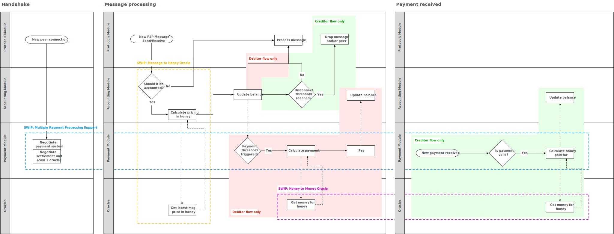

<!--You can leave these HTML comments in your merged SWIP and delete the visible duplicate text guides, they will not appear and may be helpful to refer to if you edit it again. This is the suggested template for new SWIPs. Note that a SWIP number will be assigned by an editor. When opening a pull request to submit your SWIP, please use an abbreviated title in the filename, `SWIP-draft_title_abbrev.md`. The title should be 44 characters or less.-->

## Simple summary 
<!--"If you can't explain it simply, you don't understand it well enough." Provide a simplified and layman-accessible explanation of the SWIP.-->
Swarm needs a mechanism to set prices which makes sense relative to other (distributed storage) services in the market. As the absolute price of using Swarm is defined by the cost of honey (Swarm's internal accounting unit), this SWIP proposes a minimal interface to enable upgrading honey prices, network-wide and for all nodes. The specifics on what an efficient price should reflect and how the update process looks like is *not* part of this SWIP.

## Abstract 
<!--A short (~200 word) description of the technical issue being addressed.-->
It is expected that the price of using Swarm will change over time to reflect the changing economic landscape as well as to facilitate experimentation. Such price updates must happen atomically or not happen at all, to prevent accounting unbalances from appearing. To lay the groundwork for enabling such price changes, this SWIP proposes a minimal interface for a *price-oracle*. Furthermore, this SWIP includes a proposal on implementation of an *on-chain* price oracle, governed by Swarm developers and stakeholders to allow for experimentation. 

This SWIP is part of a series of SWIPs (but can be implemented on its own). To see the full picture, please refer to [swip-message_to_honey](./swip-message_to_honey.md), [swip-multiple](./swip-honey_to_money.md), [swip-multiple_payment_processing_support](./swip-multiple_payment_processing_support.md) and the diagram below:


## Motivation
<!--The motivation is critical for SWIPs that want to change the Swarm protocol. It should clearly explain why the existing protocol specification is inadequate to address the problem that the SWIP solves. SWIP submissions without sufficient motivation may be rejected outright.-->
Nodes keep track of the balances with each other nodes using an internal reference unit: honey. Since honey is not a currency in which nodes can settle their balances with each other - it is merely a unit of account - there is a requirement to facilitate converting honey to a currency. Furthermore, it is desirable that this conversion rate can fluctuate to reflect the changing economic landscape and facilitate experimentation. 

This update process should be atomic: either all nodes upgrade or none. If Swarm would update the price by releasing a new version of the source code (as is currently the case), this would be violated as it is not possible to guarantee that all nodes are on the same release. By externalizing the price to an oracle, Swarm completely decouples its core functions from price discovery. By building support for price oracles, it will be possible to coordinate price changes across the network and set the stage for future experimentation with various mechanisms for setting prices, from DAOs, to bonding curves, to fixed prices. 

## Specification
<!--The technical specification should describe the syntax and semantics of any new feature. The specification should be detailed enough to allow competing, interoperable implementations for the current Swarm platform and future client implementations.-->
* An oracle is reachable at one specific endpoint and this endpoint is hardcoded in the Swarm source-code. 
* No other factor besides time influences the answer which an oracle gives. That is: if nodes query the oracle at the same time, the oracle gives the same answer. 
* A price oracle returns a `honeyPrice` object, specifying a `Time To Live (TTL)` in seconds and an array of `price` objects, each index specifying a `validFrom` filed as an UTCDate and a `honeyPrice`. To summarize, the oracle returns:
```typescript 
honeyPrices: { 
 TTL,
 prices: [0: {validFrom, honeyPrice}, n: {validFrom, honeyPrice}]
}
```
* The applied price is the `price` where `validFrom` is in the most recent past. 
* Upon receipt of a payment or intent to send a payment, nodes will check their local cache on the existence of a non-expired `honeyPrice` object. If this exists, the oracle will not be queried, if it does not exist, the oracle will be queried and the answer stored in the local cache of the node for `TTL` time. 
* The number of payments received/sent, `TTL` of `honeyPrices`, as well as the costs to query the oracle (computational overload/time delay), should determine whether nodes actively keep their local cache up-to-date with `honeyPrices` or whether they will passively request a new `honeyPrices` object when needed.

## Rationale
<!--The rationale fleshes out the specification by describing what motivated the design and why particular design decisions were made. It should describe alternate designs that were considered and related work, e.g. how the feature is supported in other languages. The rationale may also provide evidence of consensus within the community, and should discuss important objections or concerns raised during discussion.-->
### General rationale for choosing oracles
There exist a need for the price of Swarm to change over time. However, due to the nature of Swarm, there is a need for this price to be decided network-wide, instead of peer-to-peer. Specifically:
- The requirement on connectivity in the local bin and far-away bins means that nodes *must agree* with all nodes in their local bin and at least one node in a far-away bin on the price.
- Zero marginal costs of serving data with perfect competition means that when nodes would engage in peer-to-peer price discovery, the price will tend to zero and a sub-optimal equilibrium of near-zero prices will be reached.
- The high-quantity of transactions implies that nodes cannot engage in price-discovery for every byte of data transacted at the point of transaction, meaning they have to agree *beforehand* on how they will come to a price *at a later time*. 
- Nodes are most of the time just conduits for data and payments, meaning that most the time data requests and thus also payments will be because you want to send data to a peer who requested this data from you. 
### Rationale for the described oracle specification
* Nodes might apply different honey prices for the same payment, due to the time difference between querying the oracle for *sending* a payment and querying the oracle for *receiving* the same payment. The imbalances caused by this don't harm if the sum of all inbalances is not greater than the disconnect threshold. Experimentation should confirm that this indeed does not happen. Theoretically, if the overall price movement does not show a clear trend (either up or down) over the period where nodes do business with each other or the two nodes are neither a net receiver nor a net sender to each other, accounting imbalances should offset each other. Furthermore, less frequent as well as small price updates should minimize the imbalances. If a clear trend exists and one node is a net user and the other a net provider, the disconnect threshold will eventually be reached. Research must be performed on how the strength of a trend influences the duration until a disconnect is reached for a given stream of traffic. The assumption is that this will be sufficiently long not to cause any problems for a typical Swarm user. If there appears to be a problem with such imbalances, we see a possible solution:
As nobody benefits from price imbalances, both the sender and the receiver of a payment are incentivized to and can apply a price which is not per their clock, but per the clock of their counterparty when they expect their counterparty to query or have queried the oracle. To assist in this, a payload might be sent with the transaction, specifying the clock with which the oracle price was applied.
* An on-chain oracle *might* give a different answer to two nodes when queried at the same time if there exists a (temporary) fork in the blockchain. Again: the logic applies here about the severity of such accounting imbalances. If this appears to be severe, any oracle price-update might be only considered valid if it happened a sufficient amount of time in the past (usually 12 blocks in Ethereum)

## Backwards Compatibility 
<!--All SWIPs that introduce backwards incompatibilities must include a section describing these incompatibilities and their severity. The SWIP must explain how the author proposes to deal with these incompatibilities. SWIP submissions without a sufficient backwards compatibility treatise may be rejected outright.-->
Currently, the Swarm is not running with a live test net for settling prices, so no problems are expected with this SWIP if it is implemented before the Swarm will go live with price-incentivization. 

## Test Cases
<!--Test cases for an implementation are mandatory for SWIPs that are affecting changes to data and message formats. Other SWIPs can choose to include links to test cases if applicable.-->
Not currently available

## Implementations 
<!--The implementations must be completed before any SWIP is given status "Final", but it need not be completed before the SWIP is accepted. While there is merit to the approach of reaching consensus on the specification and rationale before writing code, the principle of "rough consensus and running code" is still useful when it comes to resolving many discussions of API details.-->
* The Swarm source code will reference an Ethereum address of a `HoneyToMoney` price oracle smart-contract
* The price oracle implements the `HoneyToMoney` interface (to-be specified). 
* The `HoneyToMoney` contract will be initially governed such that a subset of stakeholders can make decisions which are not high-impact (i.e. decide on small price-changes), but all stakeholders are required to make high-impact decisions (such as changing the implementation of the oracle, changing governance, decide on big price-changes, etc). This semi-governance structure is in place to allow experimentation with an update process of honeyPrices and is not a recommendation for a price-update process when honey is quoted in a currency worth real money. 

## Copyright Waiver
 Copyright and related rights waived via [CC0](https://creativecommons.org/publicdomain/zero/1.0/).
