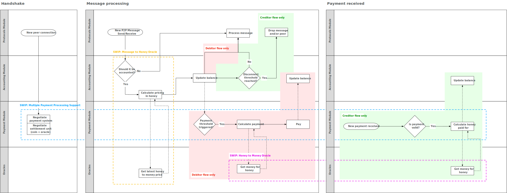
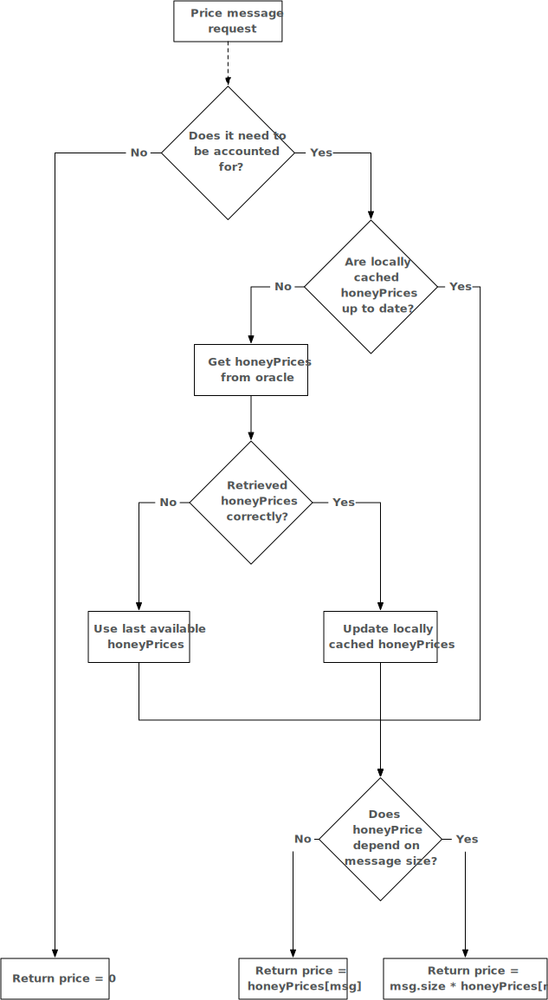

<!--You can leave these HTML comments in your merged SWIP and delete the visible duplicate text guides, they will not appear and may be helpful to refer to if you edit it again. This is the suggested template for new SWIPs. Note that a SWIP number will be assigned by an editor. When opening a pull request to submit your SWIP, please use an abbreviated title in the filename, `SWIP-draft_title_abbrev.md`. The title should be 44 characters or less.-->

## Simple summary
<!--"If you can't explain it simply, you don't understand it well enough." Provide a simplified and layman-accessible explanation of the SWIP.-->
For this SWIP, price, if not explicitly noted differently, refers to the price in `honey`, Swarm's internal accounting unit. It is not a currency with exchange value, but a unit of reference which allows peers to account for the services exchanged. It can be best understood as accounting for the number of bytes exchanged.

Nodes in the Swarm network can send various types of messages. Every message type represents different resource usage in the network. For the incentives system to be optimally tuned, the current assumption is that every message type will require a different price to account for the resources used.

Currently, Swarm developers have no empirical data nor theoretical references available to determine the optimal price of these messages relative to each other. We expect extensive experimentation and as a result, will have to progressively adjust the relative prices of messages. It is important that an update of the prices happens simultaneously on all nodes in the network or otherwise accounting imbalances between nodes will arise, potentially severely harming the connectivity of the network. 

An on-chain price oracle, managed by a multi-signature wallet of Swarm stakeholders, provides a clean way for updating relative prices; the Swarm source code will never require an update but instead references the address of the oracle which updates its quoted prices at predictable times.
This SWIP is part of a series of SWIPs (but can be implemented on its own). To see the full picture, please refer to [swip-multiple_payment_processing_support](./swip-multiple_payment_processing_support.md), [swip-honey_to_money](./swip-honey_to_money.md) and the diagram below:



## Abstract
<!--A short (~200 word) description of the technical issue being addressed.-->
To enable changing the relative prices of Swarm messages for all nodes simultaneously, Swarm will provide a `MsgToHoney` payment oracle, initially managed by Swarm stakeholders and developers. The `MsgToHoney` oracle returns an object from which the most recent price for a particular message can be inferred. Once nodes receive a message to account for, they will query their local cache for a valid price for this message. The local cache is kept up-to-date at all times by the nodes. Any query to the oracle returns an object with a fixed `Time To Live (TTL)`. After the `TTL` expires, nodes will query the oracle again. The `MsgToHoney` oracle lives on the Ethereum blockchain and is managed by a governance structure of Swarm developers and stakeholders.

## Motivation
<!--The motivation is critical for SWIPs that want to change the Swarm protocol. It should clearly explain why the existing protocol specification is inadequate to address the problem that the SWIP solves. SWIP submissions without sufficient motivation may be rejected outright.-->
In Swarm, nodes send various types of messages; chunk requests, chunk delivery, PSS… to name a few. Every message is priced differently to reflect the different load such messages have on the system. To ensure optimal usage and health of the network it is essential that these prices are quoted relative to the load they induce on the network. If this is not the case certain messages may be too cheap, resulting in unprofitability for service providers— while others may be too expensive, causing users to avoid the service. The Swarm network must be used by real nodes to get insights on how messages should be priced relative to each other. Hence, there is a need for an update process of the relative message price on a live network. This update process should be atomic: either all nodes upgrade or none. This us urrently not facilitated by the hardcoded values in the Swarm source code. Therefore, if prices change in the current implementation, nodes running different releases will account for messages differently. Eventually, this will result in disconnects due to balance differences between nodes. This SWIP proposes an on-chain price oracle to enable an atomic update process of message prices.

## Specification
<!--The technical specification should describe the syntax and semantics of any new feature. The specification should be detailed enough to allow competing, interoperable implementations for the current Swarm platform and future client implementations.-->
* The Swarm source code references the address of a smart contract which acts as a honey pricing oracle for messages.
* The price oracle implements the `MsgToHoney` interface (to be specified) 
* The `MsgToHoney` contract will be initially owned by a governance structure of Swarm developers and stakeholders. The governance structure shall be simple to set up initially, but facilitate the possibility for upgrading to a more advanced governance structure. 
* Nodes pro-actively keep track of updating their local cache of honey-prices.
* Upon sending or receiving a message, a node checks if the cached price is valid in its local database. If not, the node will query the price oracle to get the current price. Subsequently, the node will apply the current price to the balance of its peer (see diagram below).
* Nodes expect other nodes to apply the same price as they do themselves. Due to the asynchronicity of the network, this will not necessarily be true around the period that prices are updated, which causes accounting imbalances. This SWIP does not facilitate a solution for this, as it is not expected that accounting imbalances will be high enough to cause disruptions in the network. Additional analysis of the network has to confirm this statement. 
* The design of the oracle should minimize the interaction of Swarm nodes and the oracle maintainers with the oracle. 
* A design proposal is clarified under the header `Technical details`, and a high-level diagram is provided below. 


### Technical details
This section describes the interaction between the nodes and the oracle in more detail.
* Querying the oracle will return a `messagePrices` object, specifying a `Time to Live (TTL)` in seconds and `prices` object objects. The `prices` object contains an entry for each message type (`SwarmMessageType`) and `SwarmMessageType` maps a `validFrom` to a respective price. Taken together, the oracle returns:
```json
{
  "messagePrices": 
  {
    "TTL": <TTLValue>, 
    "prices": {
      "SwarmMessageTypeX": {
        "validFrom0": <price0>, 
        ...,                
        "validFromN": <priceN>
      }
      ...,
      "SwarmMessageTypeY": {
        "validFrom0": <price0>,
        ...,
        "validFromN": <priceN>
      }
    }
  }
}
```
An example of this could be:
```json
{
   "messagePrices": {
      "TTL": 3600,
      "prices": {
        "chunkRequest": {
        "1566469257": 1000,             
        "1566472857": 1010
      },
      "chunkDelivery": {
        "1566469257": 500,
        "1566476457": 400
      }
   }
}
```
* Any answer from the oracle will be valid for the node for `TTL` seconds.
* The applied price is chosen by looking up the price corresponding to the `validFrom` which is in the most recent past.
* After the `messagePrices` object expires, nodes will query the price oracle for a new `messagePrices` object. 
* On every regular code release, the default `messagePrices` will be updated so that a fallback value is always available to nodes
* Upon start-up, nodes will look at the contents of their local cache. If no `messagePrices` object is found, or the `TTL` of their cached `messagePrices` object has expired, the message oracle will be queried.
* The `TTL` is set as a variable inside the implementation of the oracle and can be updated.
* To ensure that a new entry in the `smarmMessage` object can't become valid before all nodes are updated, the smart contract or update policy must ensure that the `validFrom` of new prices must be at least `TTL` seconds in the future.
* If the oracle cannot be reached, nodes will continue to apply the `prices` as instructed by the expired `messagePrices` object or the `fallback value`—whichever is more recent. Subsequently, the node will attempt to establish a connection at regular intervals.  

## Rationale
<!--The rationale fleshes out the specification by describing what motivated the design and why particular design decisions were made. It should describe alternate designs that were considered and related work, e.g. how the feature is supported in other languages. The rationale may also provide evidence of consensus within the community, and should discuss important objections or concerns raised during discussion.-->
### Comparable solutions
No alternative solutions to updating the *relative* message pricing were considered. It is perhaps worthy to look at how op-code prices (in gas) are updated in Ethereum. Here we also have relative prices and the developers are tweaking the gas-prices on almost every hard-fork (see [opcode re-price discussion](https://ethereum-magicians.org/t/opcode-repricing/3024)). Using an oracle, updatable by a governance structure of Swarm developers and stakeholders, effectively also allows the developers to set prices (just as in Ethereum with ether opcodes). However, the Ethereum opcode upgrade mechanism must also be approved by the majority of the hashing power of the Ethereum network (to have a successful hard-fork). This check is missing in the current design for the `MsgToHoney` price oracle. 

### Non-reachable oracle
As described above: If the oracle cannot be reached, nodes will continue to apply the `prices` as instructed by the expired `messagePrices` object or the `fallback value`—whichever is more recent.
When this situation occurs, the node will likely accrue accounting imbalances with his peers which may eventually lead to a disconnect (when the accounting imbalance reaches the disconnect threshold).
Three other options were considered as a response to an unreachable oracle. Below, all three options are described, as well as the reasoning for not choosing them.
 
1) Treating the situation as fatal and shut down the node immediately.
2) Asking the peers for the price which they apply and if there is a consensus on the price by a significant majority (i.e. 80%), apply that price.
3) Use a bogus value (i.e. 1) for all messages and account with this value.
 
With regards to the first option:
Not treating an unreachable oracle as fatal error gives the node opportunity to still engage with his peers for a foreseeable time. This gives the node operator or the Ethereum network time to recover, while Swarm operations can continue uninterrupted. If the situation would be considered fatal, a bug in the Ethereum client, for example, could result in a significant amount of Swarm nodes going offline.
With regards to the second option:
This situation is potential vulnerable for an attack, as an attacker might occupy the connections of a node. Furthermore, in the case of a systematic failure of the oracle for the whole network, there is no guarantee that a significant majority will quote the same price and it is unclear what happens if this is the case.
With regards to the third option:
Using the fallback or the cached oracle response is always better than a bogus value, as the bogus value might create price incentives which are completely off, causing nodes to start behaving erratically, while not applying the same price as his peers.


## Backwards Compatibility 
<!--All SWIPs that introduce backwards incompatibilities must include a section describing these incompatibilities and their severity. The SWIP must explain how the author proposes to deal with these incompatibilities. SWIP submissions without a sufficient backwards compatibility treatise may be rejected outright.-->
This SWIP is backward compatible as long as the price oracle quotes the same prices as listed in the price matrix of the non-upgraded Swarm nodes. It is up to the owner of the `MsgToHoney` oracle to ensure that prices are not updated too much while not all running nodes are on the new Swarm. Currently, Swarm is not running a Swap-enabled live test net, so we don't expect any problems with this SWIP if it is implemented before Swarm goes live with incentivization. 

## Test Cases 
<!--Test cases for an implementation are mandatory for SWIPs that are affecting changes to data and message formats. Other SWIPs can choose to include links to test cases if applicable.-->
No test cases for this SWIP are provided at this moment.
## Implementations
<!--The implementations must be completed before any SWIP is given status "Final", but it need not be completed before the SWIP is accepted. While there is merit to the approach of reaching consensus on the specification and rationale before writing code, the principle of "rough consensus and running code" is still useful when it comes to resolving many discussions of API details.-->
No implementation for this SWIP is provided at this moment. 

## Copyright Waiver
 Copyright and related rights waived via [CC0](https://creativecommons.org/publicdomain/zero/1.0/).
