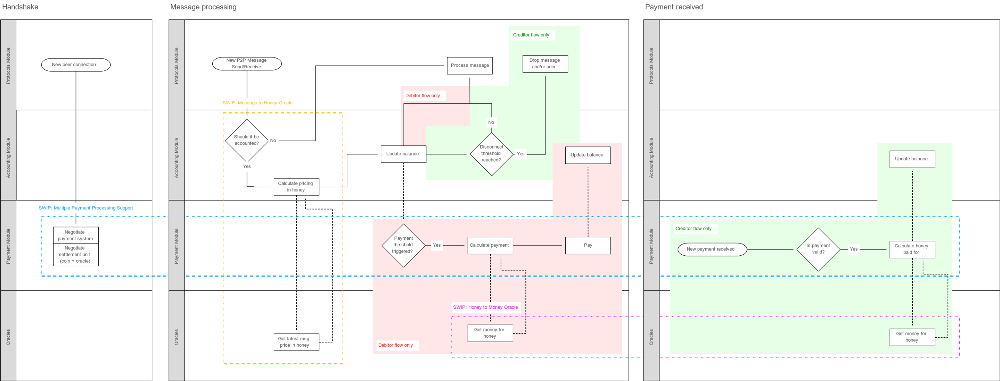

<!--You can leave these HTML comments in your merged SWIP and delete the visible duplicate text guides, they will not appear and may be helpful to refer to if you edit it again. This is the suggested template for new SWIPs. Note that a SWIP number will be assigned by an editor. When opening a pull request to submit your SWIP, please use an abbreviated title in the filename, `SWIP-draft_title_abbrev.md`. The title should be 44 characters or less.-->

## Simple Summary
<!--"If you can't explain it simply, you don't understand it well enough." Provide a simplified and layman-accessible explanation of the SWIP.-->
In the current Swarm design, accounting of the data exchanged between peers and the payment for such data is tightly coupled. To promote widespread adoption of Swarm it is best to abstract the actual payment mechanism and let nodes participating in the network decide what payment system is better suited to their needs.

This SWIP proposes decoupling the accounting for services provided via Swarm from the actual handling of the payment. A generic payment module will be defined as an interface for handling the payments; the existing Swap chequebook will be the first implementation of this interface. Doing this will pave the way for enabling other currencies to define their implementation of the payment module, which will increase the resilience of the Swarm network (i.e. if one payment module fails, others might still work) while making Swarm attractive to a wider user-base by allowing nodes to pay in their currency of preference.

To allow multiple payment modules to co-exist on the same network, nodes must be able to come to an agreement on which payment module (or modules) to use. We propose a mechanism for nodes to indicate these preferences. Furthermore, there must be a fallback option provided for the payment module to ensure that nodes can always connect. Finally, there should be a mechanism for each node to keep track of the payment methods negotiated with its peers.

This SWIP is part of a series of SWIPs (but can be implemented on its own). To see the full picture, please refer to [swip-message_to_honey](./swip-message_to_honey.md), [swip-honey_to_money](./swip-honey_to_money.md) and the diagram below:



## Abstract
<!--A short (~200 word) description of the technical issue being addressed.-->
The payment module interface specifies the minimum requirements to allow different implementations to be supported by Swarm. An implementation of this interface will be responsible for handling payments, hiding the specifics of the underlying payment processing and providing a unified API, thus decoupling the distributed storage service from the actual payment system used by participants. 

Nodes need to keep track of the balances that result from consuming/servicing storage from/to other nodes. This leads to the need of an abstract accounting unit that can be used for storage and bandwidth. We define ```honey``` as the Swarm accounting unit. Since ```honey``` is not a currency in which nodes can settle their balances with each other there should exist a mechanism to convert honey to a given currency. For the full details on how ```honey``` works, please refer to [swip-message_to_honey](./swip-message_to_honey.md) and [swip-honey_to_money](./swip-honey_to_money.md).

A minimal payment module receives a price in ```honey```, converts this price to a currency via an agreed-upon price oracle, sends the payment and returns when the payment is processed (either successfully or unsuccessfully). Making it clear in the code that this is the minimum expected from a payment module will both increase the readability and auditability of the Swarm source code, but will also make it easier for other payment methods to implement the payment module interface, hereby allowing users to choose how they want to settle their payments, which increases the resilience of the network and enlarges the potential user base. 

Incorporating the required abstractions to support payment modules will require modifying, the message handling, and the accounting and payment strategies implemented at the moment.

## Motivation
<!--The motivation is critical for SWIPs that want to change the Swarm protocol. It should clearly explain why the existing protocol specification is inadequate to address the problem that the SWIP solves. SWIP submissions without sufficient motivation may be rejected outright.-->
Currently, Swarm is implementing the chequebook contract (with a base currency of Ether). While the chequebook contract is beautiful in its simplicity, it can be expected that users of Swarm might prefer a different way of compensation for their services provided, especially if they are already participating in a payment network (e.g. Lumino, Raiden or Lightning network). 

Furthermore, storage providers might want to be compensated with a different currency or they might want to settle their payment using a different blockchain altogether. 

Finally, new users of Swarm could bootstrap its participation in a payment channel network by providing storage services with zero cost of entry, as described in [Generalised Swap Swear and Swindle games (Tron & Fischer, 2019).](https://www.sharelatex.com/read/yszmsdqyqbvc) 

When it becomes possible for nodes to set their preference for a payment module, developers will be incentivized to implement payment modules on Swarm as it will be easy for users to choose to pay with this module. It will also seamlessly enable multicurrency support and foster interoperation across blockchains without forcing participants to be tied to a single blockchain or settlement technology.

## Specification
<!--The technical specification should describe the syntax and semantics of any new feature. The specification should be detailed enough to allow competing, interoperable implementations for the current Swarm platform and future client implementations.-->

### Generic payment module
At a high level a payment module is responsible for sending a payment to a recipient (a peer providing storage services) for services provided. How payments are actually performed will depend on the specific implementation of the payment module. The payment module is then responsible for:

* Resolving the conversion from honey to money.
* Sending a payment to the recipient.
* Sending a message to the accounting module upon receipt of payment.
* Ensuring that the user can send payments with the chosen payment module before payment is due.
* Handling any potential errors.
* Optionally exposing other methods such as querying balances, topping up balances or sending payments (outside of Swarm). 

Payment module negotiation can occur either during handshake or at a later time, since the payment module is only needed when peers need to balance their debts (i.e. when the payment threshold is reached). Negotiating the payment module only when needed will help to reduce the network load when nodes build up a connection. The disadvantage is that it will be unclear in which currency nodes will going to get paid until they engage in the payment module negotiation. The fallback mechanism ensures that nodes will always be able to issue payments to balance their debts. 

Experimentation is needed to determine the best time for nodes to engage in payment module negotiation.

### Multiple payment modules support
When allowing multiple payment modules, it is essential for nodes to communicate their preference. There are three dimensions to take into consideration for the payment preference: 

1. Currency to use
2. Price oracle to use
3. Payment provider to use

We propose a standardized way to communicate these preferences and an algorithm to resolve any two preferences lists.

For any dimension, nodes list the relative importance of them. Consequently, nodes specify their accepted options within each dimension. Importance is communicated through Swarm by any positive integer.

The following is an example of the proposed configuration:

```yaml
# The relative importance of each dimension for the node
dimensions:
    currency: 70
    provider: 20
    oracle: 10

# Supported payment options by the node.
# A payment module is defined by a currency, the supported providers and oracles. Weights are the values associated to each provider.
# or oracle and it indicates the preference for that option.
currencies:
    rif:
        weight: 36
        providers:
            lumino: 15
            raiden: 45
        oracles:
            rifOracleA: 10
            rifOracleB: 70
            rifOracleC: 60
    xdai:
        weight: 9
        providers:
            lumino: 10
        oracles:
            xDaiOracle: 20
    dai:
        weight: 5
        providers:
            raiden: 80
        oracles:
            daiOracleA: 30
            daiOracleB: 20
    eth:
        weight: 40
        providers:
            swap: 90
        oracles:
            ethOracleA: 90
            ethOracleB: 10
```

When two nodes (A and B) establish a connection they independently execute the following payment method selection algorithm, using as input the configuration defined previoulsy:

1. Based on the node configuration generate a set of triplets in the form ```[currency, provider, oracle]```. As an example let's take from the previous configuration the ```rif``` entry. From that entry we can build the triplets `[rif, lumino, rifOracleA]`, `[rif, lumino, rifOracleB]`, `[rif, lumino, rifOracleC]`,`[rif, raiden, rifOracleA]`, `[rif, raiden, rifOracleB]`, `[rif, raiden, rifOracleC]`, but triplets are generated for the other currencies as well. 
2. Exchange the generated set of triplets with the peer B.
3. Keep the set of triplets which are common (intersection between peer A's triplets and peer B's triplets). If no common set exists, choose the fallback option for each dimension, as shown in the following table:

	| Dimension  | Fallback option |
	| ---------- | --------------- |
	| Currency to use | Wei (Ether)                    |
	| Price oracle    | HonMon oracle <SWIP reference> |
	| Payment method  | Chequebook contract            |

4. Compute the weighted preference of each remaining triplet from node A and node B as:

	```golang
	weightedPreference := normalized(dimensions.currency) * normalized(triplet[n].weight) + 
		+ normalized(dimensions.provider) * normalized(triplet[n].provider.weight) + 
		+ normalized(dimensions.oracle) * normalized(triplet[n].oracle.weight)
	```

	Since weights and dimensions do not need to add up to a particular value (e.g. 100) they need to be normalized.
	As an example, let's take the first generated triplet (`[rif, lumino, rifOracleA]`). The normalized dimensions and weights are:
	
	***Sum of all dimension values = 100***
	* Normalized currency dimension: 70 / 100 = 0.7
	* Normalized provider dimension: 20 / 100 = 0.2
	* Normalized oracle dimension: 10 / 100 = 0.1

	***Sum of all currency weights = 90***
	* RIF normalized weight = 36 / 90 = 0.4

	***Sum of all provider weights for RIF = 60***
	* Lumino normalized weight = 15 / 60 = 0.25

	***Sum of all oracle weights for RIF = 140***
	* oracleB normalized weight = 70 / 140 = 0.5

	Then the ```weightedPreference``` for this triplet is:

	```golang
    weightedPreference := [0.7 * 0.4 + 0.2 * 0.25 + 0.1 * 0.5]
	weightedPreference := 0.38
	```

5. Add the weights of matching triplets from A and B and choose the one with the highest cumulative preference value:

	```golang
	highestPreference := 0
	combinedWeightedPreference := 0
	
	for i, weightedPreferenceA := range weightedPreferencesA {
		combinedWeightedPreference = weightedPreferenceA + weightedPreferencesB[i]
		if highestPreference < combinedWeightedPreference {
			highestPreference = combinedWeightedPreference
		}
	}
	```

6. If there is more than one triplet with the same ```weightedPreference``` value, both nodes will compute for each colliding triplet a tie breaker as follows:

	```golang
	tieBreaker := hash(triplet.coin || triplet.provider || triplet.oracle)
	```
	
	and then each node will select the triplet with the minimum ```tieBreaker``` value.

The payment module negotiated during this process could include an oracle, in that case this oracle will override the default one described in [swip-honey_to_money](./swip-honey_to_money.md).

### Proposed changes to the existing code 

This section describes the existing code and provides suggestions on how it could be modified to achieve the end goal of this SWIP. It is by no means an indication on how this feature should be implemented, the final design and implementation will be agreed with the community and it could differ completely from what it is described here.

Payment modules are meant to be pluggable, thus, after negotiating the payment details as described in the previous section, nodes must load the corresponding payment module. Payment modules can be contributed by other development teams outside the Swarm team, in particular, it is expected for payment providers like Lumino or Raiden to provide their own payment module implementations. As such, these payment modules will live outside Swarm main repository and users will decide which modules they want to load to their Swarm node, either manually or automatically (e.g. by using a UI designed for such purpose). The Swarm node will include support for Swap as the default and fallback payment mechanism. If no additional payment module is installed by the user then the Swarm node will handle payments as it does today.

Swarm defines a ```Balance``` interface in ```p2p/protocols/accounting.go``` as an abstraction for the accounting process:

```golang
// Balance is the actual accounting instance
// Balance defines the operations needed for accounting
// Implementations internally maintain the balance for every peer
type Balance interface {
	// Adds amount to the local balance with remote node `peer`;
	// positive amount = credit local node
	// negative amount = debit local node
	Add(amount int64, peer *Peer) error
}
```

```Swap``` (as defined in swap/protocol.go) is an implementation of this interface and among the list of messages supported by its ```Spec``` there is the ```EmitChequeMsg``` message:

```golang
// Spec is the swap protocol specification
var Spec = &protocols.Spec{
	Name:       "swap",
	Version:    1,
	MaxMsgSize: 10 * 1024 * 1024,
	Messages: []interface{}{
		HandshakeMsg{},
		EmitChequeMsg{},
	},
}
```

When received, this message is handled by the ```handleEmitChequeMsg``` function defined in ```swap/swap.go```:

```golang
func (s *Swap) handleMsg(p *Peer) func(ctx context.Context, msg interface{}) error
```

The ```handleEmitChequeMsg``` function executes the accounting and payment processing required by Swap, tightly coupling both operations.

In the current codebase ```Swap``` is a member of the ```Peer``` struct defined in ```swap/peer.go```: 

```golang
// Peer is a devp2p peer for the Swap protocol
type Peer struct {
	*protocols.Peer
	swap               *Swap
	backend            contract.Backend
	beneficiary        common.Address
	contractAddress    common.Address
	lastReceivedCheque *Cheque
}
```

One option is to move the accounting responsibilities from ```Swap``` to a new component (from now on ```Accounting```), introduce it as a new member of the ```Peer``` struct and add a new collaborator on which we can delegate the payment processing. This collaborator (from now on ```SwarmPayments```) will provide access to the supported payment modules, being ```Swap``` one of such modules. This design decouples the accounting from the payment processing. We refer to the concrete payment module implementations as a ```PaymentProcessor```s.

```golang
// Peer is a devp2p peer for the Swap protocol
type Peer struct {
	*protocols.Peer
	accounting         *Accounting
	payments           *SwarmPayments
}
```

This option will drastically change the current architecture of Swap and affect how accounting works. A better approach to preserve the accounting structure as defined in ```p2p/protocols/accounting.go``` and its related modules is to keep the relationship between the Swap ```Peer``` and the ```Swap``` accounting object and introduce the ```SwarmPayments``` object as a collaborator of ```Swap```. This way we keep the accounting structure as it is today and delegate all payment related logic from ```Swap``` to the corresponding payment module via  ```SwarmPayments```. Following this idea, all the payment related members from the ```Swap``` object should be moved to the Swap payment module implementation.

```golang
// Swap represents the Swarm Accounting Protocol
// a peer to peer micropayment system
// A node maintains an individual balance with every peer
// Only messages which have a price will be accounted for
type Swap struct {
	api                 API
	store               state.Store          	 // store is needed in order to keep balances and cheques across sessions
	accountingLock      sync.RWMutex         	 // lock for data consistency in accounting-related functions
	balances            map[enode.ID]int64   	 // map of balances for each peer
	balancesLock        sync.RWMutex         	 // lock for balances map
	peers               map[enode.ID]*Peer   	 // map of all swap Peers
	peersLock           sync.RWMutex         	 // lock for peers map
	paymentThreshold    int64               	 // balance difference required for sending cheque
	disconnectThreshold int64              		 // balance difference required for dropping peer
	payments            *SwapPaymentProcessor	 // SwapPaymentProcessor provides access to the supported payment modules
}
```

The ```payments``` member of the ```Swap``` struct holds the ```SwarmPayments``` component described previously, which is responsible of holding the particular ```PaymentProcessor``` implementations supported by the node and a mapping of:

* Peer (beneficiary) addressess.
* The currency to use.
* The ```PaymentProcessor``` negotiated with the beneficiary.


The ```Add``` function from the ```Balance``` interface can be reimplemented to delegate the payment phase to the ```SwarmPayments``` object (several checks were removed from the code for simplicity):

```golang
// Add is the (sole) accounting function
// Swap implements the protocols.Balance interface
func (s *Swap) Add(amount int64, peer *protocols.Peer) (err error) {
	s.accountingLock.Lock()
	defer s.accountingLock.Unlock()

	newBalance, _ := s.updateBalance(peer.ID(), amount)

	if newBalance <= -s.paymentThreshold {
		swapPeer, _ := s.getPeer(peer.ID())

		peerBalance, _ := s.getBalance(swapPeer.ID())

		// Here the payments object will select the payment module negotiated with the swapPeer and emit a payment accordingly
		s.payments.EmitPayment(swapPeer, peerBalance)

		s.resetBalance(swapPeer.ID(), peerBalance)
	}

	return nil
}
```

And following the same delegation idea, the ```Swap``` ```handleMessage``` function can be implemented as follows:

```golang
// handleMsg is for handling messages when receiving messages
func (s *Swap) handleMsg(p *Peer) func(ctx context.Context, msg interface{}) error {
	return func(ctx context.Context, msg interface{}) error {
		switch msg := msg.(type) {
		case *EmitChequeMsg:
			go s.handlePaymentReceived(ctx, p, msg)
		}
		return nil
	}
}

// handleEmitPayment should be handled by the creditor when it receives
// a cheque from a debitor
func (s *Swap) handlePaymentReceived(ctx context.Context, p *Peer, msg *EmitChequeMsg) error {
	cheque := msg.Cheque

	// Here the payments object will select the payment module negotiated with the swapPeer and execute the appropriate cash in logic 
	s.payments.cashInPayment(ctx, p, msg)

	// reset balance by amount
	// as this is done by the creditor, receiving the cheque, the amount should be negative,
	// so that updateBalance will calculate balance + amount which result in reducing the peer's balance
	s.accountingLock.Lock()
	err := s.resetBalance(p.ID(), 0-int64(cheque.Honey))
	s.accountingLock.Unlock()
	if err != nil {
		return err
	}

	return err
}
```

The use (if required) of a price oracle will be handled internally by the ```PaymentProcessor```.

The ```Cheque```and ```ChequeParams``` defined in ```swap/types.go``` should be made more general to allow ```PaymentProcessor```s to generate the required data structures for the specific payment implementation (e.g. Balance Proof, in the case of payment channels). The current implementations of ```Cheque``` and ```ChequeParams``` should be part of the Swap ```PaymentProcessor```. For clarity they could be renamed to ```Payment``` and ```PaymentParams```, respectively.

```golang
// PaymentParams encapsulate all payment parameters
type PaymentParams struct {
	Contract    common.Address // address of chequebook, needed to avoid cross-contract submission
	Beneficiary common.Address // address of the beneficiary, the contract which will redeem the cheque
	Serial      uint64         // monotonically increasing serial number
	Amount      uint64         // cumulative amount of the cheque in currency
	Honey       uint64         // amount of honey which resulted in the cumulative currency difference
	Timeout     uint64         // timeout for cashing in
}

// Payment encapsulates the parameters and the signature
type Payment struct {
	PaymentParams
	Sig []byte // signature Sign(Keccak256(PaymentParams), prvKey)
}
```

Each peer should indicate its supported ```PaymentProcessor```s, being the Swap ```PaymentProcessor``` the default and fallback payment method to use. The ```PaymentProcessor``` implementation negotiated with a given Peer will be registered in the  ```SwarmPayments``` component. To support multiple payment methods this information could be stored in a map where the key will be each beneficiary address, and the value a list of supported ```PaymentProcessor```s:

```golang
// SwarmPayments registers the negotiated payment processors for each peer plus the default payment processor
type SwarmPayments struct {
    PaymentProcessors        map[common.Address][]PaymentProcessor // payment processors negotiated with each peer 
    DefaultPaymentProcessor  SwapPaymentProcessor                  // Swap PaymentProcessor implementation used as the default payment method
}

// PaymentProcessor is the general payment processor interface
type PaymentProcessor interface {
    params() PaymentProcessorParams
    pay(beneficiary interface{}, amount int64) error
}

/*
PaymentProcessorParams is the common interface for the parameters of a given PaymentProcessor. At least it should allow to query the params for the currency to be used by the PaymentProcessor.
*/
type PaymentProcessorParams interface {
    currency() string
}

/*
As an example, we can define a TokenPaymentProcessorParams implementation of the PaymentProcessorParams interface with the specific parameters needed by a TokenPaymentProcessorParams
*/
type TokenPaymentProcessorParams struct {
    TokenName       string
    TokenAddress    common.Address
    PriceOracle     common.Address
}

func (p TokenPaymentProcessorParams) currency() string {
    return p.TokenName
}
```

Selection of the appropriate payment module for cash in a payment in:

```golang
...
s.payments.cashInPayment(ctx, p, msg)
...
```

or for sending a payment in:

```golang
...
s.payments.EmitPayment(swapPeer, peerBalance)
...
```

will be done by performing a lookup using the peer address (or some other unique identifier) on the ```PaymentProcessors``` map:

```golang
// SwarmPayments registers the negotiated payment processors for each peer plus the default payment processor
type SwarmPayments struct {
    PaymentProcessors        map[common.Address][]PaymentProcessor // payment processors negotiated with each peer 
    DefaultPaymentProcessor  SwapPaymentProcessor                  // Swap PaymentProcessor implementation used as the default payment method
}
```

If no payment processor is found for the peer then the ```DefaultPaymentProcessor``` will be used. The ```PaymentProcessors``` map will be populated during payment module negotiation. The ```PaymentProcessor```s can be implemented as plugins by using the [HashiCorp Golang plugin system over RPC](https://github.com/hashicorp/go-plugin) or the [Golang plugin package](https://golang.org/pkg/plugin/). 

The Golang plugin package only runs on Linux and macOS and it depends on dynamic library loading. The HashiCorp Golang plugin system does not rely on dynamic library loading, providing a more secure approach with added benefits:

* Plugins can't crash the host process.
* Plugins are easy to develop and they can be written in any language with RPC support.
* Plugins only has access to the interfaces and args given to it, not to the entire memory space of the process.

When implementing the support for multiple payment modules the most adequate option for plugin development should be selected. However, due to its flexibility it is recommended to use the [HashiCorp Golang plugin system over RPC](https://github.com/hashicorp/go-plugin) or at least a similar approach.

## Rationale
<!--The rationale fleshes out the specification by describing what motivated the design and why particular design decisions were made. It should describe alternate designs that were considered and related work, e.g. how the feature is supported in other languages. The rationale may also provide evidence of consensus within the community, and should discuss important objections or concerns raised during discussion.-->

The current Swap implementation uses Ether to settle debts and requires interactions with the chequebook smart contract. The settlement process is tightly coupled with the Swarm node, making hard to support other currencies besides Ether or other settlement methods such as payment channels. Moreover, this coupling ties Swarm to Ethereum-like blockchains, impeding other blockchain solutions to benefit from the integration of Swarm as a distributed storage solution. Several options were considered to decouple the payments technology to use from Swarm:

* Introduce ERC20 support directly into the chequebook smart contract: It seems feasible to follow this path, however for each new token to be supported a new chequebook needs to be deployed or multiple token support needs to be introduced to the chequebook. While this is possible, it might introduce unwanted complexity to the Swap chequebook and not enough flexibility to support other means of payment.
* Introduce support for payment channels directly into the chequebook smart contract: This idea requires an additional level of abstraction for the cheques and the chequebook. The chequebook smart contract should be modified to directly interact with different on-chain payment mechanisms. In the case of payment channel networks cheques should be generalized to allow modeling Balance Proof. The interaction between the chequebook and the payment channel network will occur during the on-chain settlement when the chequebook smart contract should send the Balance Proof to the payment channel smart contract being used. As with the previous approach, this requires several changes to the Swap chequebook smart contract. For every payment system to be supported a different chequebook should be designed. Having a single chequebook to handle multiple payment systems will result in a smart contract too difficult to maintain and keep secure.
* Completely replace chequebook by a different payment mechanism: this option is the least flexible of all since it does not solve the problem at all, it only changes the coupling with a given technology (chequebook) for another. Additionally, it could hurt the Swarm network, forcing the appearance of multiple subnetworks, each one handling its payment mechanism, a situation that still could happen with the current Swarm design.

The approach proposed in this document of implementing pluggable payment modules that conforms to a common API was designed to overcome the limitations and complexities of the three options mentioned above.

## Backwards Compatibility
<!--All SWIPs that introduce backwards incompatibilities must include a section describing these incompatibilities and their severity. The SWIP must explain how the author proposes to deal with these incompatibilities. SWIP submissions without a sufficient backwards compatibility treatise may be rejected outright.-->
To preserve compatibility the chequebook smart contract will be the first implementation of the payment module interface. This will allow nodes willing to operate with Swarm as they do today. This SWIP does not introduce other backwards incompatibilities if implemented before the incentivized testnet goes live. If implemented after this time, further research must be performed to assess possible backward incompatibility and how to deal with it.

## Test Cases
<!--Test cases for an implementation are mandatory for SWIPs that are affecting changes to data and message formats. Other SWIPs can choose to include links to test cases if applicable.-->

No test cases for this SWIP are provided at this moment.

## Implementation
<!--The implementations must be completed before any SWIP is given status "Final", but it need not be completed before the SWIP is accepted. While there is merit to the approach of reaching consensus on the specification and rationale before writing code, the principle of "rough consensus and running code" is still useful when it comes to resolving many discussions of API details.-->

No implementation for this SWIP is provided at this moment.

## Copyright
Copyright and related rights waived via [CC0](https://creativecommons.org/publicdomain/zero/1.0/).
