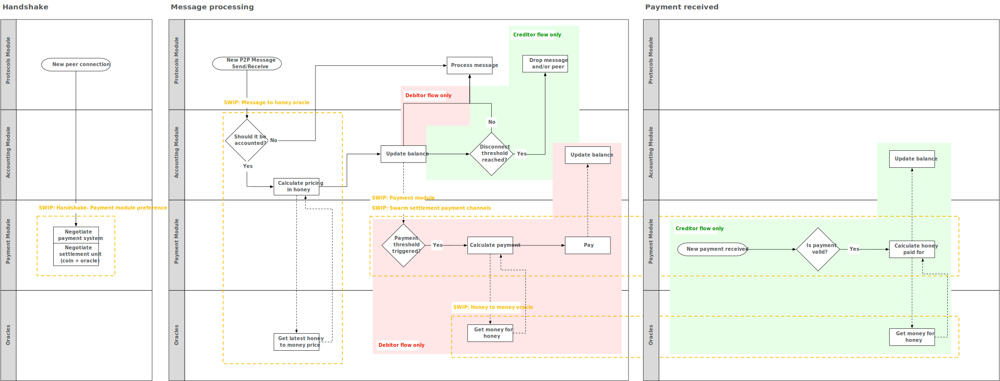
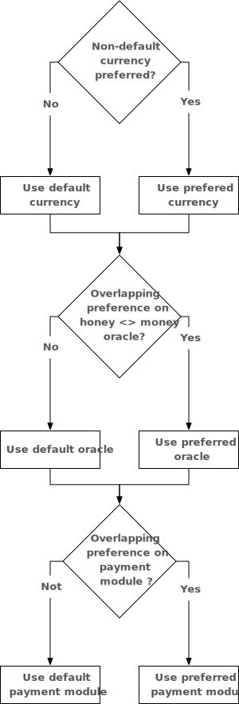

<!--You can leave these HTML comments in your merged SWIP and delete the visible duplicate text guides, they will not appear and may be helpful to refer to if you edit it again. This is the suggested template for new SWIPs. Note that a SWIP number will be assigned by an editor. When opening a pull request to submit your SWIP, please use an abbreviated title in the filename, `SWIP-draft_title_abbrev.md`. The title should be 44 characters or less.-->

## Simple Summary
<!--"If you can't explain it simply, you don't understand it well enough." Provide a simplified and layman-accessible explanation of the SWIP.-->
In the current Swarm design, accounting of the data exchanged between peers and the payment for such data is coupled. To promote widespread adoption of Swarm it is best to abstract the actual payment mechanism and let nodes participating in the network to decide what payment system better adapts to their needs.

This SWIP proposes to decouple the accounting for services provided via Swarm from the actual handling of the payment. A generic payment module will be defined as an interface for handling the payments; the existing SWAP chequebook will be the first implementation of this interface. Doing this will pave the way for enabling other currencies to define their implementation of the payment module, which will increase the resilience of the Swarm network (i.e. if one payment module fails, others might still work) while making Swarm attractive to a wider user-base by allowing nodes to pay in their currency of preference.

To allow multiple payment modules to co-exist on the same network, nodes must be able to come to an agreement on which payment module (or modules) to use. We propose a mechanism for nodes to indicate these preferences during handshake, such preferences should be normalized and weighted. Furthermore, there must be a fallback option provided for the payment module to ensure that nodes can always connect. Finally, there should be a mechanism for each node to keep track of the payment methods negotiated with its peers.

This SWIP is part of a series of SWIPs (but can be implemented on it's own). To see the full picture, please refer to `msgToHoney honeyToMoney SWIP links` and the diagram below:


## Abstract
<!--A short (~200 word) description of the technical issue being addressed.-->
The payment module interface specifies the minimum requirements to allow different implementations to be supported by Swarm. An implementation of this interface will be responsible for handling payments, hiding the specifics of the underlying payment processing and providing a unified API, thus decoupling the distributed storage service from the actual payment system used by participants. 

A minimal payment module accepts a price (in honey), converts this price to a currency via an agreed-upon price oracle, sends the payment and returns when the payment is processed (either successfully or unsuccessfully). Making it clear in the code that this is the minimum expected from a payment module will both increase the readability and audibility of the Swarm source code, but will also make it easier for other payment methods to implement the payment module interface, hereby allowing users to choose how they want to settle their payments, which increases the resilience of the network and enlarges the potential user base. 

Incorporating the required abstractions to support payment modules will require modifying the handshake protocol, the message handling, and the accounting and payment strategies implemented at the moment.

## Motivation
<!--The motivation is critical for SWIPs that want to change the Swarm protocol. It should clearly explain why the existing protocol specification is inadequate to address the problem that the SWIP solves. SWIP submissions without sufficient motivation may be rejected outright.-->
Currently, Swarm is implementing the chequebook contract (base currency: Ether) to allow nodes to receive payments without doing on-chain transactions. While the chequebook contract is beautiful in its simplicity, it is expected that users of Swarm might prefer a different way of compensation for their services provided, especially if they are already participating in a payment network (e.g. Lumino, Raiden or Lightning network). 

Storage providers might want to be compensated with a different currency (e.g. an ERC20 token) or they might want to settle their payment using a different blockchain. Furthermore, a storage provider offering other paid services will find appealing not to be forced to support multiple payment systems, but being able to consolidate the payments received under a single technology.

Finally, new users of Swarm could bootstrap its participation in a payment channel network by providing storage services with zero cost of entry, as described in [Generalised Swap Swear and Swindle games, 2019, Tron and Fischer](https://www.sharelatex.com/read/yszmsdqyqbvc) 

When it possible for nodes to set their preference for a payment module developers will be incentivized to implement payment modules on Swarm as it will be easy for users to choose to pay with this module. It will also enable seamlessly multicurrency support and foster interoperation across Blockchains without forcing participants to be tied to a single Blockchain or settlement technology.

## Specification
<!--The technical specification should describe the syntax and semantics of any new feature. The specification should be detailed enough to allow competing, interoperable implementations for the current Swarm platform and future client implementations.-->

At a high level a payment module is responsible for:

* Accepting an amount (in honey) and a recipient.
* Resolving the conversion from honey to money (currently by querying the agreed-upon price oracle with the recipient.)
* Ensuring that the user can engage in SWAP accounting for the chosen payment module before payment is due.
* Sending the recipient a payment.
* Returning true when the payment was successful.
* Returning false when the payment was not successful.
* Verifying any on-chain conditions and making sure that within a reasonable time window after the transaction happens they don't change (due to block reorganizations / payment-module specific conditions)
* The payment module references a type, version and base currency 
* The payment module optionally exposes other methods such as querying balances, topping up balances or sending payments (outside of SWARM). 

Nodes can specify their preference for both payment module, as well as price oracle in a list in a configuration file. The preferences are normalized and weighted.
For any preference list, the chosen option will be the option which has the highest cumulative preference. The preference list has three dimensions, which will be resolved from high to low:

1. Currency to use
2. Price oracle to use
3. Payment method to use

Nodes must be able to reach an agreement in any dimension of the preference list, or the fallback option for each dimension of the preference list will be chosen:

| Dimension  | Fallback option |
| ---------- | --------------- |
| Currency to use | Wei (Ether)                    |
| Price oracle    | HonMon oracle <SWIP reference> |
| Payment method  | Chequebook contract            |

Please refer to the picture below to see how preferences are resolved during the handshake:



### Technical details

This section describes the existing code and provides suggestions on how it could be modified to achieve the end goal of this SWIP. It is by no means an indication on how this feature should be implemented, the final design and implementation will be agreed with the community and it could differ completely from what it is described here.

Swarm defines a ```Balance``` interface in p2p/protocols/accounting.go as an abstraction for the accounting process:

```golang
// Balance is the actual accounting instance
// Balance defines the operations needed for accounting
// Implementations internally maintain the balance for every peer
type Balance interface {
	// Adds amount to the local balance with remote node `peer`;
	// positive amount = credit local node
	// negative amount = debit local node
	Add(amount int64, peer *Peer) error
}
```

```Swap``` (as defined in swap/protocol.go) is an implementation of this interface and among the list of meesages supported by its ```Spec``` there is the ```EmitChequeMsg``` message:

```golang
// Spec is the swap protocol specification
var Spec = &protocols.Spec{
	Name:       "swap",
	Version:    1,
	MaxMsgSize: 10 * 1024 * 1024,
	Messages: []interface{}{
		HandshakeMsg{},
		EmitChequeMsg{},
		ErrorMsg{},
	},
}
```

When received, this message is handled by the ```handleEmitChequeMsg``` function of the Swap devp2p ```Peer``` defined in swap/peer.go:

```golang
func (sp *Peer) handleEmitChequeMsg(ctx context.Context, msg interface{}) error 
```

This function performs the accounting and the payment steps tightly coupled to Swap, making it difficult to support different settlement strategies. 

The ```handleMsg``` function defined in swap/peer.go should delegate the processing of ```EmitChequeMsg``` to a component or service (from now on ```SwarmPayments```) which provides access to the payment modules supported by the node receiving the message, thus decoupling Swarm from payment processing. We refer to the concrete payment module implementation as a ```PaymentProcessor```. The existing code for ```handleEmitChequeMsg``` will become part of the SWAP ```PaymentProcessor```. The ```handleMsg``` function could be redefined as:

```golang
// handleMsg is for handling messages when receiving messages
func (sp *Peer) handleMsg(ctx context.Context, msg interface{}) error {
	switch msg := msg.(type) {

	case *EmitPaymentMsg:
		return sp.payments.emitPayment(ctx, msg)

	case *ErrorMsg:
		return sp.handleErrorMsg(ctx, msg)

	default:
		return fmt.Errorf("unknown message type: %T", msg)
	}
}
```

where the ```sp.payments``` member of the ```Peer``` struct holds the ```SwarmPayments``` component described previously. ```SwarmPayments``` is responsible to hold the particular ```PaymentProcessor``` implementations supported by the node and a mapping of:

* Peer (beneficiary) addressess.
* The currency to use.
* The ```PaymentProcessor``` negotiated during the handshake for the beneficiary.

The use (if required) of a price oracle will be handled internally by the ```PaymentProcessor```.

The ```Cheque```and ```ChequeParams``` defined in swap/types.go should be more general to allow ```PaymentProcessor```s to generate the required data structures for the specific payment implementation (e.g. Balance Proof, in the case of payment channels). The current implementations of ```Cheque``` and ```ChequeParams``` should be part of the SWAP ```PaymentProcessor```. For clarity they could be renamed to ```Payment``` and ```PaymentParams```, respectively.

```golang
// PaymentParams encapsulate all payment parameters
type PaymentParams struct {
	Contract    common.Address // address of chequebook, needed to avoid cross-contract submission
	Beneficiary common.Address // address of the beneficiary, the contract which will redeem the cheque
	Serial      uint64         // monotonically increasing serial number
	Amount      uint64         // cumulative amount of the cheque in currency
	Honey       uint64         // amount of honey which resulted in the cumulative currency difference
	Timeout     uint64         // timeout for cashing in
}

// Payment encapsulates the parameters and the signature
type Payment struct {
	PaymentParams
	Sig []byte // signature Sign(Keccak256(PaymentParams), prvKey)
}
```

Upon connection and during the handshake, each peer should indicate its supported ```PaymentProcessor```s, being the SWAP ```PaymentProcessor``` the default and fallback payment method to use. The ```PaymentProcessor``` implementation negotiated during the handshake with a given Peer will be registered in the  ```SwarmPayments``` component. To support multiple payment methods this information could be stored in a map where the key will be each beneficiary address, and the value a list of supported ```PaymentProcessor```s:

```golang
// SwarmPayments registers the negotiated payment processors for each peer plus the default payment processor
type SwarmPayments struct {
    PaymentProcessors        map[common.Address][]PaymentProcessor // payment processors negotiated with each peer during handshake 
    DefaultPaymentProcessor  SwapPaymentProcessor                  // Swap PaymentProcessor implementation used as the default payment method
}

// PaymentProcessor is the general payment processor interface
type PaymentProcessor interface {
    params() PaymentProcessorParams
    pay(amount int64, beneficiary interface{}) error
}

/*
PaymentProcessorParams is the common interface for the parameters of a given PaymentProcessor. At least it should allow to query the params for the currency to be used by the PaymentProcessor.
*/
type PaymentProcessorParams interface {
    currency() string
}

/*
As an example, we can define a TokenPaymentProcessorParams implementation of the PaymentProcessorParams interface with the specific parameters needed by a TokenPaymentProcessorParams
*/
type TokenPaymentProcessorParams struct {
    TokenName       string
    TokenAddress    common.Address
    PriceOracle     common.Address
}

func (p TokenPaymentProcessorParams) currency() string {
    return p.TokenName
}
```

## Rationale
<!--The rationale fleshes out the specification by describing what motivated the design and why particular design decisions were made. It should describe alternate designs that were considered and related work, e.g. how the feature is supported in other languages. The rationale may also provide evidence of consensus within the community, and should discuss important objections or concerns raised during discussion.-->

The current Swap implementation uses Ether to settle debts and requires interactions with the chequebook smart contract. The settlement process is tightly coupled with the Swarm node, making hard to support other currencies besides Ether or other settlement methods such as payment channels. Moreover, this coupling tights Swarm to Ethereum-like Blockchains, impeding other Blockchain solutions to benefit from the integration of Swarm as a distributed storage solution. Several options were considered to decouple the payments technology to use from Swarm:

* Introduce ERC20 support directly into the chequebook smart contract: It seems feasible to follow this path, however for each new token to be supported a new chequebook needs to be deployed or multiple token support needs to be introduced to the chequebook. While this is possible, it might introduce unwanted complexity to the SWAP chequebook and not enough flexibility to support other means of payment.
* Introduce support for payment channels directly into the chequebook smart contract: This idea requires an additional level of abstraction for the cheques and the chequebook. The chequebook smart contract should be modified to directly interact with different on-chain payment mechanisms. In the case of payment channel networks cheques should be generalized to allow modeling Balance Proof. The interaction between the chequebook and the payment channel network will occur during the on-chain settlement when the chequebook smart contract should send the Balance Proof to the payment channel smart contract(s) being used. As with the previous approach, this requires several changes to the SWAP chequebook smart contract. For every payment system to be supported a different chequebook should be designed. Having a single chequebook to handle multiple payment systems will result in a smart contract too difficult to maintain and keep secure.
* Completely replace chequebook by a different payment mechanism: this option is the least flexible of all since it does not solve the problem at all, it only changes the coupling with a given technology (chequebook) for another. Additionally, it could hurt the Swarm network, forcing the appearance of multiple subnetworks, each one handling its payment mechanism, a situation that still could happen with the current Swarm design.

## Backwards Compatibility
<!--All SWIPs that introduce backwards incompatibilities must include a section describing these incompatibilities and their severity. The SWIP must explain how the author proposes to deal with these incompatibilities. SWIP submissions without a sufficient backwards compatibility treatise may be rejected outright.-->
To preserve compatibility the chequebook smart contract will be the first implementation of the payment module interface. This will allow nodes willing to operate with Swarm as they do today. This SWIP does not introduce any other backward incompatibility if implemented before the incentivized test net goes live. If implemented after this time, further research must be performed to assess possible backward incompatibility and how to deal with it.

## Test Cases
<!--Test cases for an implementation are mandatory for SWIPs that are affecting changes to data and message formats. Other SWIPs can choose to include links to test cases if applicable.-->

No test cases for this SWIP are provided at this moment.

## Implementation
<!--The implementations must be completed before any SWIP is given status "Final", but it need not be completed before the SWIP is accepted. While there is merit to the approach of reaching consensus on the specification and rationale before writing code, the principle of "rough consensus and running code" is still useful when it comes to resolving many discussions of API details.-->

No implementation for this SWIP is provided at this moment.

## Copyright
Copyright and related rights waived via [CC0](https://creativecommons.org/publicdomain/zero/1.0/).
